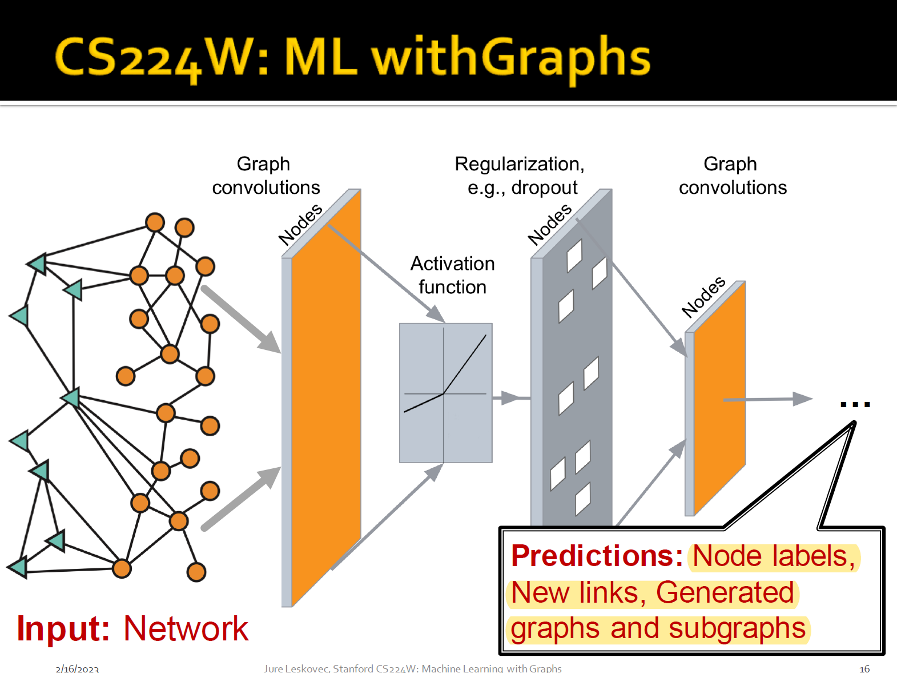
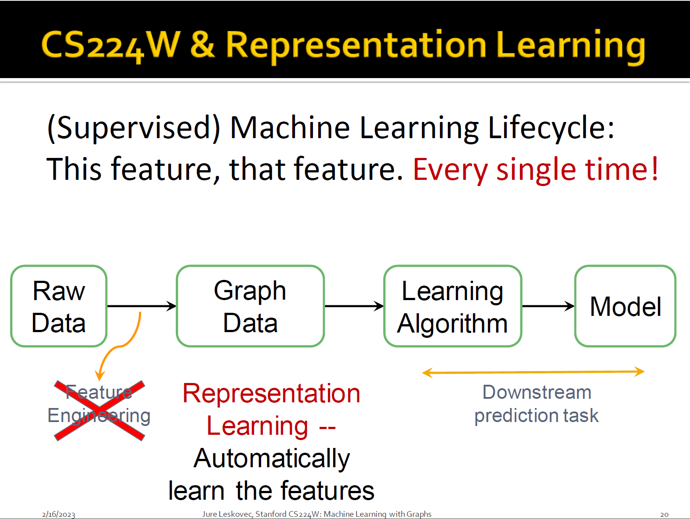

# Why Graphs

**general language for describing and analyzing entities with relations/interactions**

many types of data are graphs...

Networks(natural graphs)

+ Social networks
+ Communication and transactions
+ Biomedicine
+ Brain connections

Graphs(as a representation)

+ Information/knowledge
+ Software
+ Similarity networks
+ Relational structures

Networks are complex

+ Arbitrary size and complex topological structure
+ No fixed node ordering or reference point
+ Often dynamic and have multimodal features

Feature engineering are taken away => representation learning

**map nodes to representation**(learn a NN)

Topics covered

+ Traditional methods
+ Methods for node embeddings
+ GNN
+ Knowledge graphs and reasoning
+ Deep generative models for graphs
+ Applications to Biomedicine, Science, Industry