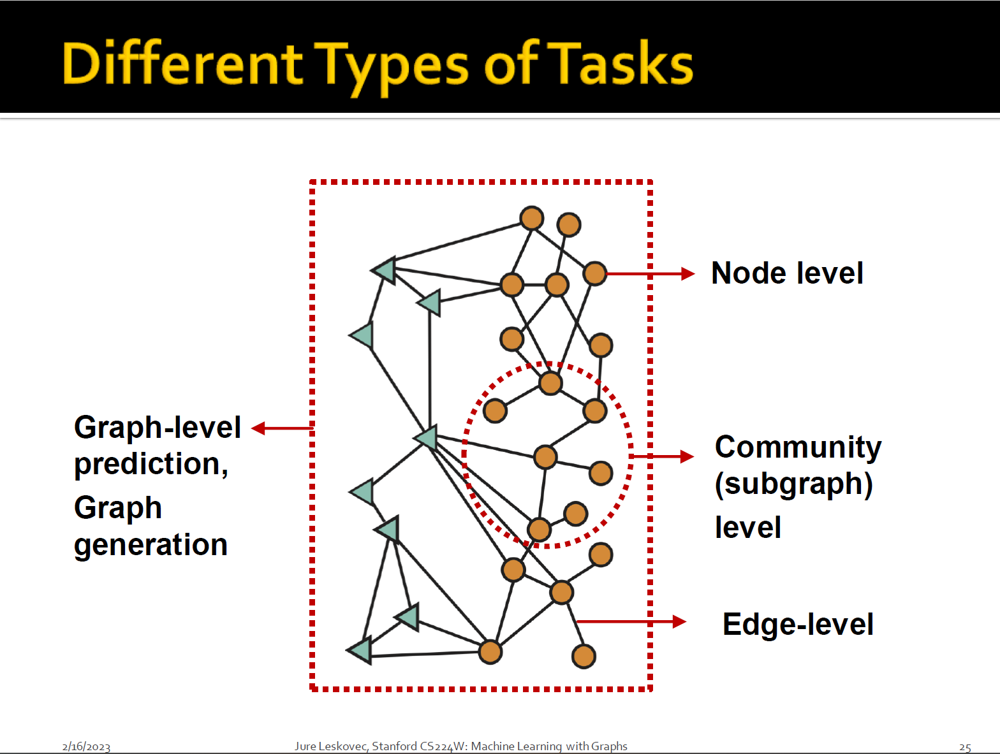
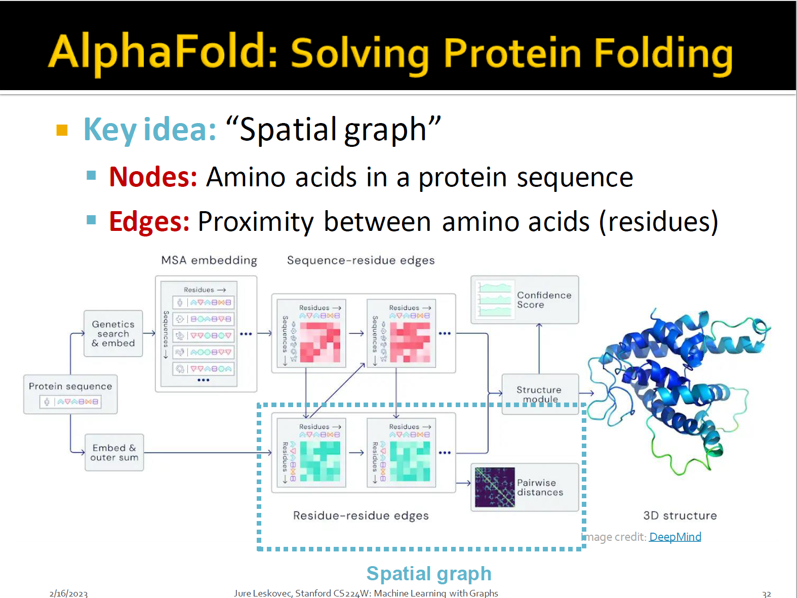
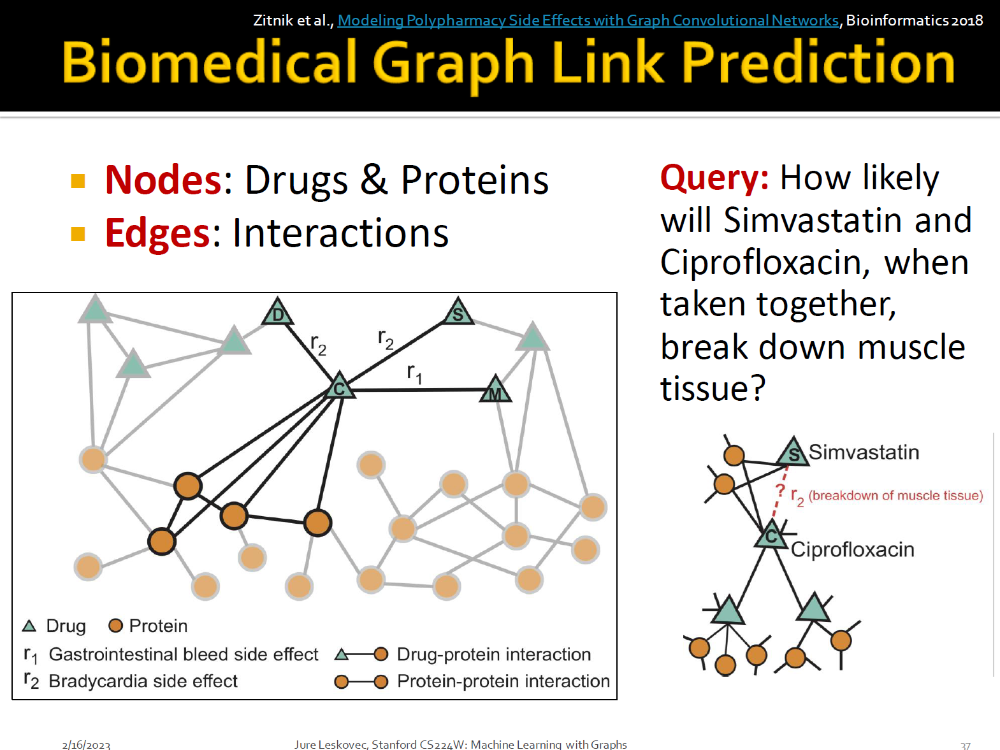
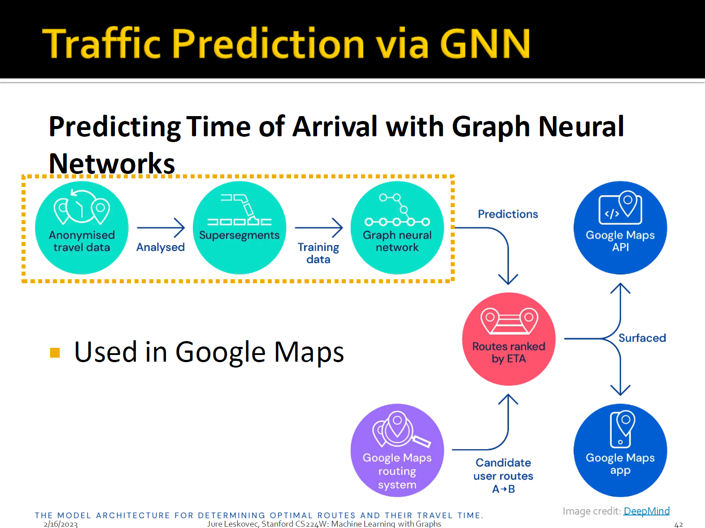
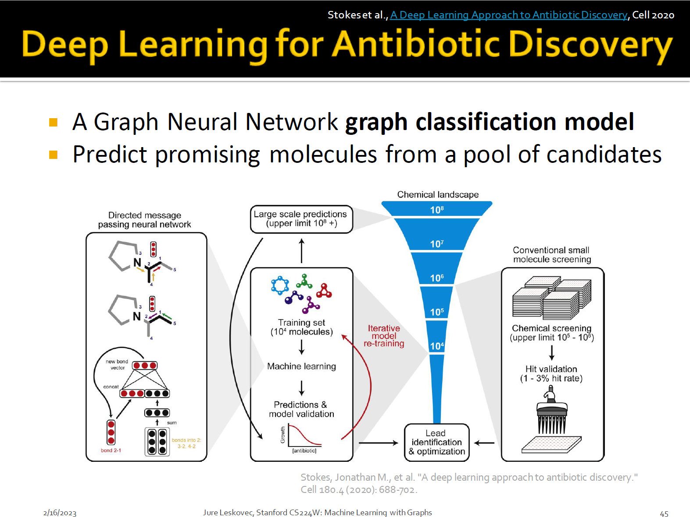
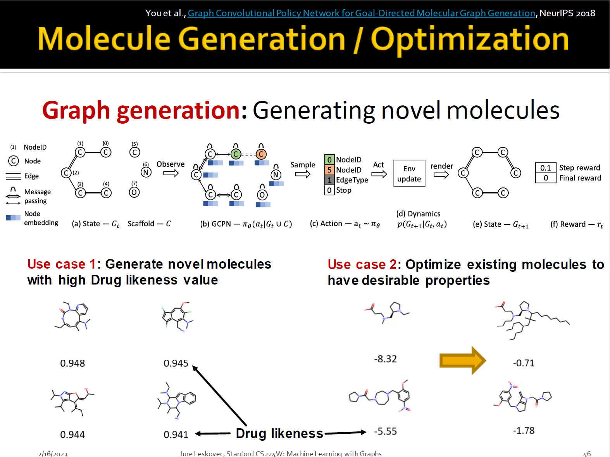
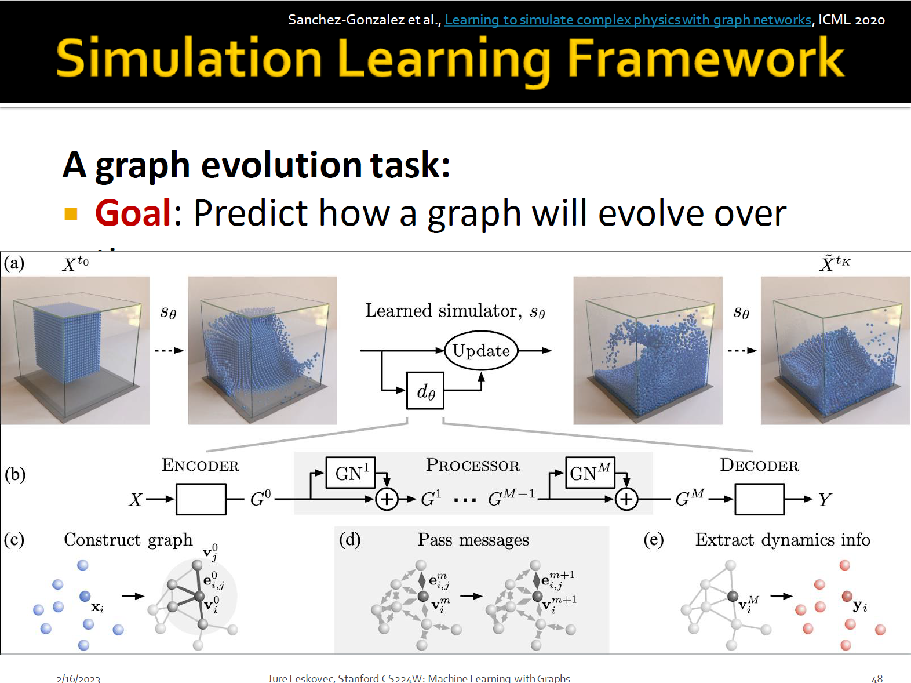

# Applications of Graph ML

Classic Graph ML Tasks

+ Node classification
+ Link prediction
+ Graph classification
+ Clustering
+ Other tasks
  + Graph generation
  + Graph evolution

Example of Node-level ML Tasks

Protein Folding

+ AlphaFold
  + Has Artificial Intelligence 'Solved' Biology's Protein-Folding Problem?
  + 

Examples of Edge-level ML Tasks

+ Recommender Systems

  + Users interacts with items
    + Nodes: Users and items
    + Edges: User-item interactions

  + Goal: Recommend items users might like

  + Task: Recommend related pins to users
    + Learn node embeddings $z_i$ such that $d(z_{cake1}, z_{cake2}) < d(z_{cake1}, z_{sweater})$
    + **Predict whether two nodes in a graph are related**

+ Drug Side Effects
  + Many patients take multiple drugs to treat complex or co-existing diseases
  + Task: Given a pair of drugs predict adverse side effects
  + 

Examples of Subgraph-level ML Tasks

Traffic Prediction

+ Nodes: Road segments
+ Edges: Connectivity between road segments
+ 

Examples of Graph-level ML Tasks

Drug Discovery

+ Antibiotics are small molecular graphs
  + Nodes: Atoms
  + Edges: Chemical bonds
  + 
  + 

Physics Simulation

+ Nodes: Particles
+ Edges: Interaction between particles
+ 