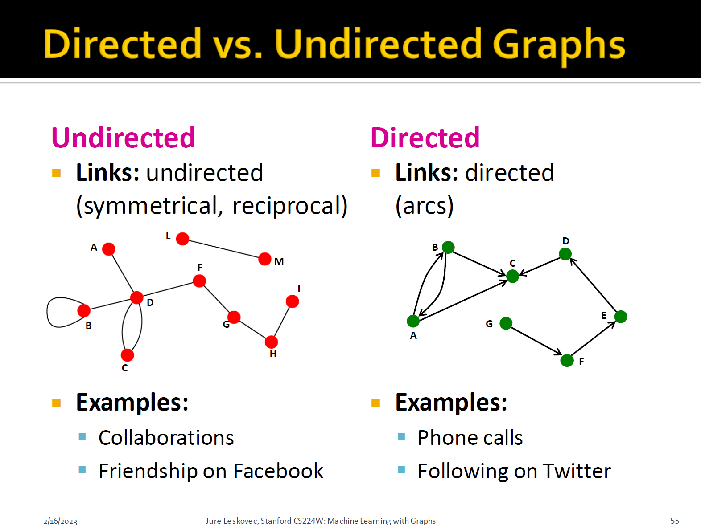
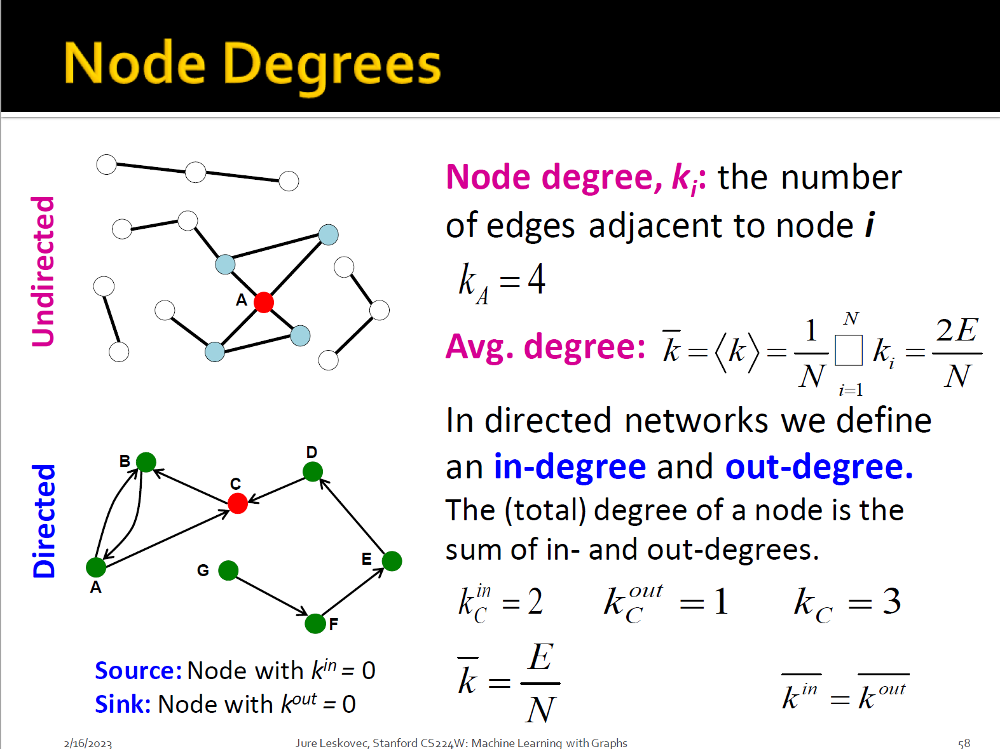
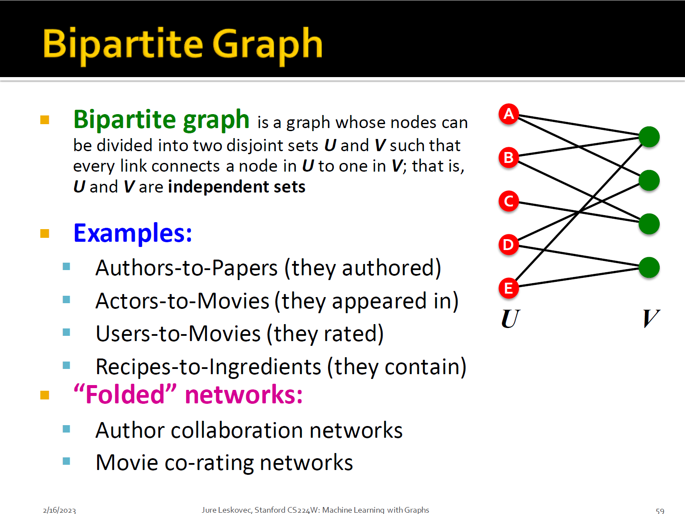
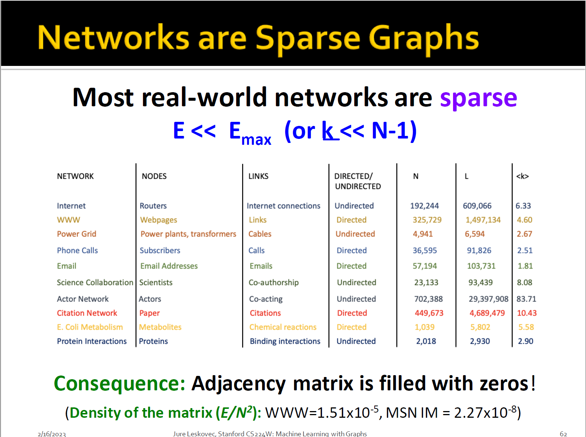
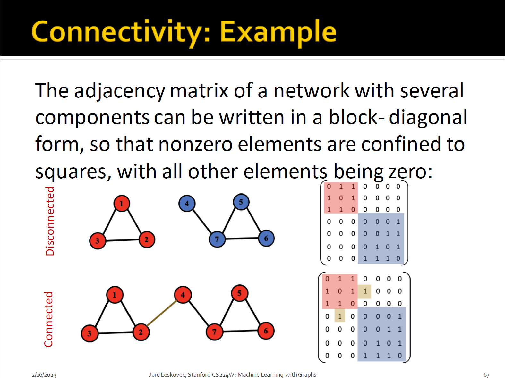
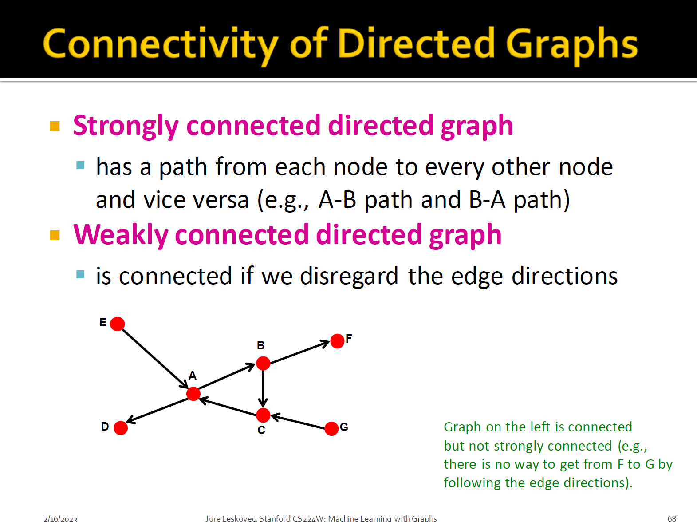
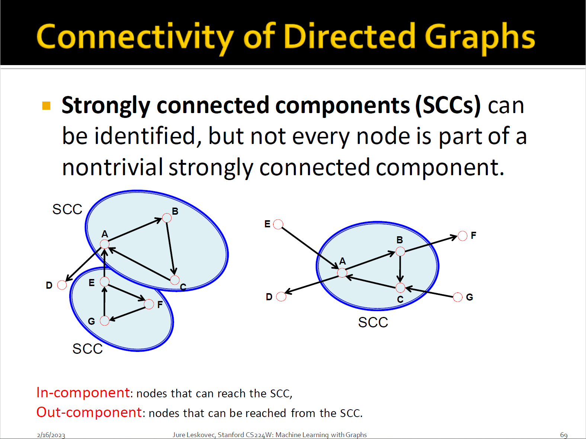

# Machine Learning with Graphs

Components of a Network

+ Objects: nodes, vertices $N$
+ Interactions: links, edges $E$
+ System: network, graph $G(N,E)$

Graphs: A Common Language

Different Type of Graphs

Node Degrees

Bipartite Graph

folded/projected bipartite graphs

use adjacency matrix

**adjacency matrices are sparce**

Representing Graphs

+ Edge list
+ Adjacency list

Node and Edge Attributes

+ Weight 
+ Ranking
+ Type
+ Sign
+ Properties depending on the structure of the rest of the graph

Adjacency matrices

+ Weight
+ Self-edges
+ Multigraph

disconnect graph

