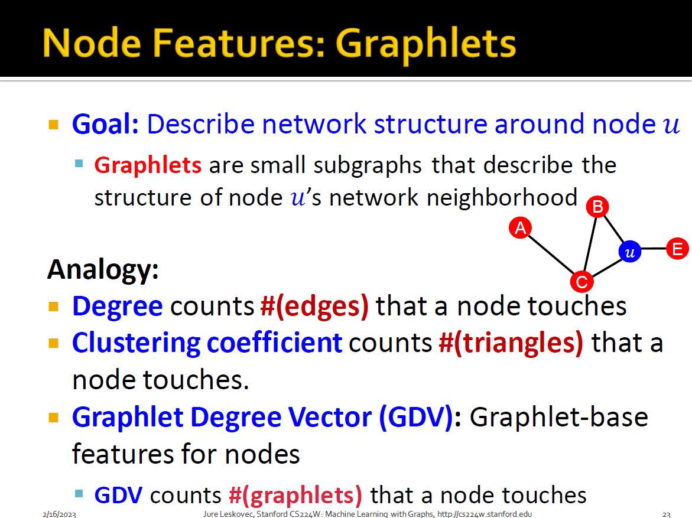

# Traditional Feature-based Methods: Node

## Feature Design

Focus on **undirected graphs**

+ Node-level prediction
+ Link-level prediction
+ Graph-level prediction

## Machine Learning in Graphs

Given:
$$
G=(V,E)
$$
Learn a function:
$$
f:V \to R
$$
How do we learn the function?

## Node-level Tasks

+ Node classification
+ Goal: characterize the structure and position of a node in the network
  + Node degree
  + Node centrality
  + Clustering coefficient
  + Graphlets
+ Degree
  + 
+ Centrality
  + Takes the **node importance in a graph** into account
  + Different ways to model importance:
    + Eigenvector centrality
      + 
      + 
    + Betweenness centrality
      + 
      + 
+ Clustering Coefficient
  + 

+ Graphlets
  + 
  + counting triangles(social network, friend in common)
  + 
  + 
  + Similar to chemical fingerprints(not only 0/1, but counts)
  + **Induced graph**
  + As a signature of a node that describes the topology of node's neighborhood
  + Provides a measure of a node's local network topology

