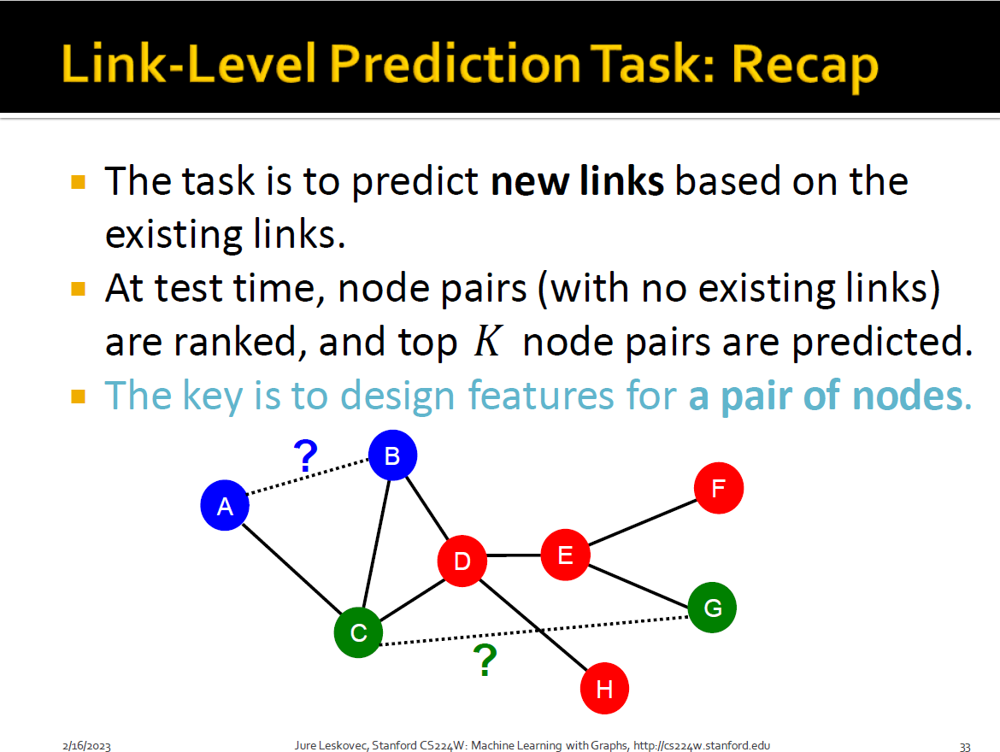
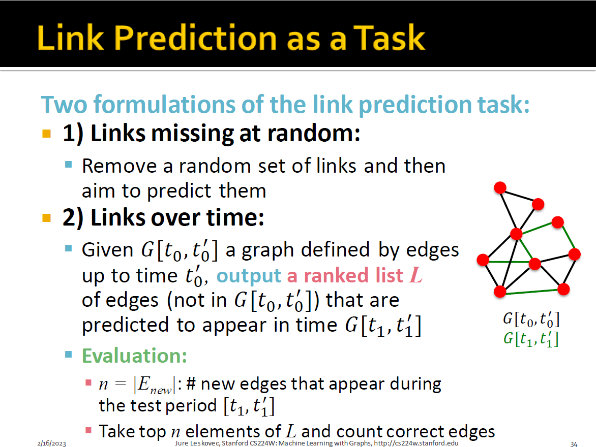
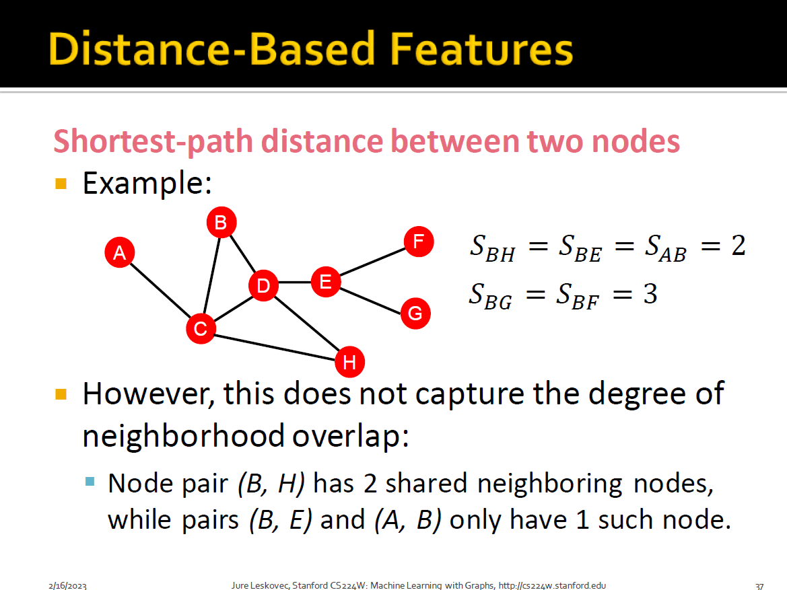
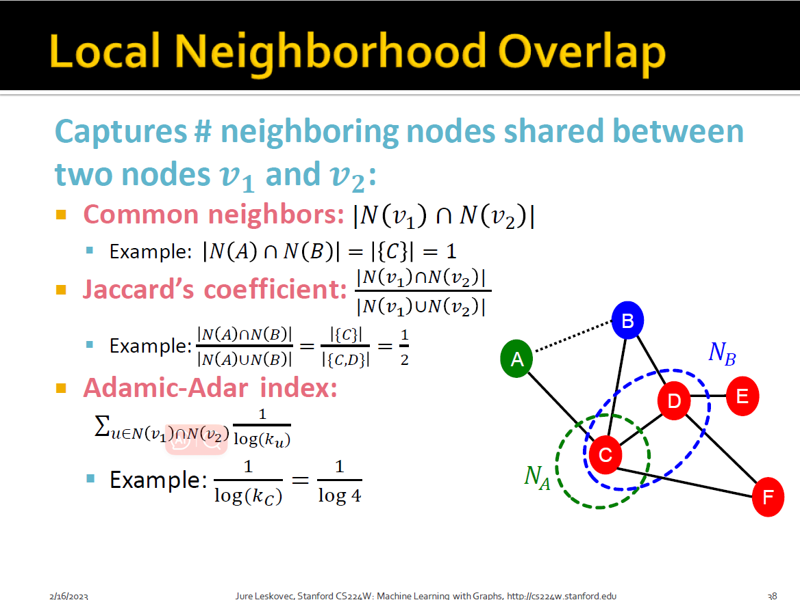
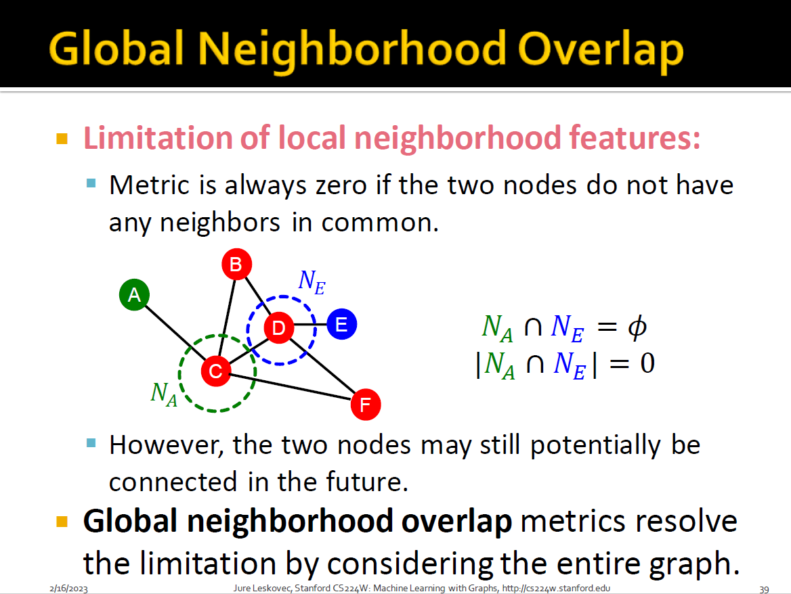
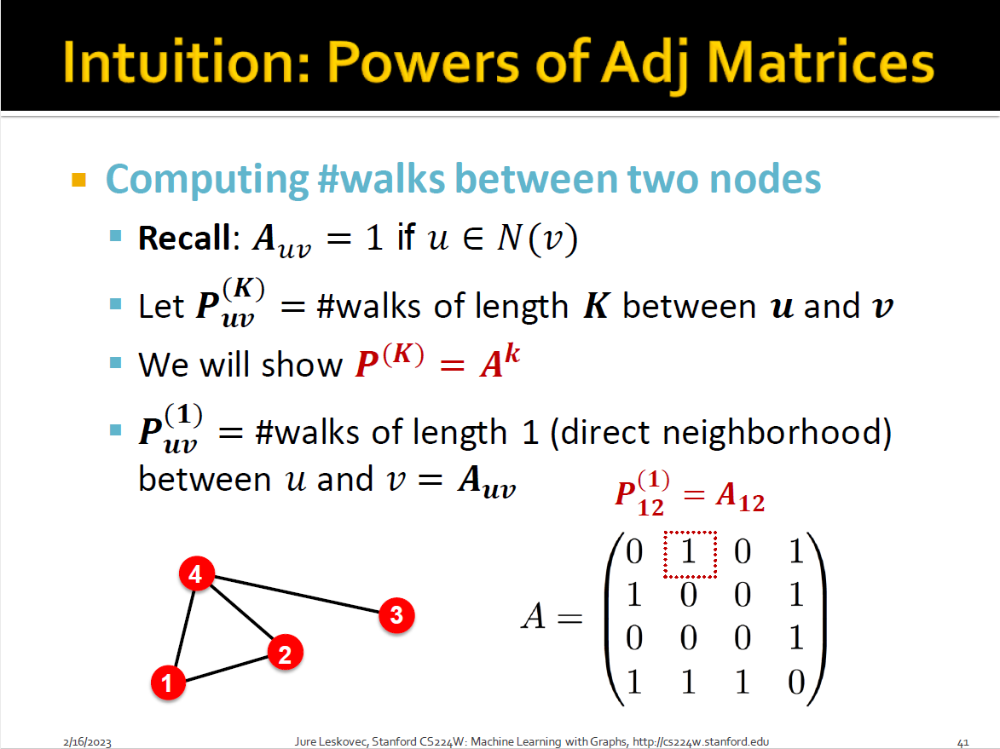
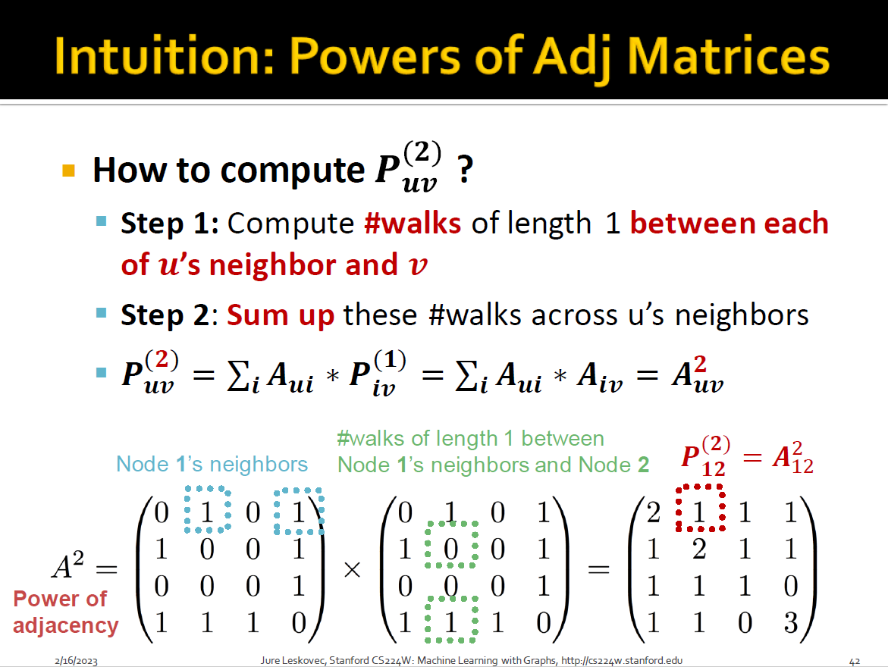
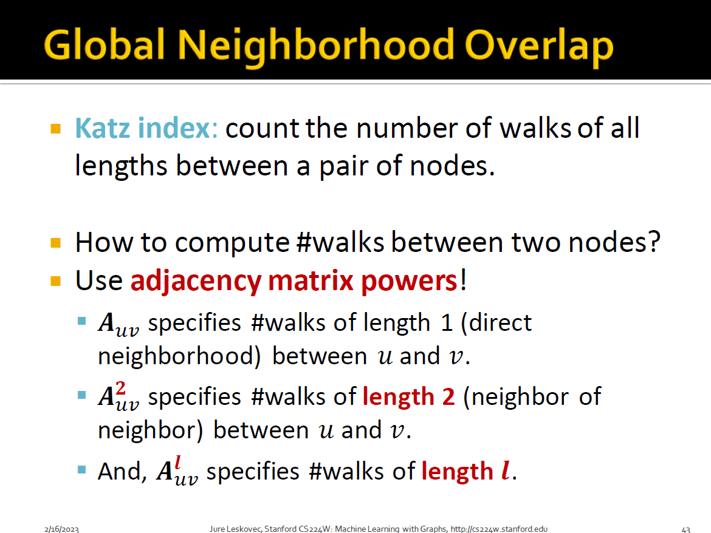
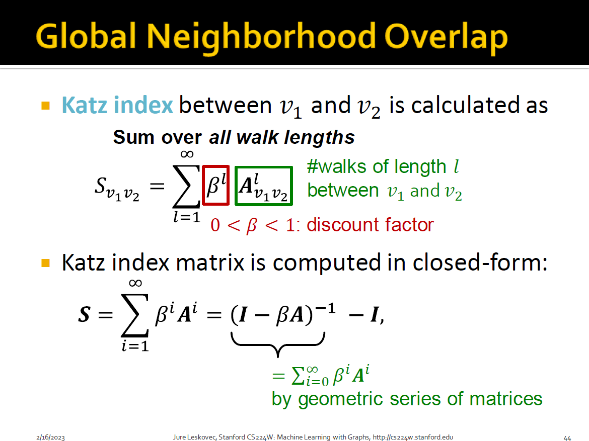

# Traditional Feature-based Methods Link

+ missing data
+ evolving network

## Methodology

+ For each pair of nodes $(x,y)$ computes score $c(x,y)$
  + For example, $c(x,y)$ could be the number of common neighbors of $x$ and $y$
+ Sort pairs $(x,y)$ by the decreasing score $c(x,y)$
+ Predict top $n$ pairs as new links
+ See which of these links actually appear in $G[t_1,t_1']$

## Overview

+ Distance-based feature
+ Local neighborhood overlap
+ Global neighborhood overlap

describe the link between two nodes

## Approaches

+ 
+ 
  + Adamic-Adar index: depends on degree
+ 
  + Katz index: count the number of paths of all lengths between a given pair of nodes
  + Q: How to compute #paths between two nodes?
  + A: **Use powers of the graph adjacency matrix!**
  + 
  + length, not degree
  + 
  + 
  + 
  + 