# Traditional Feature-based Methods: Graph

Goal: features that characterize the structure of an entire graph

## Background: Kernel Methods

Idea: design **kernels instead of feature vectors**

A quick introduction to kernels:

+ Kernel $K(G,G') \in R$ measures similarity b/w data
+ Kernel matrix $K=(K(G,G'))_{G,G'}$ must always be positive semidefinite(i.e., have positive eigenvals)
+ There exists a feature representation $\fi (\cdot)$ such that $K(G,G')=\fi(G)^T\fi(G')$
+ Once the kernel is defined, off-the-shelf ML model, such as *kernel SVM*, can be used to make predictions

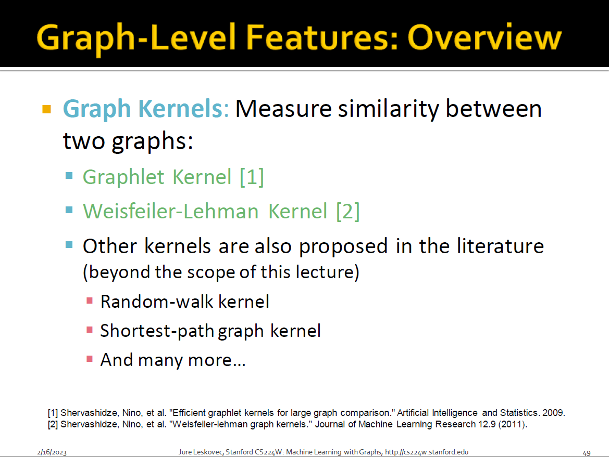

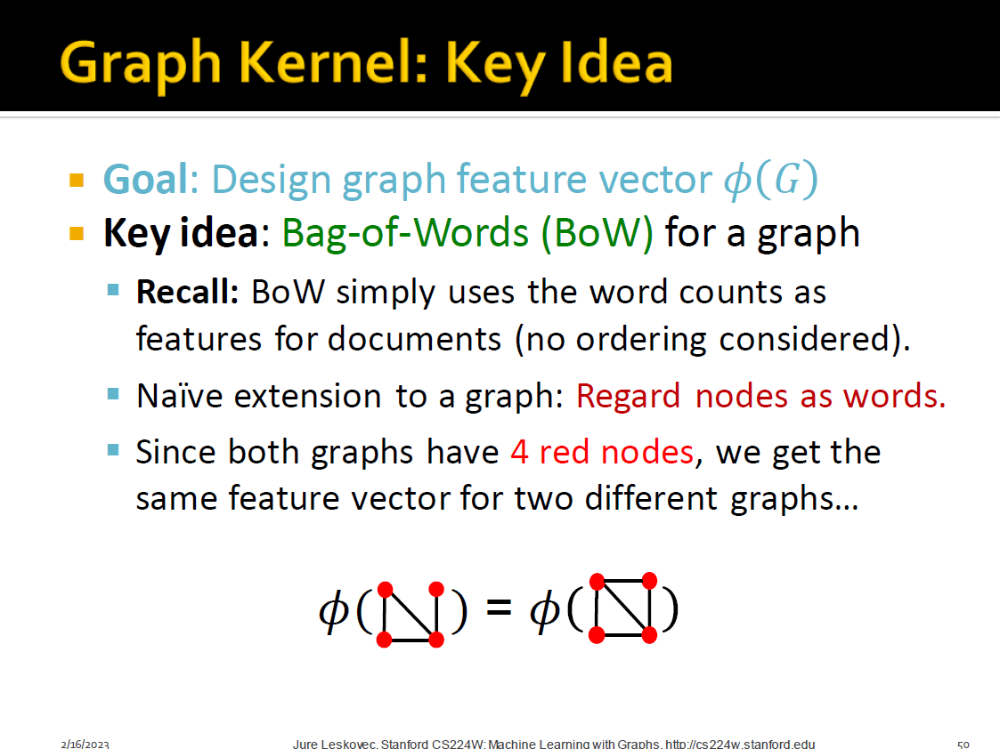

+ bag-of-words => bag-of-nodes?

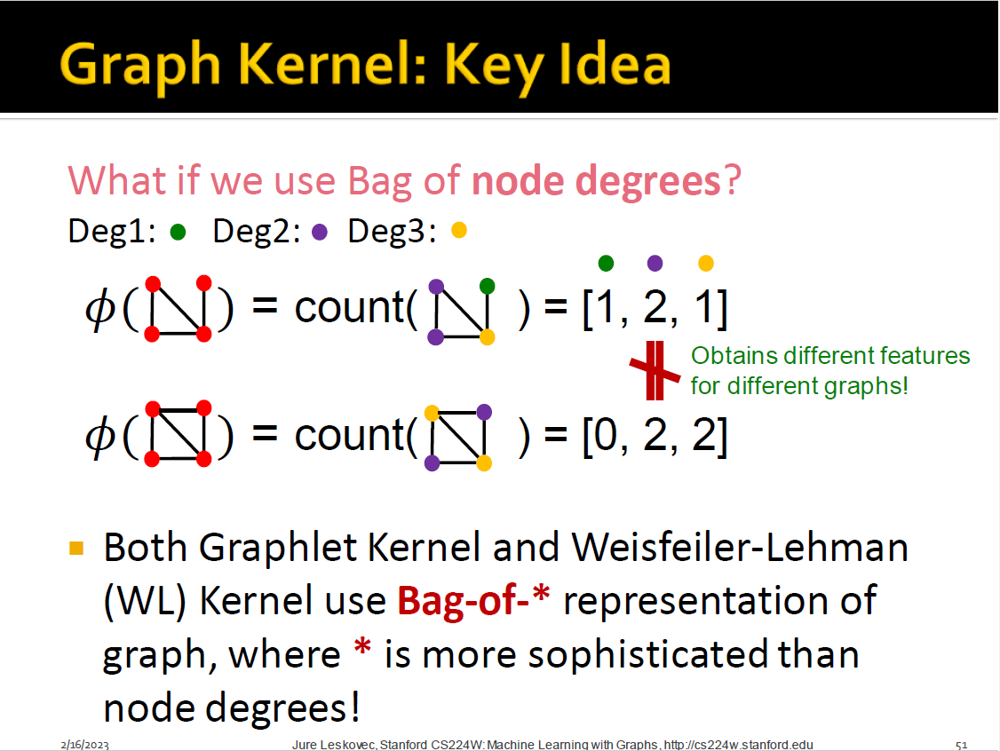

+ bag-of-nodes => bag-of-node degrees?
+ more sophisticated solution?

## Graphlet Features

Key idea: Count the number of different graphlets in a graph

Note: two differences are

+ Nodes in graphlets here do **not need to be connected**(allows for isolated nodes)
+ The graphlets here are not rooted.

Example

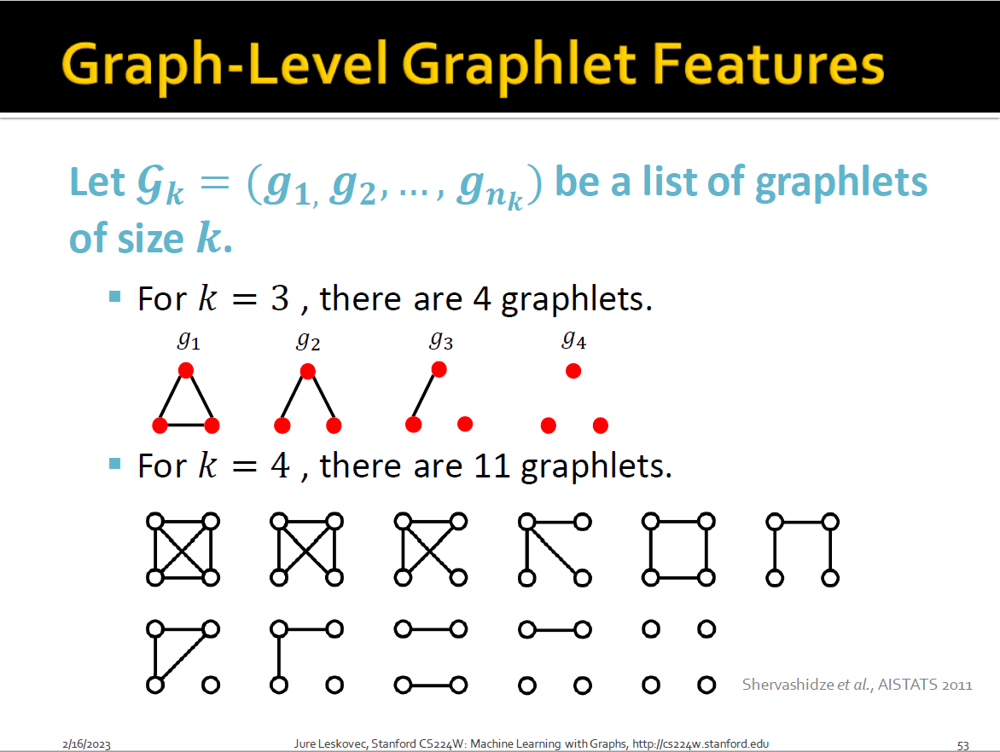

Given a graph $G$, and a graphlet list 
$$
G_k=(g_1,g_2,...,g_{nk})
$$
defines the graphlet count vector $f_G \in R^{nk}$ as
$$
(f_G)_i=\#(g_i \subseteq G) \quad for \quad i=1,2,...,n_k. 
$$
example

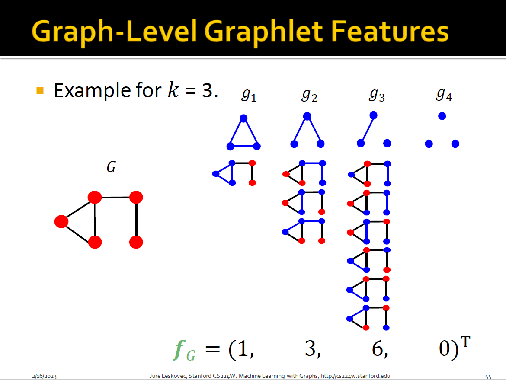

## Graphlet Kernel

Given two graphs, G and G', graphlet kernel is computed as 
$$
K(G,G')=f_G^Tf_{G'}
$$
Problem: different sizes

Solution: normalize each feature vector
$$
h_G=\frac{f_G}{Sum(f_G)}
$$

$$
K(G,G')=h_G^Th_{G'}
$$

Limitations: counting graphlets is expensive

+ Counting size-$k$ graphlets for a graph with size $n$ by enumeration takes $n^k$
+ This is unavoidable in the worst-case since *subgraph isomorphism test*(judging whether a graph is a subgraph of another graph) is **NP-hard**.
+ If a graph's node degree is bounded by $d$, an $O(nd^(k-1))$ algorithm exists to count all the graphlets of size $k$

## Weisfeiler-Lehman Kernel

Goal: design an efficient graph feature descriptor $\phi(G)$

Idea: use neighborhood structure to iteratively enrich node vocabulary

+ Generalized version of Bag of node degrees since node degrees are one-hop neighborhood information

Algorithm: color refinement

Given: A graph $G$ with a set of nodes $V$.

- Assign an initial color $c^{(0)}(v)$ to each node $v$.
- Iteratively refine node colors by

$$
c^{(k+1)}(v)=\operatorname{HASH}\left(\left\{c^{(k)}(v),\left\{c^{(k)}(u)\right\}_{u \in N(v)}\right\}\right) \text {, }
$$

​	where *HASH* maps different inputs to different colors.
- After $K$ steps of color refinement, $c^{(K)}(v)$ summarizes the structure of $K$-hop neighborhood

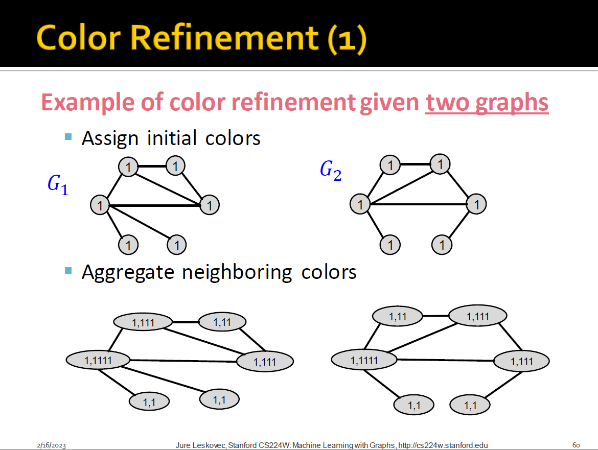

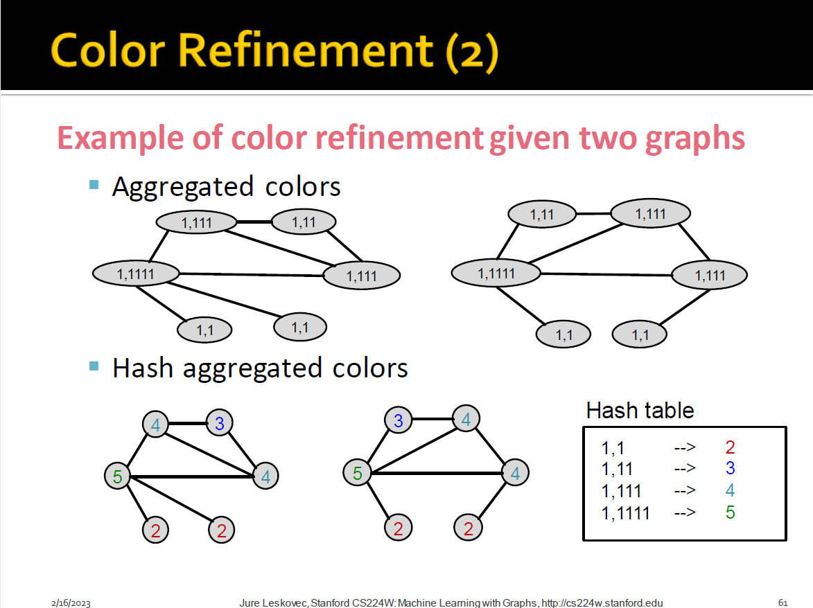

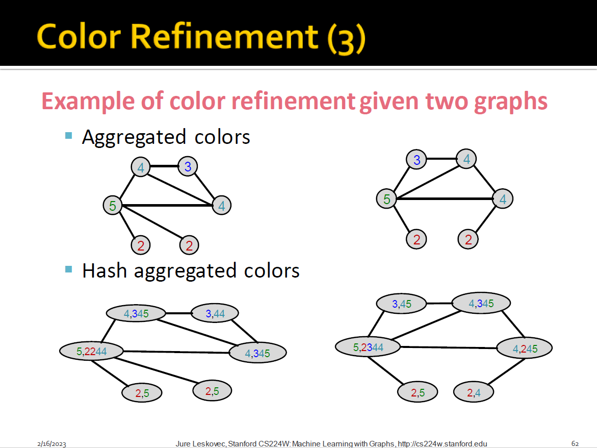

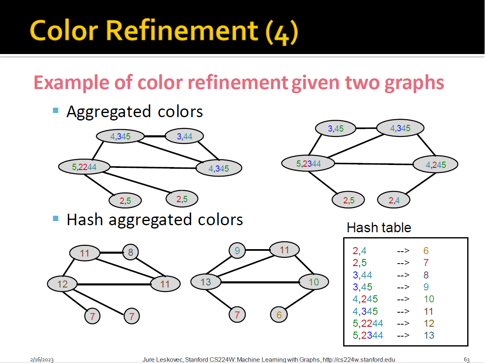

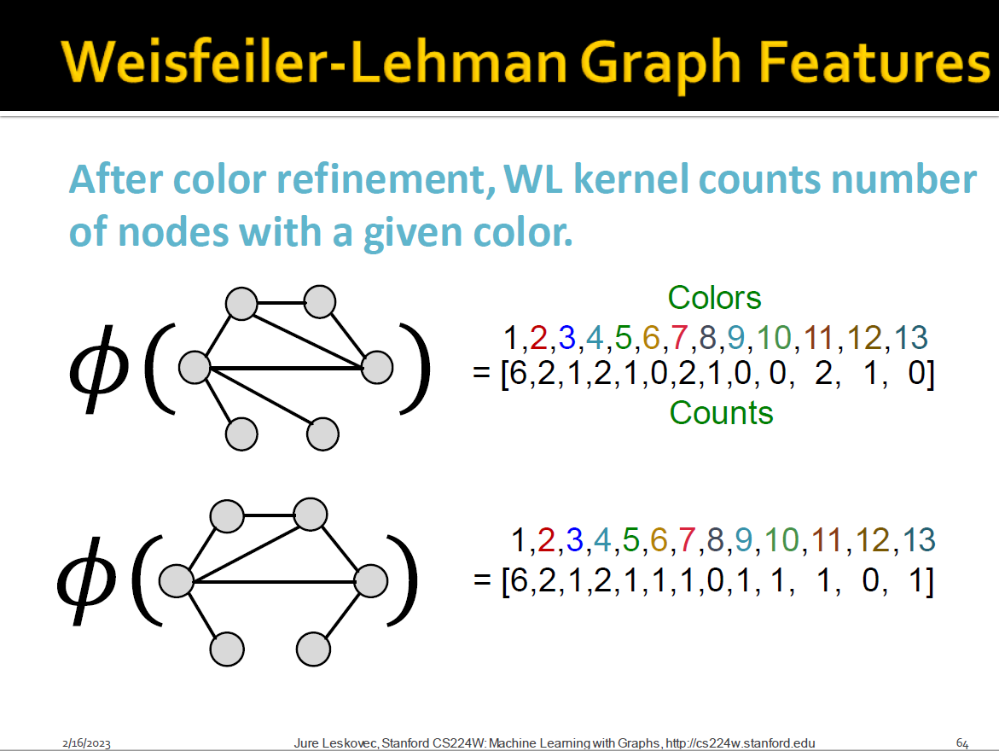

## Weisfeiler-Lehman Kernel

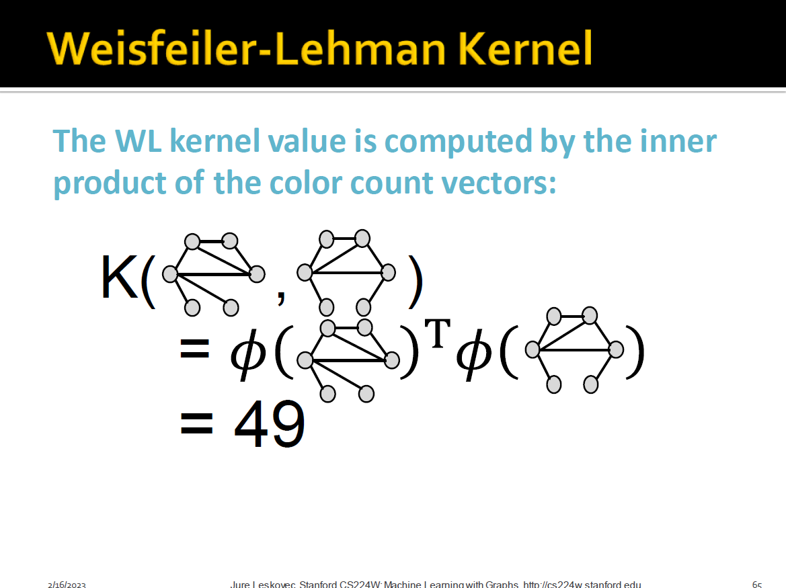

+ WL kernel is computationally efficient
  + The time complexity at each step is linear in #(edges)
+ When computing a kernel value, only colors appeared in the two graphs need to be tracked
  + Thus. #(colors) is at most the total number of nodes
+ Counting colors takes linear-time w.r.t. #(nodes)
+ In total, time complexity is linear in #(edges)