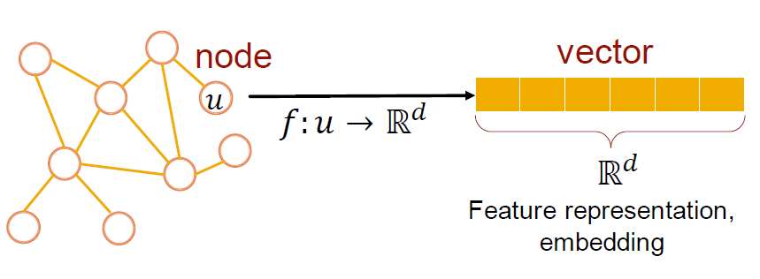
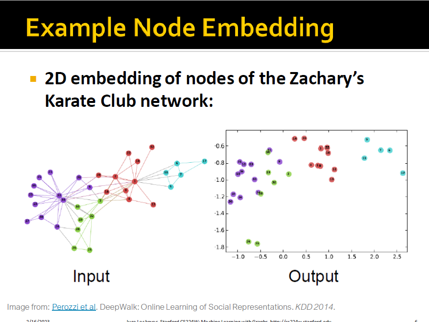
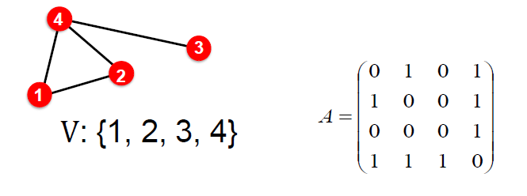
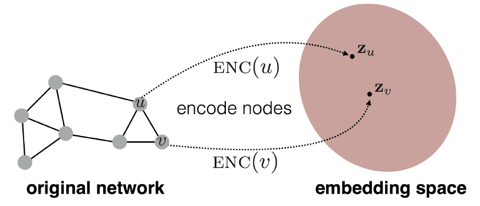
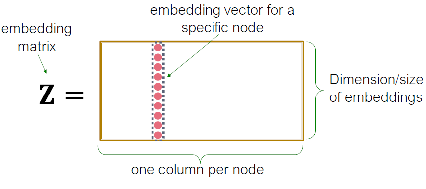

# Node Embeddings

## Recap: Traditional ML for Graphs

1. Input Graph
   + Feature Engineering => Representation Learning
2. Structured Features
3. Learning Algorithm
4. Prediction

## Graph Representation Learning

Goal: Efficient task-independent feature learning for machine learning with graphs(find the mapping)

### Why Embedding?

Task: map nodes into an embedding space

+ Similarity of embeddings between nodes indicates their similarity  in the network
+ Encode network information
+ Potentially used for many downstream predictions
  + Node classification
  + Link prediction
  + Graph classification
  + Anomalous node detection
  + Clustering

### Setup

+ Assume that we have a graph G:
  + $V$ is the vertex set
  + $A$ is the adjacency matrix(assume binary)
  + For simplicity: no node features or extra information is used
  + 

### Embedding Nodes

Goal is to encode nodes so that **similarity in the embedding space**(e.g, dot product) approximates **similarity in the graph**

Goal: align the original network and embedding
$$
\operatorname{similarity}(u,v)\approx z_v^Tz_u
$$

### Learning Node Embeddings

1. Encoder maps from nodes to embeddings
2. Define a node similarity function(i.e., a measure of similarity in the original network)
3. Decoder DEC maps from embeddings to the similarity score
4. Optimize the parameters of the encoder so that

$$
\operatorname{similarity}(u,v)\approx z_v^Tz_u
$$

### Two Key Components

Encoder: maps each node to a low-dimensional vector
$$
\operatorname{ENC}(v)=z_v
$$

+ $z_v$ as a $d$-dimensional embedding(64-1000)

Similarity function: specifies how the relationships in vector space map to the relationships in the original network
$$
\operatorname{similarity}(u,v)\approx z_v^Tz_u
$$

### Shallow Encoding

Simplest encoding approach: Encoder is just an embedding-lookup
$$
\operatorname{ENC}(v)=z_v=Z \cdot v
$$
while $Z$ as matrix(each column is a node embedding[what we learn\optimize])

$v$ as indicator vector, all zeros except a one in column indicating node $v$
$$
Z \in R^{D*\left|V\right|},v \in \mathbb{I}^{|\mathcal{V}|}
$$

**Each node is assigned a unique vector**(method s like DeepWalk, node2vec)

## Framework Summary

+ Encoder + Decoder Framework
  + Shallow encoder: embedding lookup
  + Parameters to optimize: $Z$ which contains node embeddings $z_u$ for all nodes $u \in V$
  + Decoder: based on node similarity
  + Objective: maximize $z^Tz_u$ for node pairs $(u,v)$ that are similar

### How to Define Similarity

+ Key choice of methods is **how they define node similarity**.

+ Should two nodes have a similar embedding if they…
  + are linked?
  + share neighbors?
  + have similar "structural roles"
+ We will now learn node similarity definition that uses random walks, and how to optimize embeddings for such a similarity measure

### Note on Node Embeddings

+ This is unsupervised/self-supervised way of learning node embeddings.
  + We are **not** utilizing node labels
  + We are not utilizing node features
  + The goal is to directly estimate a set of coordinates (i.e., the embedding) of a node so that some aspect of the network structure (captured by DEC) is preserved
+ These embeddings are task independent
  + They are not trained for a specific task but can be used for any task
