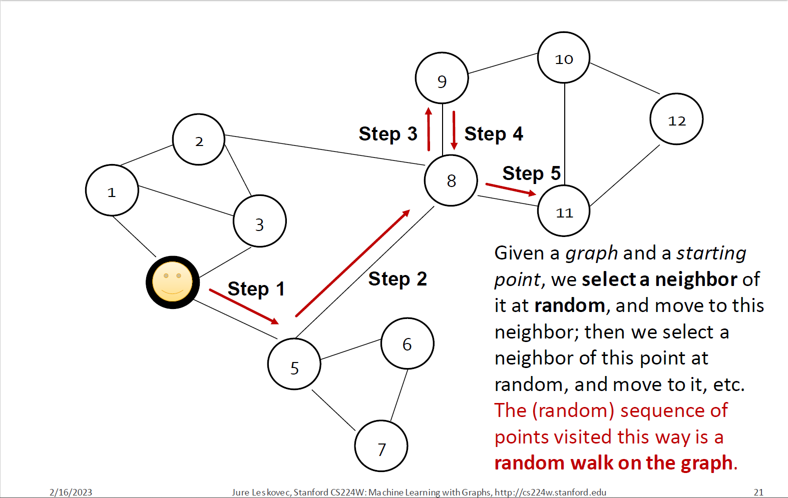
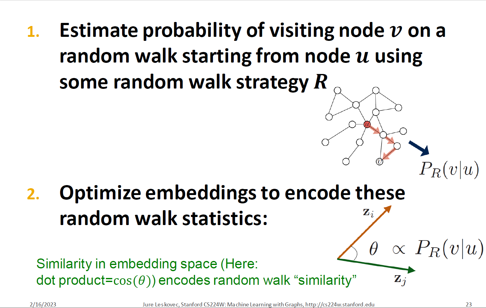
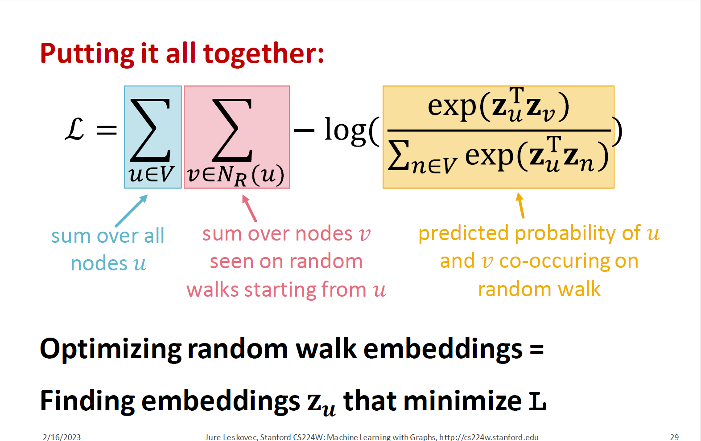
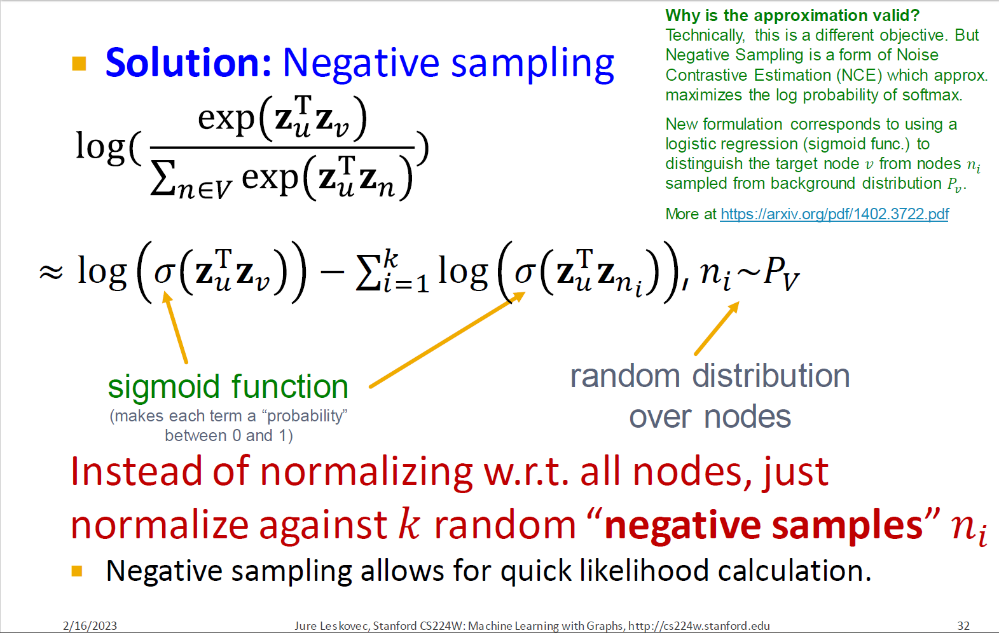
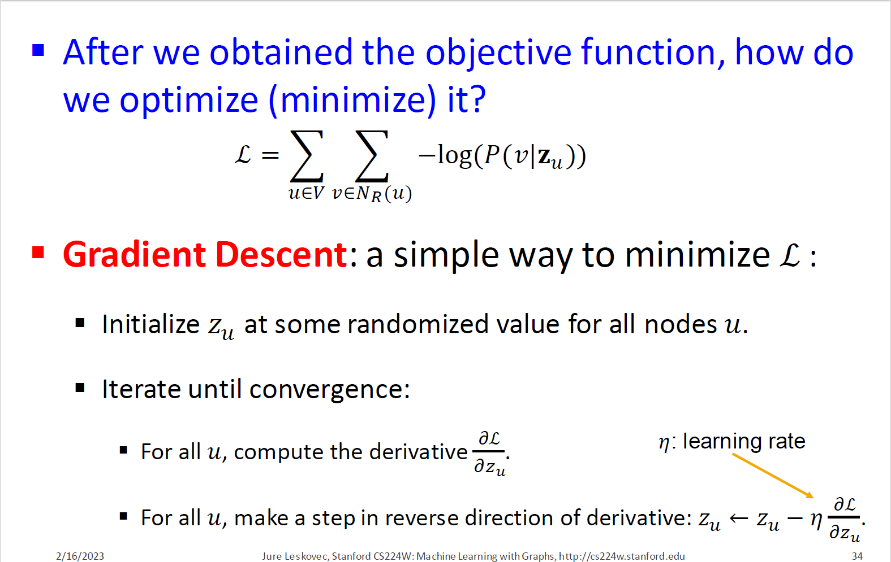
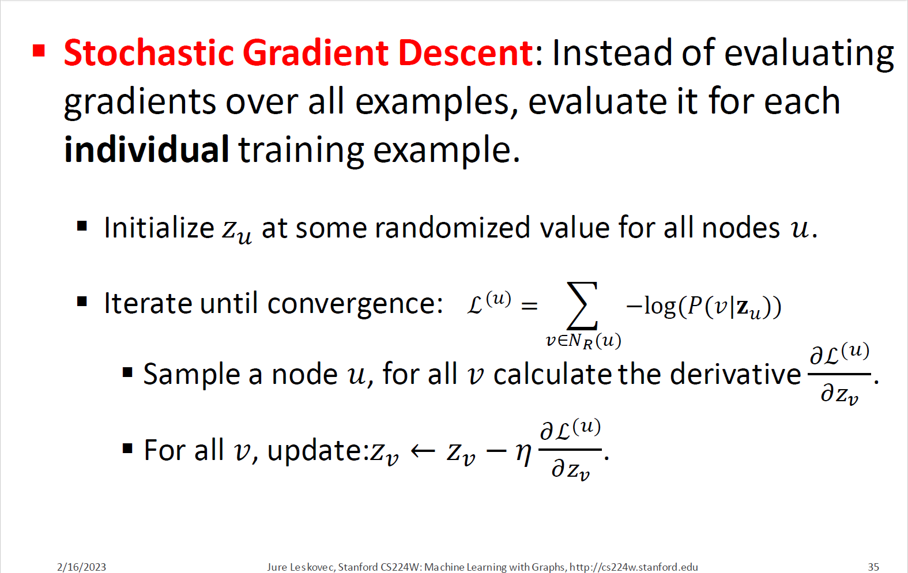
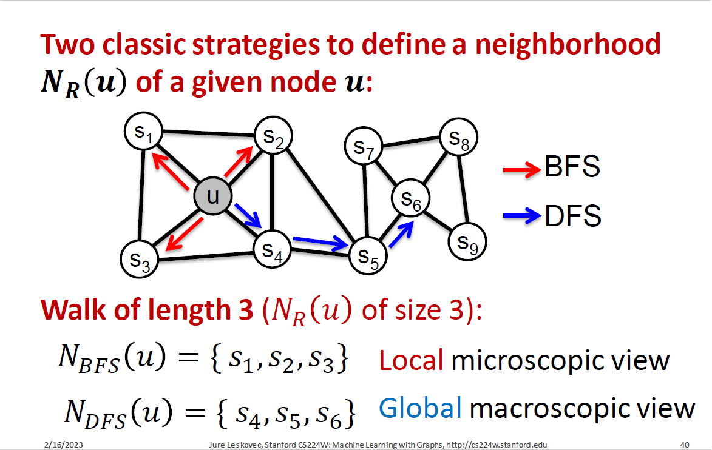
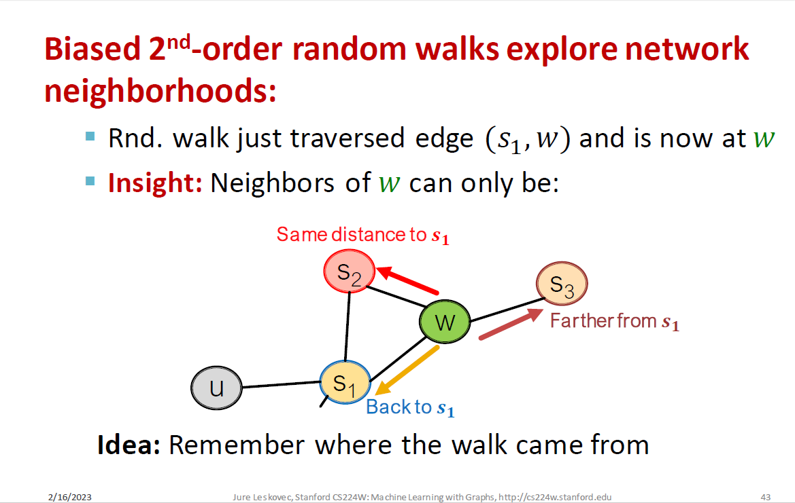
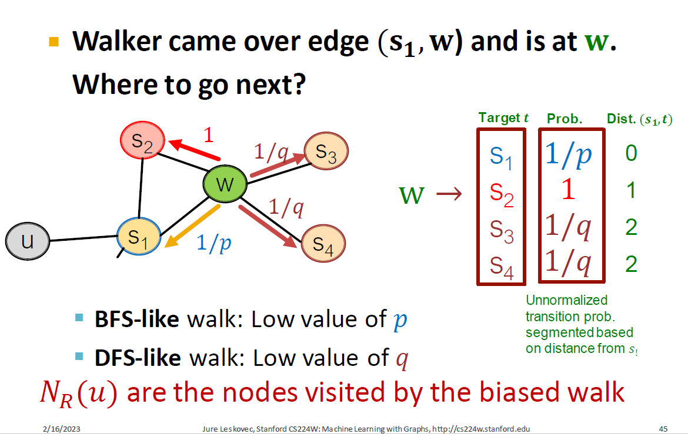

# Random Walk Approaches for Node Embeddings

## Notation

+ Vector $z_u$

  + The embedding of node $u$ (what we aim to find).

+ Probability $P(v |z_u)$

  + The (predicted) probability of visiting node $v$ on random walks starting from node $u$

+ Softmax function

  + Turns vector of $K$ real values (model predictions) into K probabilities that sum to 1:

  + $$
    \sigma(z)_i=\frac{e^{z_i}}{\sum_{j=1}^Ke^{z_j}}
    $$

+ Sigmoid function

  + S-shaped function that turns real values into the range of $(0, 1)$

  + $$
    S(x)=\frac{1}{1+e^{-x}}
    $$

## Random Walk

### Embeddings

$z_u^T z_v \approx$ probability that $u$ and $v$ co-occur on a random walk over the graph

### Why?

1. Expressivity: Flexible stochastic definition of node similarity that **incorporates both local and higher-order neighborhood information Idea**: if random walk starting from node $u$ visits $v$ with high probability, $u$ and $v$ are similar (high-order multi-hop information)
2. Efficiency: Do not need to consider all node pairs when training; only need to consider pairs that co-occur on random walks

## Unsupervised Feature Learning

+ Intuition: Find embedding of nodes in $d$-dimensional space that preserves similarity
+ Idea: Learn node embedding such that nearby nodes are close together in the network
+ Given a node 𝑢, how do we define nearby nodes?
  + $N_R(u)$ … neighborhood of $u$ obtained by some random walk strategy $R$

### Feature Learning as Optimization

+ Given $G=(V,E)$

+ Our goal is to learn a mapping

$$
f:u \rightarrow R^d:f(u)=z_u
$$

+ Log-likelihood objective

$$
\mathop{max}\limits_f \sum_{u \in V}\mathop{log}\mathop{P}(N_R(u)|z_u)
$$

$N_R(u)$ is the neighborhood of node $u$ by strategy $R$

+ Given node $u$, we want to learn feature representations that are predictive of the nodes 
  in its random walk neighborhood $N_R(u)$

### Random Walk Optimization

1.	Run short fixed-length random walks starting from each node $u$ in the graph using some random walk strategy $R$.
2.	For each node $u$ collect $NR(u)$, the multiset* of nodes visited on random walks starting from $u$.
3.	Optimize embeddings according to: Given node $u$, predict its neighbors $NR(u)$.

Equivalently,
$$
\mathcal{L}=\sum_{u \in V} \sum_{v \in N_{R}(u)}-\log \left(P\left(v \mid \mathbf{z}_{u}\right)\right)
$$

- Intuition: Optimize embeddings  $\boldsymbol{z}_{u}$  to maximize the likelihood of random walk co-occurrences.
- Parameterize  $P\left(v \mid \mathbf{z}_{u}\right)$  using softmax:

$$
P\left(v \mid \mathbf{z}_{u}\right)=\frac{\exp \left(\mathbf{z}_{u}^{\mathrm{T}} \mathbf{z}_{v}\right)}{\sum_{n \in V} \exp \left(\mathbf{z}_{u}^{\mathrm{T}} \mathbf{z}_{n}\right)}
$$

Why softmax?

We want node  $v$  to be most similar to node  $u$ (out of all nodes  $n$). 

Intuition:  
$$
\sum_{i} \exp \left(x_{i}\right) \approx   \max _{i} \exp \left(x_{i}\right)
$$

Putting it all together:
$$
\mathcal{L}=\sum_{u \in V} \sum_{v \in N_{R}(u)}-\log \left(\frac{\exp \left(\mathbf{z}_{u}^{\mathrm{T}} \mathbf{z}_{v}\right)}{\sum_{n \in V} \exp \left(\mathbf{z}_{u}^{\mathrm{T}} \mathbf{z}_{n}\right)}\right)
$$

But doing this naively is too expensive

Nested sum over nodes gives $O(|V|^2)$ complexity

To approximate
$$
{\sum_{n \in V} \exp \left(\mathbf{z}_{u}^{\mathrm{T}} \mathbf{z}_{n}\right)}
$$
The solution is negative sampling
$$
\begin{array}{l}
\log \left(\frac{\exp \left(\mathbf{z}_{u}^{\mathrm{T}} \mathbf{z}_{v}\right)}{\sum_{n \in V} \exp \left(\mathbf{z}_{u}^{\mathrm{T}} \mathbf{z}_{n}\right)}\right) \\
\approx \log \left(\sigma\left(\mathbf{z}_{u}^{\mathrm{T}} \mathbf{z}_{v}\right)\right)-\sum_{i=1}^{k} \log \left(\sigma\left(\mathbf{z}_{u}^{\mathrm{T}} \mathbf{z}_{n_{i}}\right)\right), n_{i} \sim P_{V} \\
\end{array}
$$

+ Sample $k$ negative nodes each with prob. proportional to its degree
+ Two considerations for $k$ (#negative samples)
  1. Higher $k$ gives more robust estimates
  2. Higher $k$ corresponds to higher bias on negative events
+ In practice $5 \leq k \leq 20$ 

## Stochastic Gradient Descent

## How should we randomly walk?

+ So far we have described how to optimize embeddings given a random walk strategy $R$
+ What strategies should we use to run these random walks?
  + Simplest idea: Just run fixed-length, unbiased random walks starting from each node (i.e., DeepWalk from Perozzi et al., 2013)
    + The issue is that such notion of similarity is too constrained
+ How can we generalize this?

## Overview of node2vec

+ Goal: Embed nodes with similar network neighborhoods in the feature space
  + We frame this goal as a maximum likelihood optimization problem, independent to the downstream prediction task
+ Key observation: Flexible notion of network neighborhood $N_R(u)$ of node $u$ leads to rich node embeddings
  + Develop biased $2^{nd}$ order random walk $R$ to generate network neighborhood $N_R(u)$ of node $u$
+ Idea: use flexible, biased random walks that can trade off between **local** and **global** views of the network

### BFS vs. DFS

BFS: Micro-view of neighborhood

DFS: Macro-view of neighborhood

### Interpolating BFS and DFS

Biased fixed-length random walk $R$ that given a node $u$ generates neighborhood $N_R(u)$

+ Two parameters:
  + Return parameter $p$:
    + Return back to the previous node
  + In-out parameter $q$:
    + Moving outwards (DFS) vs. inwards (BFS)
    + Intuitively, $q$ is the "ratio" of BFS vs. DFS

### Biased Random Walks

$p$, $q$ model transition probabilities:

+ $p$ ... return parameter
+ $q$ ... "walk away" parameter

## node2vec algorithm

1. Compute random walk probabilities
2. Simulate $r$ random walks of length $l$ starting from each node $u$
3. Optimize the node2vec objective using Stochastic Gradient Descent

+ Linear-time complexity
+ All 3 steps are individually parallelizable

## Summary so far

+ Code idea: Embed nodes so that distances in embedding space reflect node similarities in the original network
+ So what method should I use..?: Random walk approaches are generally more efficient
+ In general: Must choose definition of nodes similarity