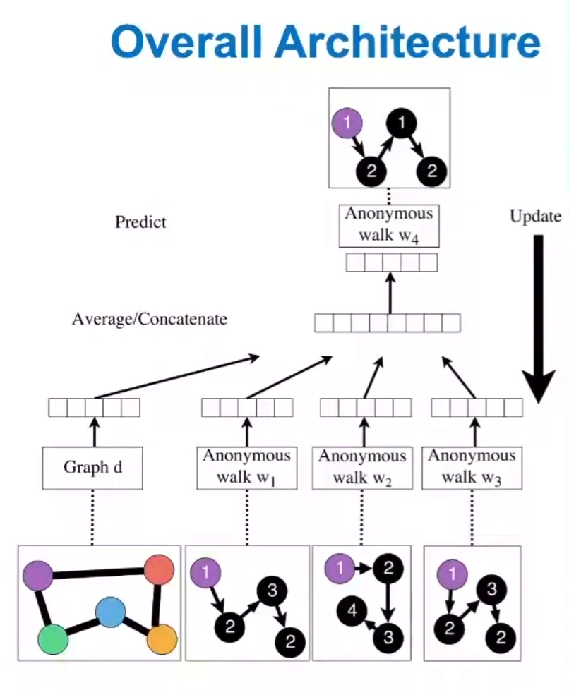

# Embedding Entire Graphs

Goal: Want to embed a subgraph or an entire graph $G$. Graph embedding: $z_G$.

Tasks:

+ Classifying toxic vs. non-toxic molecules
+ Identifying anomalous graphs

## Approach 1

Simple idea 1

+ Run standard graph embedding technique on the (sub)graph $G$
+ Then just sum (or average) the node embeddings in the (sub)graph $G$

$$
z_G=\sum_{V \in G}z_v
$$

+ Used by Duvenaud to classify molecules based on their graph structure

## Approach 2

Idea 2

+ Introduce a "virtual node"(connect to the set of nodes which we want to embed) to represent the (sub)graph and run a standard graph embedding technique

## Approach 3

+ States in **anonymous walks** correspond to the index of the **first time** we visited the node in a random walk

+ Agnostic to the identity of the nodes visited(hence anonymous)

+ Numbers of anonymous walks grows exponentially
  + There are 5 anon. walks $w_i$ of length 3: $w_1$=111,$w_2$=112,$w_3$=121,$w_4$=122,$w_5$=123

## Simple use of Anonymous Walks

+ Simulate anonymous walks $w_i$ of $l$ steps and record their counts
+ **Represent the graph as a probability distribution over these walks**
+ For example
  + Set $l=3$
  + Then we can represent the graph as a 5-dim vector
    + Since there are 5 anonymous walks $w_i$ of length 3: 111, 112, 121, 122, 123
  + $z_G[i]$=probability of anonymous walk $w_i$ in $G$

## Sampling Anonymous Walks

+ Sampling anonymous walks: Generate independently a set of $m$ random walks

+ Represent the graph as a probability distribution over these walks

+ How many random walks $m$ do we need?

  + We want the distribution to have error of more than $\epsilon$ with prob. less than $\delta$

  + $$
    m=[\frac{2}{\epsilon^2}(\operatorname{log}(2^\eta-2)-log(\delta))]
    $$

## New idea: Learn Walk Embeddings

Rather than simply represent each walk by the fraction of time it occurs, we learn embedding $z_i$ of anonymous walk $w_i$

+ Learn a graph embedding $Z_G$ together with all the anonymous walk embeddings $z_i$ 

+ $$
  Z={z_i:i=1...\eta}
  $$

+ where \eta$ is the number of sampled anonymous walks

How to embed walks?

+ Idea: Embed walks s.t. the next walk can be predicted

## Learn Walk Embeddings

+ Run $T$ different random walks from $\u$ each of length $l$

$$
N_r(u)=\{w_1^u,w_2^u...w_T^u\}
$$

+ Learn to predict walks that co-occur in $\Delta$-size window

+ Estimate embedding $z_i$ of anonymous walk $w_i$, Let $\eta$ be number of all possible walk embeddings

  + Objective

  + $$
    \max _{\mathrm{Z}, \mathrm{d}} \frac{1}{T} \sum_{t=\Delta}^{T-\Delta} \log P\left(w_{t} \mid\left\{w_{t-\Delta}, \ldots, w_{t+\Delta}, \mathbf{z}_{\boldsymbol{G}}\right\}\right) 
    $$

  + $$
    P\left(w_{t} \mid\left\{w_{t-\Delta}, \ldots, w_{t+\Delta}, \mathbf{z}_{\boldsymbol{G}}\right\}\right)=\frac{\exp \left(y\left(w_{t}\right)\right)}{\sum_{i=1}^{\eta} \exp \left(y\left(w_{i}\right)\right)}
    $$

  + $$
    y\left(w_{t}\right)=b+U \cdot\left(\operatorname{cat}\left(\frac{1}{2 \Delta} \sum_{i=-\Delta}^{\Delta} z_{i}, \mathbf{z}_{\boldsymbol{G}}\right)\right)
    $$

    + $$
      \operatorname{cat}\left(\frac{1}{2 \Delta} \sum_{i=-\Delta}^{\Delta} z_{i}, z_{G}\right) 
      $$

    + 

    + means an average of anonymous walk embeddings in window, concatenated with the graph embedding  $z_{G}$

    + $b \in \mathbb{R}, U \in \mathbb{R}^{D}$ are learnable parameters. This represents a linear layer.

+ We obtain the graph embedding $z_G$ (learnable parameter) after optimization
+ Use $z_G$ to make predictions (e.g. graph classification)
  + Option1: Inner product Kernel $z^T_{G_{1}}z_{G_{2}}$ (Lecture 2)
  + Option2: Use a neural network that takes $z_G$ as input to classify

## Summary

We discussed 3 ideas to graph embeddings:

+ Approach 1: Embed nodes and sum/avg them
+ Approach 2: Create super node that spans the (sub) graph and then embed that node
+ Approach 3: Anonymous Walk Embeddings
  + Idea 1: Sample the anon. walks and represent the graph as fraction of times each anon walk occurs
  + Idea 2: Embed anonymous walks, concatenate their embeddings to get a graph embedding

## Preview: Hierarchical Embeddings

+ We can hierarchically cluster nodes in graphs,and sum/avg the node embeddings according to these clusters.

## How to Use Embeddings

-  How to use embeddings  $z_{i}$  of nodes:
   -  Clustering/community detection: Cluster points  $z_{i}$ 
   -  Node classification: Predict label of node  $i$  based on $z_{i}$ 
   -  Link prediction: Predict edge  $(i, j)$  based on  $\left(z_{i}, z_{j}\right)$ 
      -  Where we can: concatenate, avg, product, or take a difference between the embeddings:
         -  Concatenate:  $f\left(\mathbf{z}_{i}, \mathbf{z}_{j}\right)=g\left(\left[\mathbf{z}_{i}, \mathbf{z}_{j}\right]\right)$
         -  Hadamard:  $f\left(\mathbf{Z}_{i}, \mathbf{Z}_{j}\right)=g\left(\mathbf{Z}_{i} * \boldsymbol{Z}_{j}\right)$  (per coordinate product)
         -  Sum/Avg:  $f\left(\mathbf{z}_{i}, \boldsymbol{z}_{j}\right)=g\left(\mathbf{z}_{i}+\mathbf{z}_{j}\right)$ 
         -  Distance:  $f\left(\mathbf{z}_{i}, \mathbf{z}_{j}\right)=g\left(\left\|\mathbf{z}_{i}-\mathbf{z}_{j}\right\|_{2}\right)$ _
   -  Graph classification: Graph embedding $z_G$ via aggregating node embeddings or virtual-node. Predict label based on graph embedding  $\mathbf{z}_{G}$.