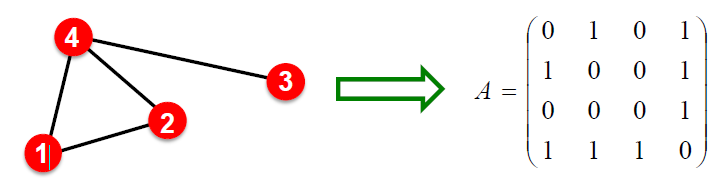
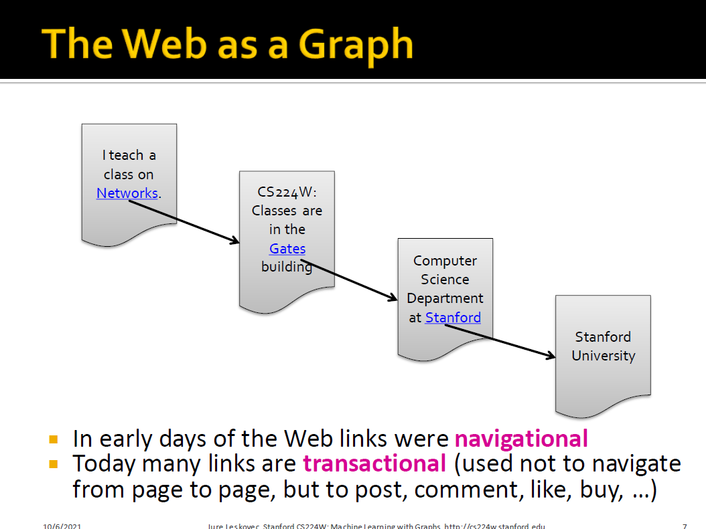
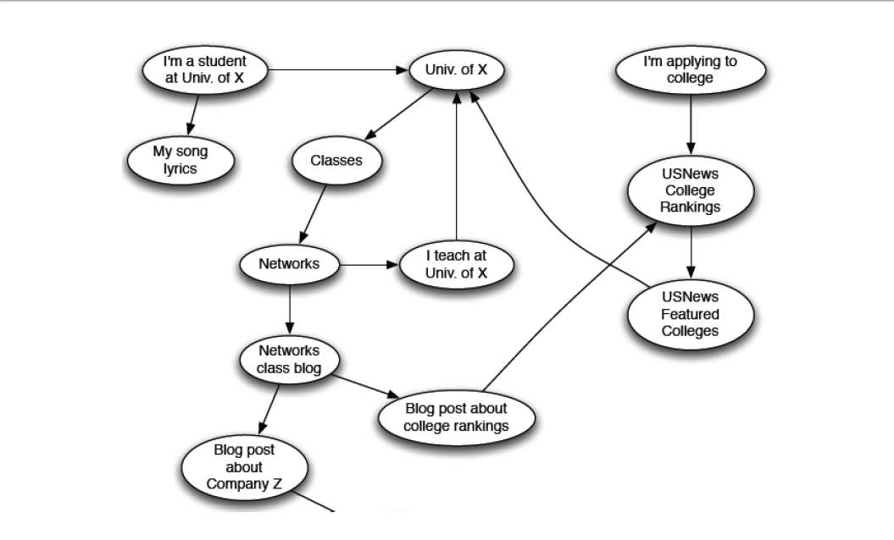
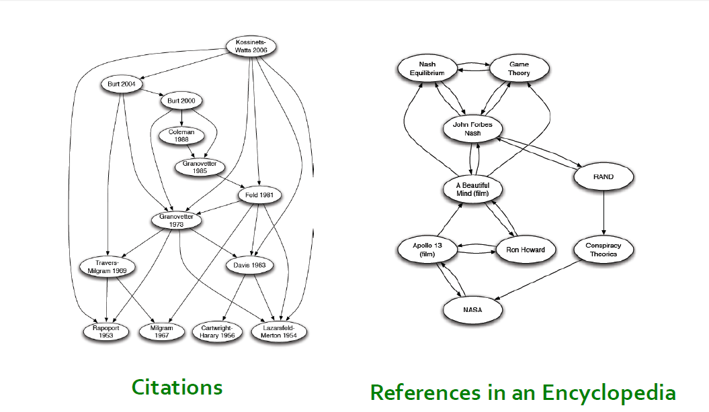
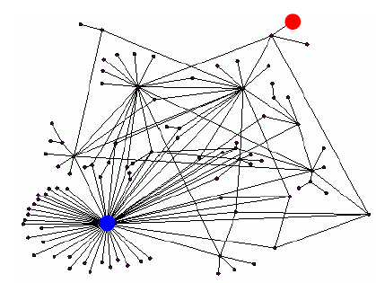
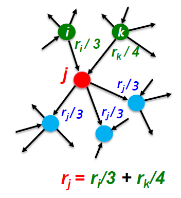
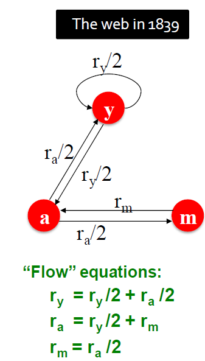
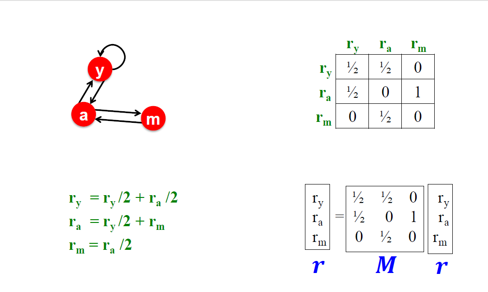
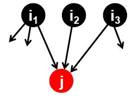
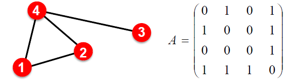

# PageRank

## Graph as Matrix

+ Treating a graph as matrix allows us to:
  + Determine node importance via random walk (PageRank)
  + Obtain node embeddings via matrix factorization (MF)
  + View other node embeddings (e.g. Node2Vec) as MF
+ Random walk, matrix factorization and node embeddings are closely related!

## Example: The Web as a Graph

Q: What does the Web “look like” at a global level?

+ Web as a graph:
  + Nodes = web pages
  + Edges = hyperlinks
  + Side issue: What is a node?
    + Dynamic pages created on the fly
    + “dark matter” inaccessible database generated pages

## The Web as a Directed Graph

## Other Information Networks

## What Does the Web Look Like?

+ How is the Web linked?
+ What is the “map” of the Web?

Web as a **directed graph** 

+ Given node $v$, what nodes can $v$ reach?
+ What other nodes can reach $v$

## Ranking Nodes on the Graph

+ All web pages are not equally “important”
  + thispersondoesnotexist.com vs. www.stanford.edu
+ There is large diversity in the web graph node connectivity.
+ So, let’s rank the pages using the web graph link structure!

## Link Analysis Algorithms

We will cover the following Link Analysis approaches to compute the importance of nodes in a graph:

+ PageRank
+ Personalized PageRank (PPR)
+ Random Walk with Restarts

## Links as Votes

+ Idea: Links as votes
  + Page is more important if it has more links
    + In coming links? Out going links?
+ Think of in links as votes:
  + www.stanford.edu has 23,400 in links
  + thispersondoesnotexist.com has 1 in link
+ Are all in links equal?
  + Links from important pages count more
  + **Recursive** question!

## PageRank: The "Flow" model

+ A “vote” from an important page is worth more:
  + Each link’s vote is proportional to the importance of its source page
  + If page $i$ with importance $r_i$ has $d_i$ out links, each link gets $r_i/d_i$ votes
  + Page $j$ ’s own importance $r_j$ is the sum of the votes on its in links

+ A page is important if it is pointed to by other important pages
+ Define “rank” $r_j$ for node $j$

$$
r_{j}=\sum_{i \rightarrow j} \frac{r_{i}}{d_{i}}
$$

$d_i$ as out-degree of node $i$

You might wonder: Let’s just use Gaussian elimination to solve this system of linear equations. Bad idea! (**not scalable**)

## PageRank: Matrix Formulation

- Stochastic adjacency matrix $M$  
    - $d_i$ is the outdegree of node $i$
    - If  $j \rightarrow i$ , then  $M_{ij}=\frac{1}{d_j}$ 

        - $M$ is a column stochastic matrix
            - Columns sum to $1$

- Rank vector $r$: An entry per page
  - $r_i$  is the importance score of page $i$
  - $\sum_{i} r_i=1$

- The flow equations can be written

$$
r=M \cdot r \quad r_{j}=\sum_{i \rightarrow j} \frac{r_{i}}{d_{i}}
$$

## Example: Flow Equations & M

## Connection to Random Walk

+ Imagine a random web surfer:
  + At any time $t$, surfer is on some page $i$
  + At time $t+1$, the surfer follows an out link from $i$ uniformly at random
  + Ends up on some page $j$ linked from $i$
  + Process repeats indefinitely
+ Let:
  + $p(t)$… vector whose $i^{th}$ coordinate is the prob. that the surfer is at page $i$ at time $t$
  + So, $p(t)$ is a probability distribution over pages

## The Stationary Distribution

+ Where is the surfer at time $t+1$？

  + Follow a link uniformly at random

    + $$
      p(t+1)=M \cdot p(t)
      $$

+ Suppose the random walk reaches a state $p(t+1)=M \cdot p(t)=p(t)$ then $p(t)$ is **stationary distribution** of a random walk

+ Our original rank vector $r$ satisfies $r=M \cdot r$

  + So, $r$ is a stationary distribution for the random walk

## Recall Eigenvector of A Matrix

- Recall from lecture 2 (eigenvector centrality), let $A \in\{0,1\}^{n \times n}$ be an adj. matrix of undir. graph:

- Eigenvector of adjacency matrix: vectors satisfying $\lambda c=Ac$ 
- $c$: eigenvector;  $\lambda$: eigenvalue
- Note:
  - This is the definition of eigenvector centrality (for undirected graphs)
  - PageRank is defined for directed graphs

## Eigenvector Formulation

- The flow equation:
  - $1 \cdot r=M \cdot r$

- **So the rank vector $r$ is an eigenvector of the stochastic adj. matrix $M$(with eigenvalue $1$)**
  - Starting from any vector  $\boldsymbol{u}$, the limit $\boldsymbol{M}(\boldsymbol{M}(\ldots \boldsymbol{M}(\boldsymbol{M} \boldsymbol{u})))$ is the **long-term distribution** of the surfers
    - **PageRank** = Limiting distribution = **principal eigenvector** of  M 
    - Note: If $\boldsymbol{r}$ is the limit of the product  $\boldsymbol{M} \boldsymbol{M} \ldots \boldsymbol{M} \boldsymbol{u}$, then  $\boldsymbol{r}$  satisfies the **flow equation** $1 \cdot \boldsymbol{r}=\boldsymbol{M r}$ 
    - So $\boldsymbol{r}$ is the **principal eigenvector** of $\boldsymbol{M}$ with eigenvalue $1$
- We can now efficiently solve for  $r$!
  - The method is called **Power iteration**

## PageRank: Summary

- PageRank:
  - Measures importance of nodes in a graph using the link structure of the web
  - Models a random web surfer using the stochastic adjacency matrix $M$
  - PageRank solves  $r=Mr$ where $r$ can be viewed as both the **principle eigenvector** of $M$ and as the stationary distribution of a random walk over the graph