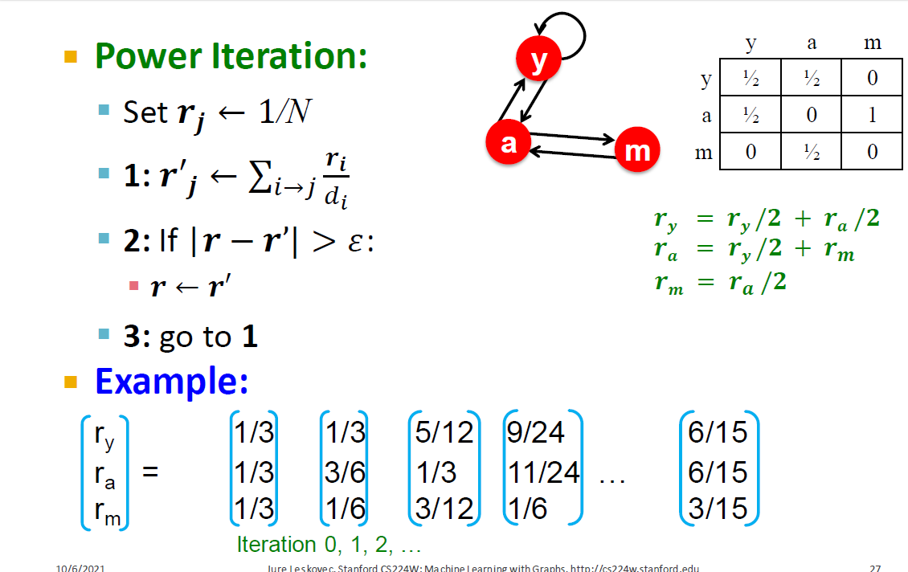
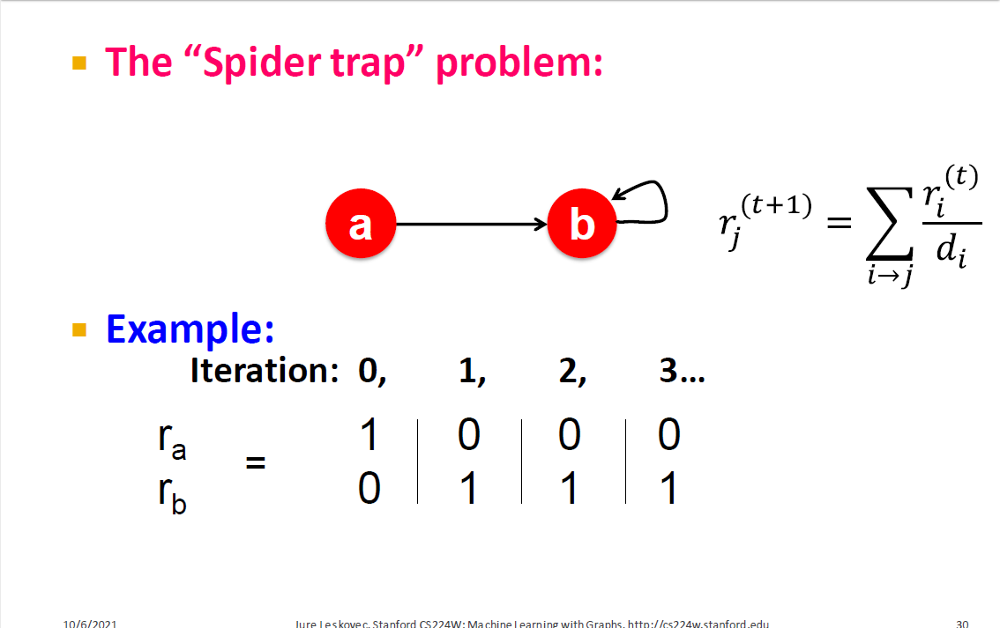
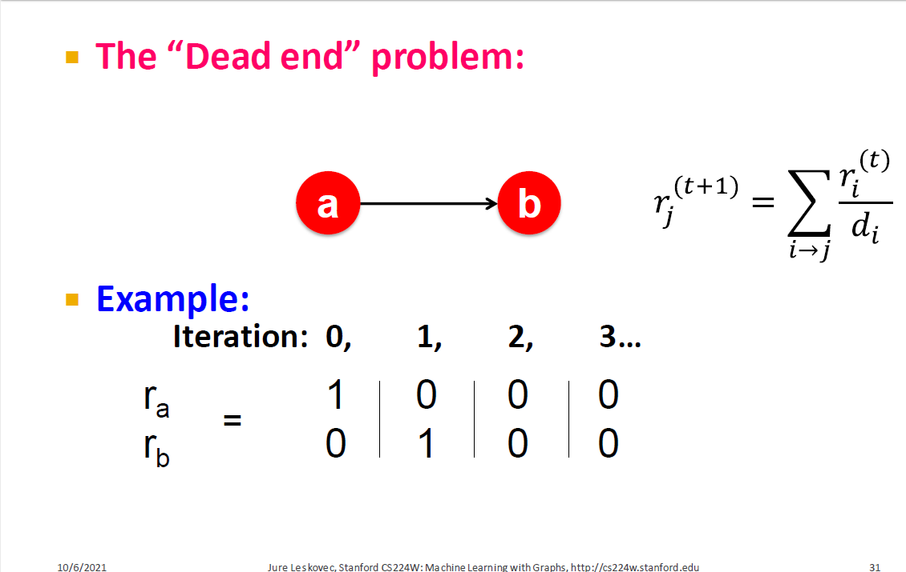
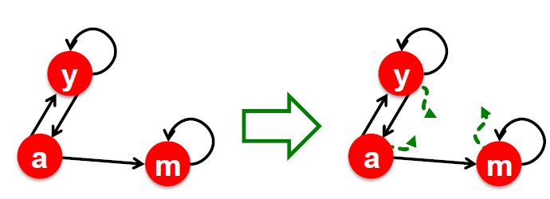
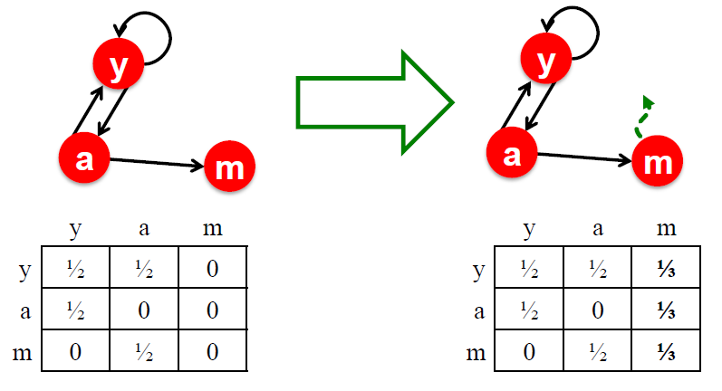
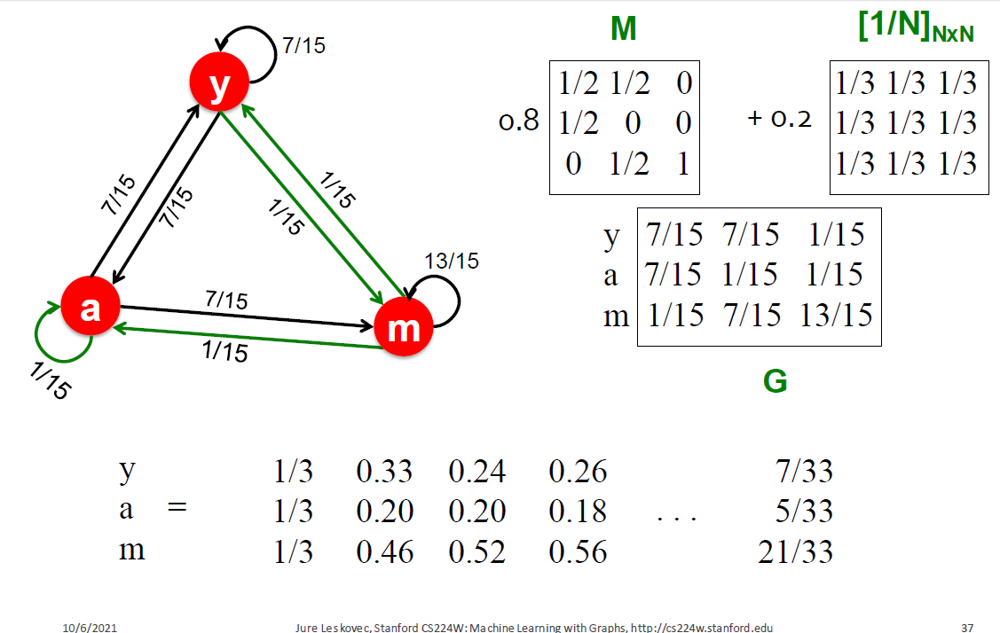
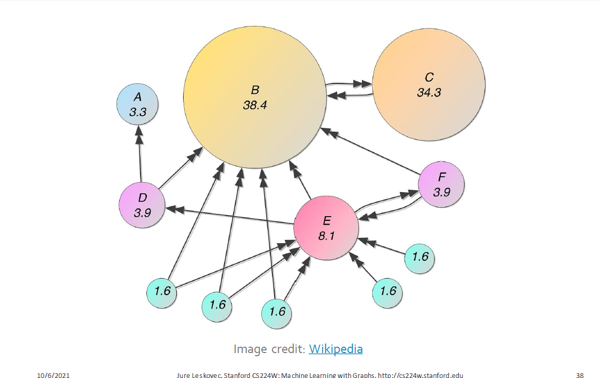

# PageRank: How to solve

Given a graph with $n$ nodes, we use an iterative procedure:

+ Assign each node an initial page rank
+ Repeat until convergence  $\left(\sum_{i}\left|r_{i}^{t+1}-r_{i}^{t}\right|<\epsilon\right)$
  + Calculate the page rank of each node

$$
r_{j}^{(t+1)}=\sum_{i \rightarrow j} \frac{r_{i}^{(t)}}{d_{i}}
$$

$ d_{i} \ldots .$ out-degree of node $i$ 

## **Power Iteration Method**

- Given a web graph with  N  nodes, where the nodes are pages and edges are hyperlinks
- Power iteration: a simple iterative scheme
  - Initialize:  $\boldsymbol{r}^{(0)}=[1 / N, \ldots .1 / N]^{T}$
  - Iterate:  $\boldsymbol{r}^{(\boldsymbol{t}+\mathbf{1})}=\boldsymbol{M} \cdot \boldsymbol{r}^{(t)}$ 
  - Stop when  $\left|\boldsymbol{r}^{(\boldsymbol{t}+\mathbf{1})}-\boldsymbol{r}^{(t)}\right|_{1}<\varepsilon$

$$
r_{j}^{(t+1)}=\sum_{i \rightarrow j} \frac{r_{i}^{(t)}}{d_{i}}
$$

$d_{i} \ldots .$ out-degree of node $i$ 

$|x|_{1}=\sum_{1}^{N}\left|x_{i}\right|$ is the $L_{1}$ norm 

Can use any other vector norm, e.g., Euclidean

About 50 iterations is sufficient to estimate the limiting solution

## PageRank: Three Questions

$r_{j}^{(t+1)}=\sum_{i \rightarrow j} \frac{r_{i}^{(t)}}{d_{i}}$ or equivalently $r=Mr$

+ Does this converge?
+ Does it converge to what we want?
+ Are results reasonable?

## PageRank: Problems

Two problems:

+ Some pages are dead ends (have no out links)
  + Such pages cause importance to “leak out”
+ Spider traps (all out links are within the group)
  + Eventually spider traps absorb all importance

## Solution to Spider Traps

+ Solution for spider traps: At each time step, the random surfer has two options
  + With prob. $\beta$ , follow a link at random
  + With prob. $1-\beta$ jump to a random page
  + Common values for $\beta$ are in the range $0.8$ to $0.9$
+ Surfer will teleport out of spider trap within a few time steps

## Solution to Dead Ends

+ Teleports: Follow random teleport links with total probability 1.0 from dead ends
  + Adjust matrix accordingly

## Why Teleports Solve the Problem

Why are dead ends and spider traps a problem and why do teleports solve the problem?

+ Spider traps are not a problem, but with traps PageRank scores are **not** what we want
  + Solution: Never get stuck in a spider trap by teleporting out of it in a finite number of steps
+ Dead ends are a problem
  + The matrix is not column stochastic so our initial assumptions are not met
  + Solution: Make matrix column stochastic by always teleporting when there is nowhere else to go

## Solution: Random Teleports

+ Google’s solution that does it all: At each step, random surfer has two options:
  + With probability $\beta$, follow a link at random
  + With probability $1-\beta$, jump to some random page

+ PageRank equation

  + $$
    r_{j}=\sum_{i \rightarrow j} \beta \frac{r_{i}}{d_{i}}+(1-\beta) \frac{1}{N}
    $$

  + $d_i$ … out degree of node $i$

  + This formulation **assumes that $M$ has no dead ends**. We can either preprocess matrix $M$ to remove all dead ends or explicitly follow random teleport links with probability $1.0$ from dead ends

## The Google Matrix

- PageRank equation [Brin-Page, '98]

$$
r_{j}=\sum_{i \rightarrow j} \beta \frac{r_{i}}{d_{i}}+(1-\beta) \frac{1}{N}
$$

- The Google Matrix $G$:
$$
 P=\beta M+(1-\beta)\left[\frac{1}{N}\right]_{N \times N}
$$
 $[1 / \mathrm{N}]_{\mathrm{N*N} \ldots} \mathrm{N}$ by matrix

- We have a recursive problem:  $r=G \cdot r$ and the power method still works
- What is $\beta$?
  - In practice  $\beta$=$0.8$, $0.9$  (make $5$ steps on avg., jump)
- Here we don't do simulation, we assume it is infinitely long and we can compute this random walk by basically solving this recursive equation by basically computing the **leading eigenvector of this graph-transformed matrix**

$\beta=0.8$

+ all nodes have importance (even without in links, cause there are teleports)
+ more (important) in links => more importance

## Summary

+ PageRank solves for $r=Gr$ and can be efficiently computed by power iteration of the stochastic adjacency matrix ($G$)
+ Adding random uniform teleportation solves issues of dead ends and spider traps
