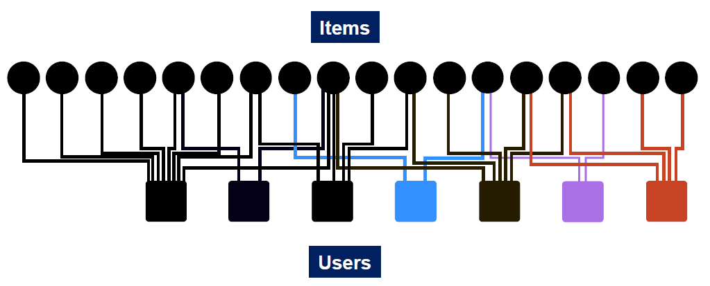
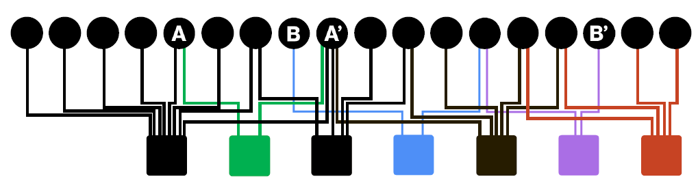
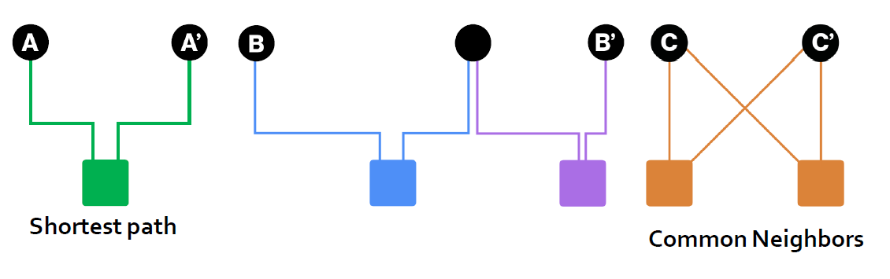
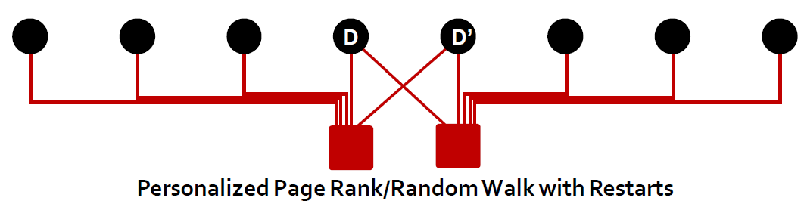
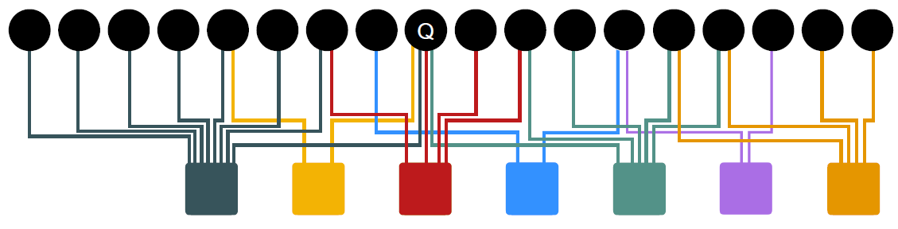
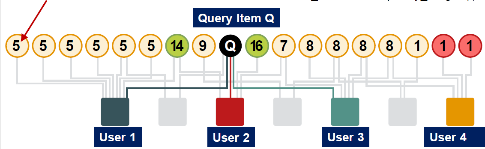

# Random Walk with Restarts

Given: A bipartite graph representing user and item interactions (e.g. purchase)



## Bipartite User-Item Graph

+ Goal: Proximity on graphs
  + What items should we recommend to a user who interacts with item $Q$?
  + Intuition : if items $Q$ and $P$ are interacted by similar users, recommend $P$ when user interacts with $Q$…
+ Which is more related $A$, $A'$ or $B$, $B'$?
  + 

## Node Proximity Measurements

+ Which is more related $A$, $A'$, $B$, $B'$ or $C$, $C'$?
  + 
  + Merge **shortest path** and **common neighbors**
  + 
  + Less strong than $C$, $C'$

## Proximity on Graphs

+ PageRank:
  + Ranks nodes by “importance”
  + Teleports with uniform probability to any node in the network
+ Personalized PageRank:
  + Ranks proximity of nodes to the teleport nodes $S$ (**subset**, not anywhere)
+ Proximity on graphs:
  + Q: What is most related item to Item $Q$?
  + Random Walks with Restarts
    + Teleport **back to the starting node**: $S=\{Q\}$

## Idea: Random Walks

+ Idea
  + Every node has some importance
  + Importance gets evenly split among all edges and pushed to the neighbors:
+ Given a set of QUERY_NODES, we simulate a random walk:
  + Make a step to a random neighbor and record the visit (visit count) 
  + With probability ALPHA, restart the walk at one of the QUERY_NODES
  + The nodes with the highest visit count have highest proximity to the QUERY_NODES

## Random Walk Algorithm

Pseudocode

```python
item = QUERY_NODES.sample_by_weight (
for i in range( N_STEPS ):
	user = item.get_random_neighbor (
	item = user.get_random_neighbor ( )
	item.visit_count += 1
	if random( ) < ALPHA:
		item = QUERY_NODES.sample.by_weight ( )
```

note that `ALPHA = 0.5`, `QUERY_NODES = {Q}`



## Pixie Random Walk Algorithm

Number of visits by random walks starting at $Q$



**Power iteration also works**

## Benefits

+ Why is this a good solution?
+ Because the “similarity” considers:
  + Multiple connections
  + Multiple paths
  + Direct and indirect connections
  + Degree of the node

## Summary: Page Rank Variants

+ PageRank:
  + Teleports to any node
  + Nodes can have the same probability of the surfer landing:
    $S=[0.1,0.1,0.1,0.1,0.1,0.1,0.1,0.1,0.1,0.1]$
+ Topic-Specific PageRank aka Personalized PageRank:
  + Teleports to a specific set of nodes
  + Nodes can have different probabilities of the surfer landing there:
    $S=[0.1,0,0,0.2,0,0,0.5,0,0,0.2]$
+ Random Walk with Restarts:
  + Topic Specific PageRank where teleport is always to the same node:
    $S=[0,0,0,0,1,0,0,0,0,0,0]$

## Summary

+ A graph is naturally represented as a matrix
+ We defined a random walk process over the graph
  + Random surfer moving across the links and with random teleportation
  + Stochastic adjacency matrix $M$
+ PageRank = Limiting distribution of the surfer location represented node importance
  + Corresponds to the leading eigenvector of transformed adjacency matrix $M$.