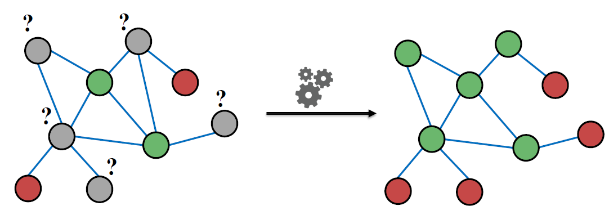
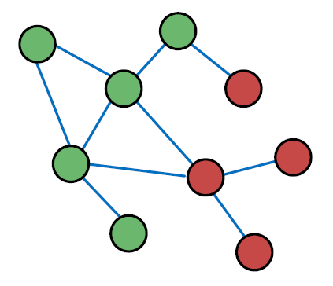
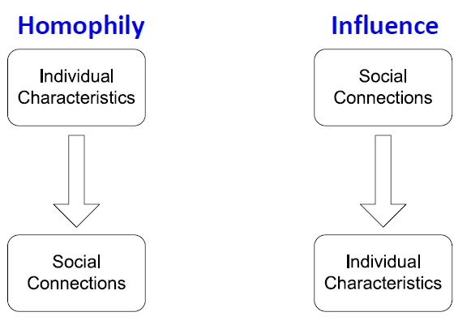
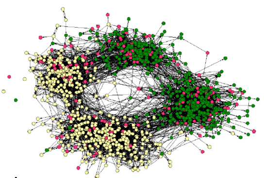
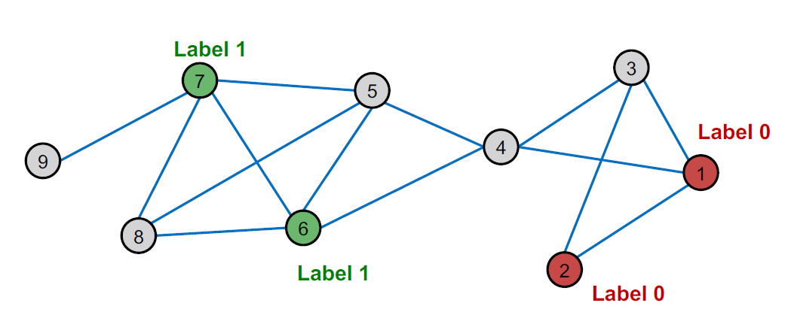
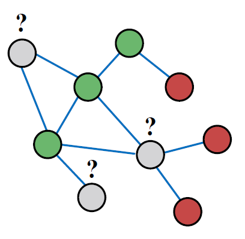
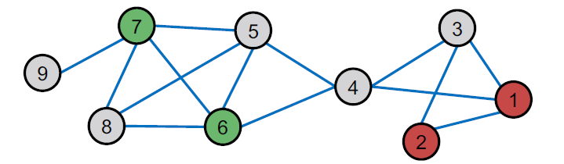

# Message passing and Node

## Outline

+ Main question today: Given a network with labels on some nodes, how do we assign labels to all other nodes in the network?
+ Example: In a network, some nodes are fraudsters, and some other nodes are fully trusted. How do you find the other fraudsters and trustworthy nodes?
+ We already discussed node embeddings as a method to solve this in Lecture 3

+ Given labels of some nodes
+ Let’s predict labels of unlabeled nodes
+ This is called semi-supervised node classification
+ Today we will discuss an alternative framework: Message passing
+ Intuition: Correlations (dependencies) exist in networks.
  + In other words: Similar nodes are connected.
  + Key concept is collective classification: Idea of assigning labels to all nodes in a network together.
+ We will look at three techniques today:
  + Relational classification
  + Iterative classification
  + Belief propagation

## Correlation Exists in Networks

+ Behaviors of nodes are correlated across the links of the network
+ Correlation: Nearby nodes have the same color (belonging to the same class)

+ Two explanations for why behaviors of nodes in networks are correlated:
  + 

## Social Homophily

+ Homophily: The tendency of individuals to associate and bond with similar others
  + *“Birds of a feather flock together”*
  + It has been observed in a vast array of network studies, based on a variety of attributes (e.g., age, gender, organizational role, etc.)
  + Example: Researchers who focus on the same research area are more likely to establish a connection (meeting at conferences, interacting in academic talks, etc.)

Example of homophily

+ Online social network
  + Nodes = people
  + Edges = friendship
  + Node color = interests (sports, arts, etc.)
+ People with the same interest are more closely connected due to homophily

## Social Influence: Example

+ Influence: Social connections can influence the individual characteristics of a person
  + Example: I recommend my musical preferences to my friends, until one of them grows to like my same favorite genres!

## Classification with Network Data

+ How do we leverage this correlation observed in networks to help predict node labels?
+ 
+ How do we predict the labels for the nodes in grey?

## Motivation (1)

+ Similar nodes are typically close together or directly connected in the network:
  + Guilt-by-association: If I am connected to a node with label $X$, then I am likely to have label $X$ as well.
  + Example: Malicious/benign web page: Malicious web pages link to one another to increase visibility, look credible, and rank higher in search engines

## Motivation (2)

+ Classification label of a node $v$ in network may depend on:
  + Features of $v$
  + Labels of the nodes in $v$’s neighborhood
  + Features of the nodes in $v$’s neighborhood

## Semi-supervised Learning (1)

Given:

+ Graph
+ Few labeled nodes

Find: Class (red/green) of remaining nodes
Main assumption: There is homophily in the network

## Semi-supervised Learning (2)

Example task:
- Let  $\boldsymbol{A}$ be a  $n \times n$  adjacency matrix over  $n$  nodes
- Let  $Y=\{0,1\}^{n}$  be a vector of labels:
    - $\mathrm{Y}_{v}=1$  belongs to Class 1
    - $\mathrm{Y}_{v}=0$  belongs to Class 0
    - There are unlabeled node needs to be classified
- Goal: Predict which unlabeled nodes are likely Class 1, and which are likely Class 0

## Approach: Collective Classification

+ Many applications under this setting:
  + Document classification
  + Part of speech tagging
  + Link prediction
  + Optical character recognition
  + Image/3D data segmentation
  + Entity resolution in sensor networks
  + Spam and fraud detection

## Collective Classification Overview (1)

- Intuition: Simultaneous classification of interlinked nodes using correlations
- Probabilistic framework
- **Markov Assumption**: the label  $Y_{v}$  of one node  $v$  **depends on the labels of its neighbors**  $N_{v}$ 

$$
P\left(Y_{v}\right)=P\left(Y_{v} \mid N_{v}\right)
$$

- Collective classification involves 3 steps:
  - Local Classifier
    - Assign initial labels
  - Relational Classifier
    - Capture correlations between nodes
  - Collective Inference
    - Propagate correlations through network

## Collective Classification Overview (2)

Local Classifier: Used for initial label assignment (only once in the beginning)

+ Predicts label based on node attributes/features
+ Standard classification task
+ **Does not use network information**

Relational Classifier: Capture correlations

+ Learns a classifier to label one node based on the labels and/or attributes of its neighbors
+ This is where network information is used

Collective Inference: Propagate the correlation

+ Apply relational classifier to each node iteratively
+ Iterate until the inconsistency between neighboring labels is minimized
+ Network structure affects the final prediction

## Problem Setting

- How to predict the labels  $Y_{v}$  for the unlabeled nodes  $v$ (in grey color)?

- Each node  $v$  has a feature vector  $f_{v}$ 

- Labels for some nodes are given ($1$ for green, $0$ for red)

- Task: Find  $P\left(Y_{v}\right)$  given all features and the network

- $$
  \quad P\left(Y_{v}\right)=  ?
  $$

## Overview of What is Coming

+ We focus on semi-supervised node classification
+ Intuition is based on homophily: Similar nodes are typically close together or directly connected
+ Three techniques we will introduce:
  + Relational classification
  + Iterative classification
  + Belief propagation