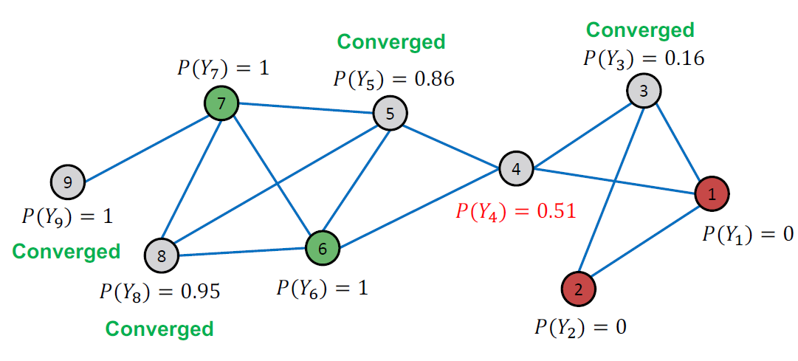
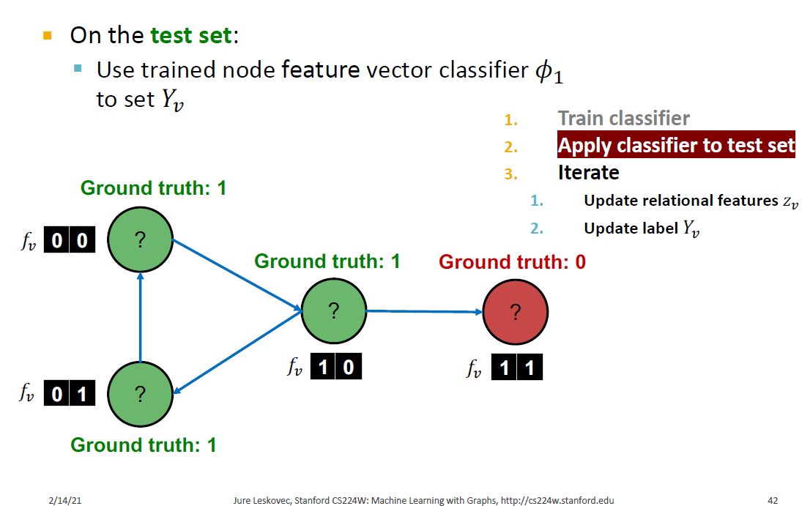

# Relational and Iterative Classification

## Collective Classification Models

+ Relational classifiers
+ Iterative classification
+ Loopy belief propagation

## Probabilistic Relational Classifier (1)

- Basic idea: Class probability  $Y_{v}$  of node  $v$  is a weighted average of class probabilities of its neighbors
- For labeled nodes $v$, initialize label  $Y_{v}$  with ground-truth label  $Y_{v}^{*}$ 
- For unlabeled nodes, initialize $Y_{v}=0.5$ 
- Update all nodes in a random order until convergence or until maximum number of iterations is reached

## Probabilistic Relational Classifier (2)

- Update for each node  $v$  and label  $c $(e.g. 0 or 1 )

  - $$
    P\left(Y_{v}=c\right)=\frac{1}{\sum_{(v, u) \in E} A_{v, u}} \sum_{(v, u) \in E} A_{v, u} P\left(Y_{u}=c\right)
    $$

  - If edges have strength/weight information, $A_{v, u}$  can be the edge weight between  $v$  and  $u$ 

  - $P\left(Y_{v}=c\right)$  is the probability of node  $v$  having label  $c$ (**the likelihood that node $v$ belongs to a given class $c$, is the average likelihood its neighbors belong to the same class $c$**)

- Challenges:
  - Convergence is not guaranteed
  - Model cannot use node feature information

## Example: Initialization

Initialization:

+ All labeled nodes with their labels
+ All unlabeled nodes 0.5 (belonging to class 1 with probability 0.5)

Let $P_{Y_1}=P(Y_1=1)$

+ Update for the $1^{st}$ Iteration (the order follows the node id) :
  + 
  + 
  + 
  + 
  + 
  + 
  + 

- All scores stabilize after 4 iterations. We therefore predict:
  - Nodes 4, 5, 8, 9 belong to class 1 $\left(P_{Y_{v}}>0.5\right)$
  - Nodes 3 belong to class 0 $\left(P_{Y_{v}}<0.5\right)$ 

## Iterative classification

- Relational classifiers do not use node attributes. How can one leverage them?
- Main idea of iterative classification: Classify node  $v$  based on its attributes  $f_{v}$  as well as labels  $Z_{v}$  of neighbor set  $N_{v}$

- **Input: Graph**
-  $f_{v}$: feature vector for node  $v$ 
- Some nodes  $v$  are labeled with  $Y_{v}$ 
- **Task:** Predict label of unlabeled nodes
- **Approach: Train two classifiers:**
-  $\phi_{1}\left(f_{v}\right)=$ Predict node label based on node feature vector  $f_{v}$ 
-  $\phi_{2}\left(f_{v}, z_{v}\right)=$ Predict label based on node feature vector  $f_{v}$  and summary  $z_{v}$  of labels of  $v^{\prime}$s neighbors.

## Computing the Summary $z_v$

How do we compute the summary  $z_{v}$  of labels of  $v^{\prime}$ s neighbors $N_{v}$?
- Ideas:  $\boldsymbol{z}_{\boldsymbol{v}}=$vector

  - Histogram of the number (or fraction) of each label in $N_{v}$
  - Most common label in $N_{v}$
  - Number of different labels in $N_{v}$
  - 
  - **what $z_v$ captures is** 2 for green, 1 for red or 67% for green, 33% for red
  

## Architecture of Iterative Classifiers

- Phase 1: Classify based on node attributes alone
  - On a training set, train classifier (e.g., linear classifier, neural networks, ...):
  - $\phi_{1}\left(f_{v}\right)$  to predict  $Y_{v}$  based on  $f_{v}$ 
  - $\phi_{2}\left(f_{v}, z_{v}\right)$  to predict  $Y_{v}$  based on  $f_{v}$  and summary  $z_{v}$  of labels of  $v$  's neighbors
- Phase 2: Iterate till convergence
  - On **test set**, set labels  $Y_{v}$  based on the classifier  $\phi_{1}$, compute  $z_{v}$  and predict the labels with  $\phi_{2}$ 
  - Repeat for each node $v$ 
    - Update $z_{v}$ based on $Y_{u}$  for all  $u \in N_{v}$
    - Update  $Y_{v}$  based on the new  $z_{v}\left(\phi_{2}\right)$
  - Iterate until class labels **stabilize or max number** of iterations is reached
  - Note: Convergence is not guaranteed

## Example: Web Page Classification (1)

+ Input: Graph of web pages
+ Node: Web page
+ Edge: Hyper-link between web pages
  + Directed edge: a page points to another page
+ Node features: Webpage description
  + For simplicity, we only consider 2 binary features
+ Task: Predict the topic of the webpage

Here we use current label rather than ground truth (e.g.  nodes in the upper left corner $O=\[1, 0\]$) 

## Summary

+ We talked about 2 approaches to collective classification
+ Relational classification
  + Iteratively update probabilities of node belonging to a label class based on its neighbors
+ Iterative classification
  + Improve over collective classification to handle attribute/feature information
  + Classify node 𝑖 based on its features as well as labels of neighbors