# Collective Classification

## Loopy belief propagation

+ Belief Propagation is a dynamic programming approach to answering probability queries in a graph (e.g. probability of node $v$ belonging to class 1)
+ Iterative process in which **neighbor nodes** “talk” to each other, **passing messages**
+ 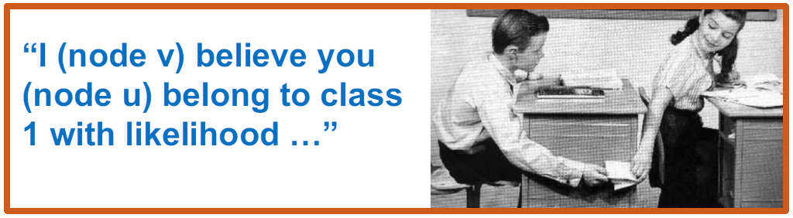
+ When **consensus is reached**, calculate final belief

## Message Passing: Basics

+ Task: Count the number of nodes in a graph*
+ Condition: Each node can only interact (pass message) with its neighbors
+ Solution: Each node listens to the message from its neighbor, updates it, and passes it forward
+ $m$: the message
+ Example: path graph
+ 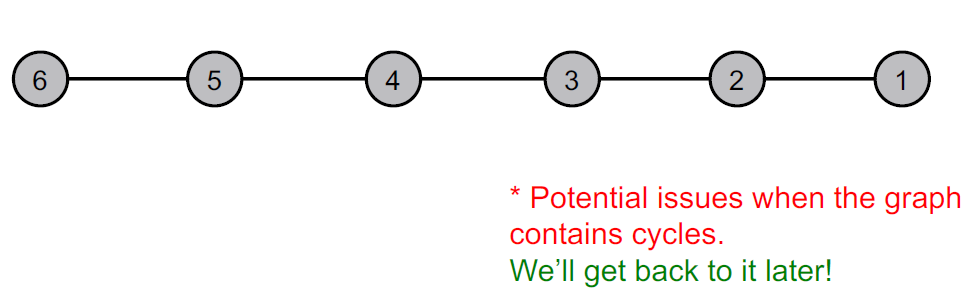
+ 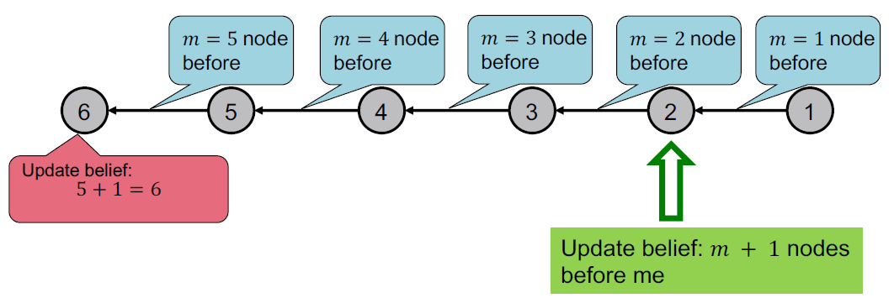

## Message Passing Algorithm

+ Task: Count the number of nodes in a graph
+ Algorithm:
  + Define an ordering of nodes (that results in a path)
  + Edge directions are according to order of nodes
    + Edge direction defines the order of message passing
  + For node $i$ from 1 to 6
    + Compute the message from node $i$ to $i+1$ (number of nodes counted so far)
    + Pass the message from node $i$ to $i+1$
+ 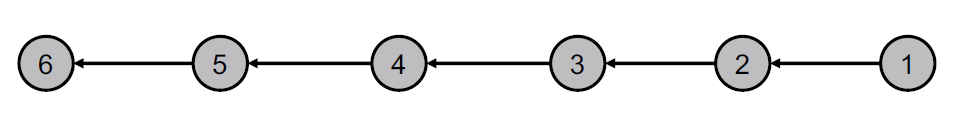

## Generalizing to a tree

+ We can perform message passing not only on a path graph, but also on a tree-structured graph
+ Define order of message passing from **leaves** to **root**
+ 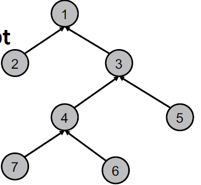

## Message Passing in a tree

Update beliefs in tree structure

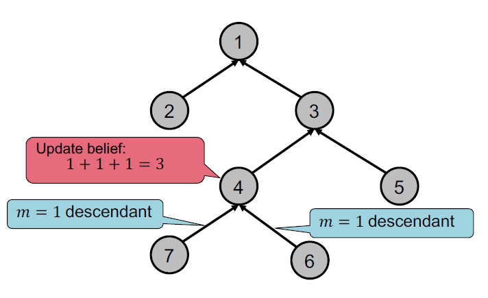

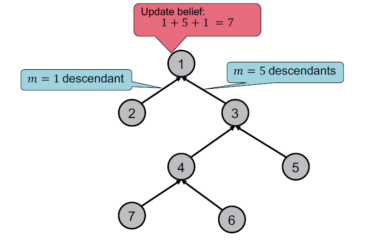

## Loopy BP Algorithm

What message will $i$ send to $j$?
- It depends on what $i$ hears from its neighbors
- Each neighbor passes a message to $i$ its beliefs of the state of $i$

Loopy BP Algorithm

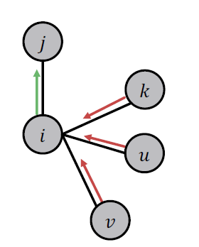

## Notation

- Label-label potential matrix $\psi$: **Dependency between a node and its neighbor.** $\boldsymbol{\psi}\left(Y_{i}, Y_{j}\right)$ is proportional to the probability of a node $j$ being in class $Y_{j}$  given that it has neighbor $i$ in class $Y_{i}$. (similar to **Markov transition matrix**)
- Prior belief $\phi$: $\phi\left(Y_{i}\right)$ is proportional to the probability of node $i$ being in class $Y_{i}$.
-  $m_{i \rightarrow j}\left(Y_{j}\right)$ is  $i$'s message / estimate of $j$ being in class $Y_{j}$.
-  $\mathcal{L}$  is the set of all classes/labels

## Loppy BP Algorithm

1. Initialize all messages to 1
2. Repeat for each node:

$$
m_{i \rightarrow j}\left(Y_{j}\right)=\sum_{Y_{i} \in \mathcal{L}} \psi\left(Y_{i}, Y_{j}\right) \phi_{i}\left(Y_{i}\right) \prod_{k \in N_{i} \backslash \mathrm{j}} m_{k \rightarrow i}\left(Y_{i}\right), \forall Y_{j} \in \mathcal{L}
$$

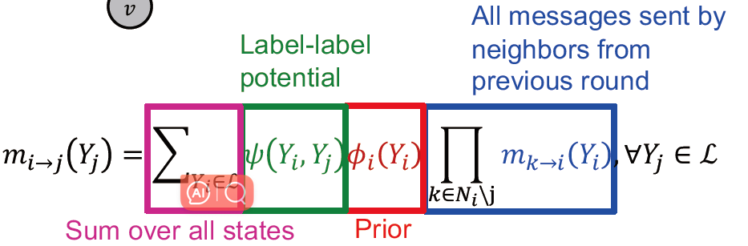

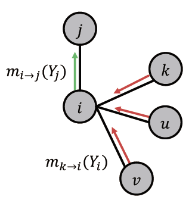

After convergence: $b_i(Y_i)$ = node $i$’s belief of being in class $Y_i$
$$
b_{i}\left(Y_{i}\right)=\phi_{i}\left(Y_{i}\right) \prod_{j \in N_{i}} m_{j \rightarrow i}\left(Y_{i}\right), \forall Y_{i} \in \mathcal{L}
$$
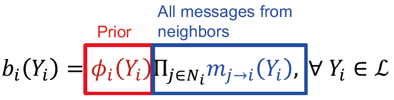

## Example: Loopy Belief Propagation

+ Now we consider a graph with cycles
+ There is no longer an ordering of nodes
+ We apply the same algorithm as in previous slides:
  + Start from arbitrary nodes
  + Follow the edges to update the neighboring nodes

What if our graph has cycles?

Messages from different subgraphs are **no longer independent**!

**But we can still run BP**, but it will pass messages in loops.

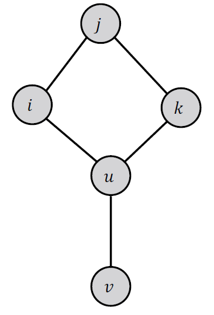

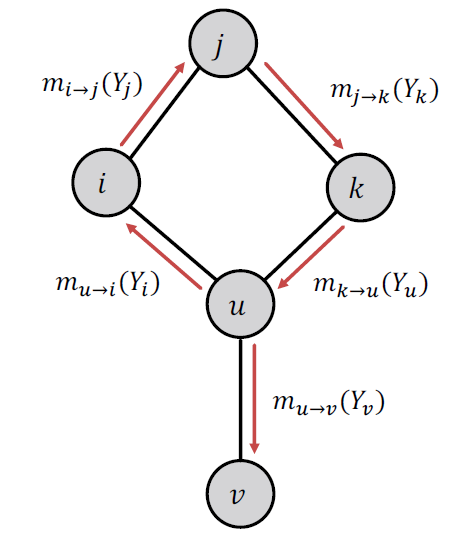

## What Can Go Wrong?

- Beliefs may not converge
  - Message $m_{u \rightarrow i}\left(Y_{i}\right)$ is based on initial belief of $i$, not a separate evidence for $i$ 
  - The initial belief of $i$ (which could be incorrect) is **reinforced** by the cycle  $i \rightarrow j \rightarrow k \rightarrow u \rightarrow i$ 
- However, in practice, Loopy BP is still a good heuristic for complex graphs which contain many branches.

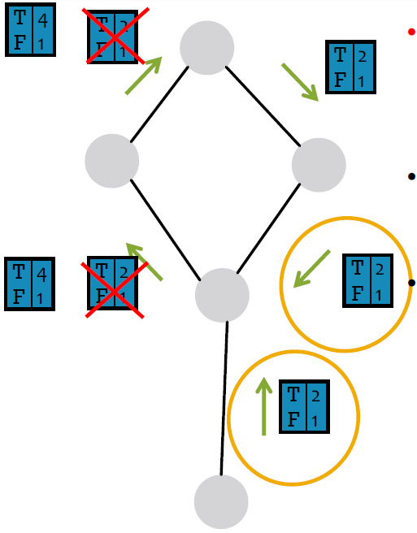

+ **Messages loop around and around**: 2, 4, 8, 16, 32, ... **More and more convinced** that these variables are T! (**positive feedback**)
+ BP incorrectly treats this message as **separate evidence** that the variable is T (true).
+ Multiplies these two messages as if they were **independent**.
  + But they don’t actually come from independent parts of the graph.
  + One influenced the other (via a cycle).

> This is an extreme example. Often in practice, the cyclic influences are weak. (As cycles are long or include at least one weak correlation.)

## Advantages of Belief Propagation

- Advantages:
  - Easy to program \& parallelize
  - General: can apply to any graph model with any form of potentials
    - Potential can be higher order: e.g.  $\boldsymbol{\psi}\left(Y_{i}, Y_{j}, Y_{k}, Y_{v} \ldots\right)$ 
- Challenges:
  - Convergence is not guaranteed (when to stop), especially if many closed loops (trick: run a short number of steps)
- Potential functions (parameters)
  - Require training to estimate

## Summary

+ We learned how to leverage correlation in graphs to make prediction on nodes
+ Key techniques:
  + Relational classification
  + Iterative classification
  + Loopy belief propagation