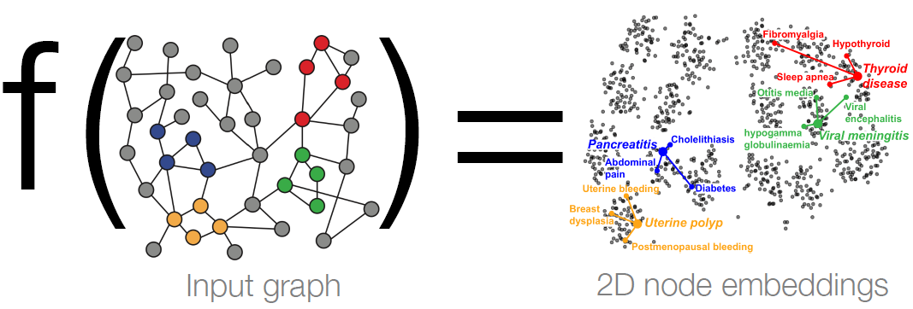
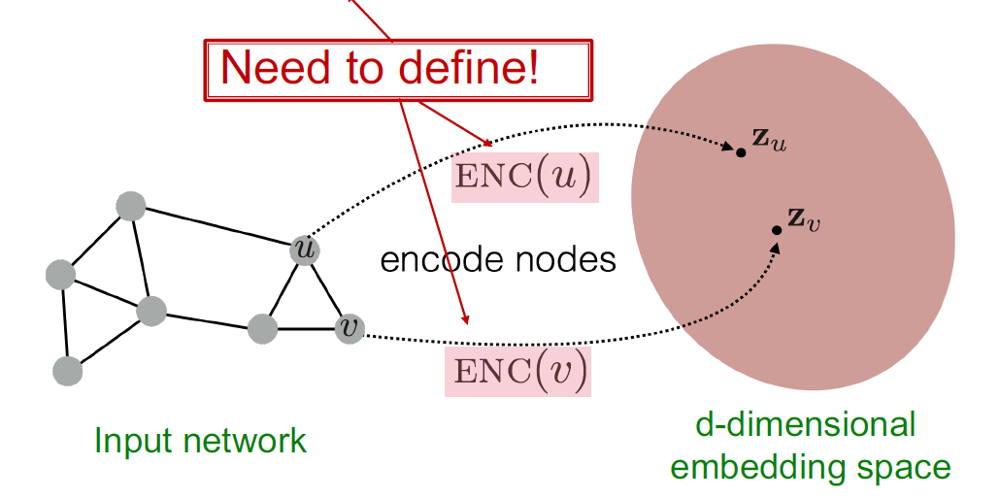
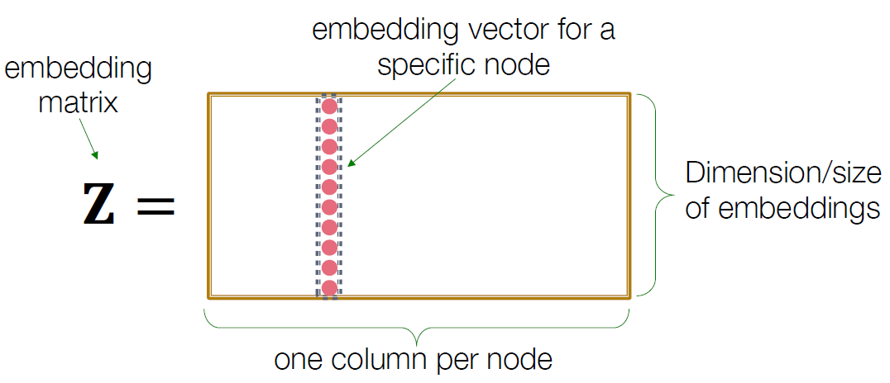
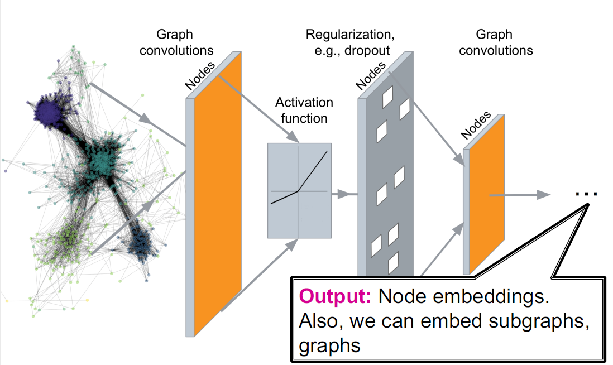
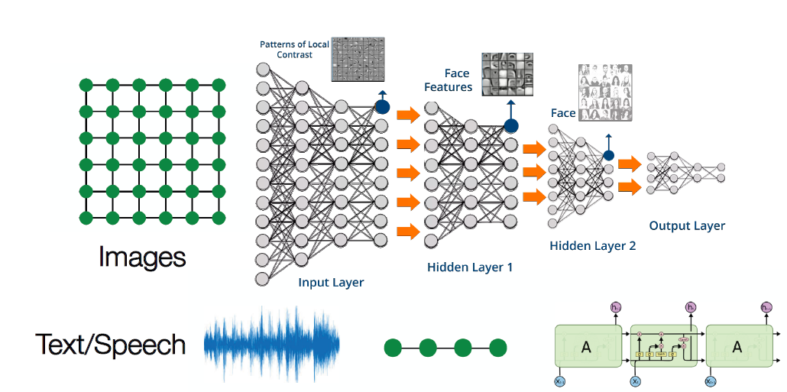
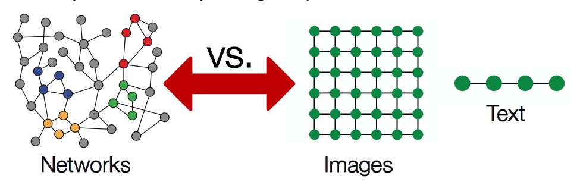

# Introduction to Graph Neural Networks

## Recap: Node Embeddings

+ Intuition: Map nodes to $d$-dimensional embeddings such that similar nodes in the graph are embedded close together

+ How to learn mapping function $f$?

+ 

+ $$
  \text { Goal: similarity }(u, v) \approx \mathbf{z}_{v}^{\mathrm{T}} \mathbf{z}_{u}
  $$

- 

## Recap: Two Key Components

+ Encoder: maps each node to a low-dimensional vector

  + $$
    \operatorname{ENC}(v)=z_v
    $$

  + where $v$ is node in the input graph, and $z_v$ is a $d$-dimensional embedding

+ Similarity function: specifies how the relationships in vector space map to the relationships in the original network (**Decoder**)

  + $$
    \text {similarity}(u, v) \approx \mathbf{z}_{v}^{\mathrm{T}} \mathbf{z}_{u}
    $$

  + 

## Recap: "Shallow" Encoding

Simplest encoding approach: **encoder is just an embedding-lookup**

## Recap: Shallow Encoders

Limitations of shallow embedding methods:
-  $\boldsymbol{O}(|\boldsymbol{V}|)$ parameters are needed:
   -  No sharing of parameters between nodes
   -  Every node has its own unique embedding

-  Inherently "transductive":
  -  Cannot generate embeddings for nodes that are not seen during training

- Do not incorporate node features (like deep walk or node2vec) :
  - Many graphs have features that we can and should leverage

## Today: Deep Graph Encoders

- Today: We will now discuss deep methods based on **graph neural networks (GNNs):**

$$
\operatorname{ENC}(v)=\quad \begin{array}{c}
\text { multiple layers of }\\
\text { non-linear transformations } \\
\text { based on graph structure }
\end{array}
$$

- Note: All these deep encoders can be **combined with node similarity functions** defined in the lecture 3

## Deep Graph Encoders

## Tasks on Networks

Tasks we will be able to solve:

+ Node classification
  + Predict a type of a given node
+ Link prediction
  + Predict whether two nodes are linked
+ Community detection
  + Identify densely linked clusters of nodes
+ Network similarity
  + How similar are two (sub)networks

## Modern ML Toolbox

Modern deep learning toolbox is designed for simple sequences & (fix-sized) grids

## Why is it Hard?

But networks are far more complex!

+ Arbitrary size and complex topological structure (i.e., no spatial locality like grids)
+ No fixed node ordering or reference point
+ Often dynamic and have multimodal features

