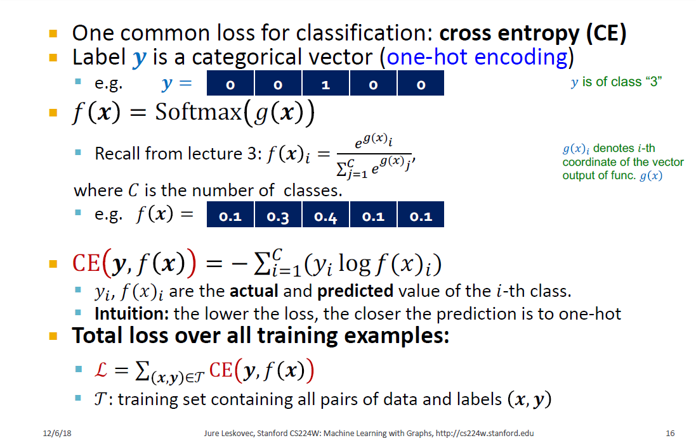
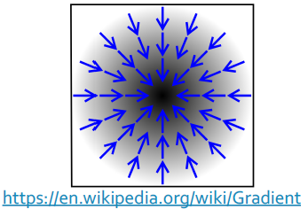
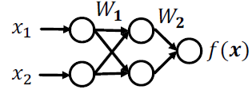
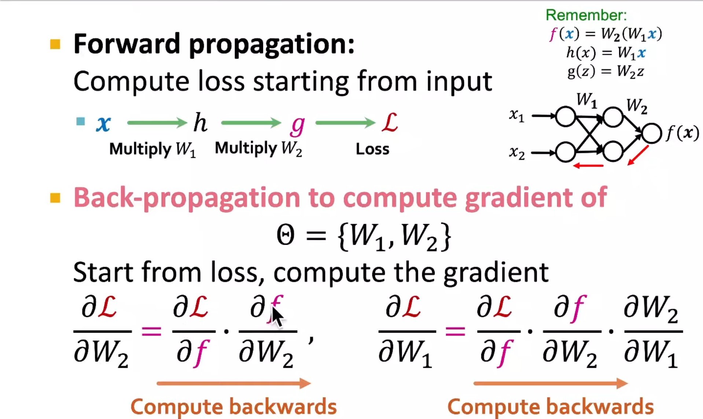

# Machine Learning with Graphs

## Machine Learning as Optimization

+ Supervised learning: we are given input $x$, and the goal is to predict label $y$
+ Input $x$ can be:
  + Vectors of real numbers
  + Sequences (natural language)
  + Matrices (images)
  + Graphs (potentially with node and edge features)
+ We formulate the task as an optimization problem
+ Minimize the objective function

$$
\min _{\Theta} \mathcal{L}(\boldsymbol{y}, f(\boldsymbol{x}))
$$

- $\Theta$: a set of parameters we optimize

  -  Could contain one or more scalars, vectors, matrices ...
  -  E.g.  $\Theta=\{Z\}$  in the shallow encoder (the embedding lookup)

- $\mathcal{L}$:  loss function. Example: L2 loss

- $$
  \mathcal{L}(\boldsymbol{y}, f(\boldsymbol{x}))=\|y-f(x)\|_{2}
  $$

  - Other common loss functions:

    - L1 loss, huber loss, max margin (hinge loss), cross entropy ...

    - See https://pytorch.org/docs/stable/nn.htm|\#loss-functions

## Loss Function Example

## Machine Learning as Optimization

- How to optimize the objective function?

- Gradient vector: Direction and rate of fastest increase Partial derivative

- $$
  \nabla_{\Theta} \mathcal{L}=\left(\frac{\partial \mathcal{L}}{\partial \Theta_{1}}, \frac{\partial \mathcal{L} }{\partial \Theta_{2}}, \ldots\right)
  $$

  + $\Theta_{1}$, $\Theta_{2} \ldots$: components of $\Theta$ 

-  Recall **directional derivative** of a multi-variable function (e.g.  $\mathcal{L}$  ) along a given vector represents the instantaneous rate of change of the function along the vector.
-  Gradient is the directional derivative in the **direction of largest increase**

+ 

## Gradient Descent

- Iterative algorithm: repeatedly update weights in the (opposite) direction of gradients until convergence

- Training: Optimize  $\Theta$  iteratively

- $$
   \Theta \leftarrow \Theta-\eta \frac{\partial \mathcal{L}}{\partial \Theta}
   $$

   - Iteration: 1 step of gradient descent

- Learning rate (LR)  $\boldsymbol{\eta}$:

   - Hyperparameter that controls the size of gradient step
   - Can vary over the course of training (LR scheduling)

- **Ideal termination condition**: $\mathbf{0}$ gradient

   - In practice, we stop training if it no longer improves performance on **validation set** (part of dataset we hold out from training)

## Stochastic Gradient Descent (SGD)

- Problem with gradient descent:
  - Exact gradient requires computing $\nabla_{\Theta} \mathcal{L}(\boldsymbol{y}, f(x))$, where $x$ is the entire dataset!
    - This means summing gradient contributions over all the points in the dataset
    - Modern datasets often contain billions of data points
    - Extremely expensive for every gradient descent step
- Solution: Stochastic gradient descent (SGD)
  - At every step, pick a different minibatch $\mathcal{B}$ containing a subset of the dataset, use it as input $x$

 ## Minibatch SGD

+ Concepts:
  + Batch size: the number of data points in a minibatch
    + E.g. number of nodes for node classification task
  + Iteration: 1 step of SGD on a minibatch
  + Epoch: one full pass over the dataset (# iterations is equal to ratio of dataset size and batch size)
+ SGD is unbiased estimator of full gradient:
  + But there is no guarantee on the rate of convergence
  + In practice often requires tuning of learning rate
+ Common optimizer that improves over SGD:
  + Adam, Adagrad, Adadelta, RMSprop …

## Neural Network Function

- Objective: $\min _{\Theta} \mathcal{L}(\boldsymbol{y}, f(x))$ 
- In deep learning, the function $f$ can be very complex
- To start simple, consider linear function

$$
f(x)=W \cdot x, \quad \Theta=\{W\}
$$

- If $f$ returns a scalar, then $W$ is a learnable vector

$$
\nabla_{W} f=\left(\frac{\partial f}{\partial w_{1}}, \frac{\partial f}{\partial w_{2}}, \frac{\partial f}{\partial w_{3}} \ldots\right)
$$

- If $f$ returns a vector, then $W$ is the weight matrix

$$
\nabla_{W} f=W^{T} \quad \text { Jacobian matrix of } f
$$

## Back-propagation

- How about a more complex function:

$$
f(x)=W_{2}\left(W_{1} x\right), \quad \Theta=\left\{W_{1}, W_{2}\right\}
$$

- Recall **chain rule**:

$$
\begin{array}{c}
\frac{\mathrm{d} z}{\mathrm{~d} x}=\frac{\mathrm{d} z}{\mathrm{~d} y} \cdot \frac{\mathrm{d} y}{\mathrm{~d} x}
\end{array}
$$

+ $$
  \text {E.g. } \nabla_{x} f=\frac{\partial f}{\partial\left(W_{1} x\right)} \cdot \frac{\partial\left(W_{1} x\right)}{\partial x}
  $$

+ In other words

  + $f(x)=W_{2}\left(W_{1} x\right)$
  + $h(x)=W_{1} x   h(x)=W_{1} x$
  + $\mathrm{g}(z)=W_{2} z$

- Back-propagation: Use of **chain rule** to propagate gradients of intermediate steps, and finally obtain gradient of $\mathcal{L}$ w.r.t. $\Theta$

## Back-propagation Example (1)

- Example: Simple 2-layer linear network

+ $$
  f(x)=g(h(x))=W_{2}\left(W_{1} x\right)
  $$

-  
-  $\mathcal{L}=\sum_{(x, y) \in \mathcal{B}}||(\boldsymbol{y},-f(\boldsymbol{x}))||_{2}$ sums the L2 loss in a minibatch $\mathcal{B}$
-  Hidden layer: intermediate representation for input $x$ 
   -  Here we use $h(x)=W_{1} x$  to denote the hidden layer  _
   -  $f(x)=W_{2} h(x)$

## Back-propagation Example (2)

## Non-linearity

- Note that in $f(x)=W_{2}\left(W_{1} x\right), W_{2} W_{1}$ is another matrix (vector, if we do binary classification)

- Hence $f(x)$ is still linear w.r.t. $x$ no matter how many weight matrices we compose

- Introduce non-linearity:

  - Rectified linear unit (ReLU)  

    - $$
      \operatorname{ReLU}(x)=\max (x, 0)
      $$

  - Sigmoid

    - $$
      \sigma(x)=\frac{1}{1+e^{-x}}
      $$

  

## Multi-layer Perceptron (MLP)

- Each layer of MLP combines linear transformation and non-linearity:

- $$
  \boldsymbol{x}^{(l+1)}=\sigma\left(W_{l} \boldsymbol{x}^{(l)}+b^{l}\right)
  $$

  - where $W_{l}$ is weight matrix that transforms hidden representation at layer $l$ to layer $l+1$ 

  -  $b^{l}$ is bias at layer $l$, and is added to the linear transformation of $\boldsymbol{x}$ 

  -  $\sigma$ is non-linearity function (e.g., sigmod)

- Suppose $x$ is 2-dimensional, with entries $x_{1}$ and $x_{2}$
  - .png) 

## Summary

- Objective function:

$$
\min _{\Theta} \mathcal{L}(\boldsymbol{y}, f(x))
$$

-  $f$ can be a simple linear layer, an MLP, or other neural networks (e.g., a GNN later)
- Sample a minibatch of input $x$ 
- Forward propagation: compute $\mathcal{L}$ given $x$ 
- Back-propagation: obtain gradient $\nabla_{\Theta} \mathcal{L}$ using a chain rule
- Use stochastic gradient descent (SGD) to optimize for $\Theta$ over many iterations
