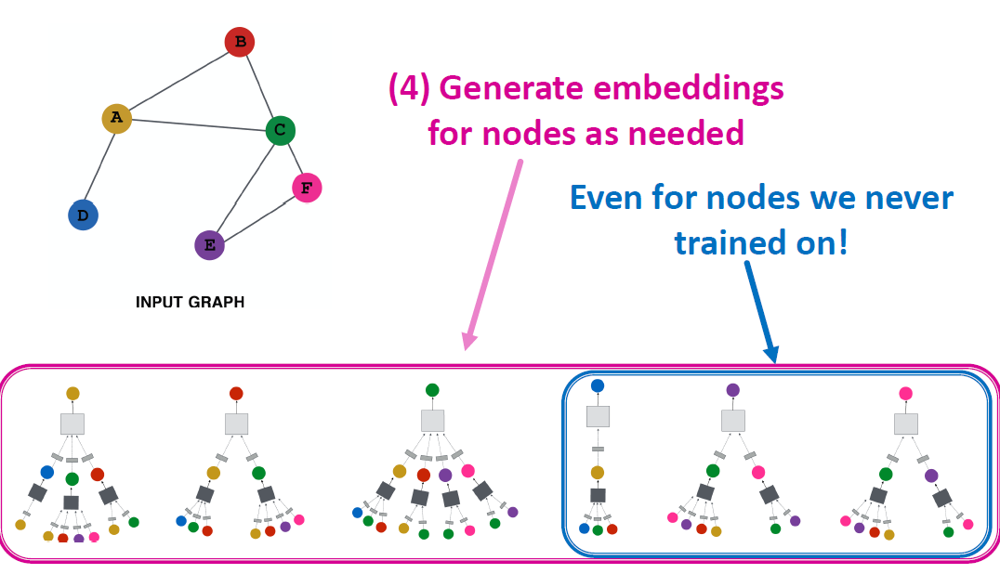

# Deep Learning for Graphs

## Content

+ Local network neighborhoods:
  + Describe aggregation strategies
  + Define computation graphs
+ Stacking multiple layers:
  + Describe the model, parameters, training
  + How to fit the model?
  + Simple example for unsupervised and supervised training

## Setup

+ Assume we have a graph $G$:

  + $V$ is the **vertex set**

  -  $\boldsymbol{A}$ is the **adjacency matrix** (assume binary)
  -  $\boldsymbol{X} \in \mathbb{R}^{m \times|V|}$ is a matrix of node features
  -  $v$: a node in $V$; $N(v)$: the set of neighbors of $v$.

  - Node features:

      - Social networks: User profile, User image

      - Biological networks: Gene expression profiles, gene functional information

      - When there is no node feature in the graph dataset:

          - Indicator vectors (one-hot encoding of a node)

          - Vector of constant 1: $[1,1, \ldots, 1]$

## A Naive Approach

+ Join adjacency matrix and features
+ Feed them into a deep neural net:
+ 

+ Issues with this idea:
  + $O(|V|)$ parameters
  + Not applicable to graphs of different sizes
  + Sensitive to node ordering

## Idea: Convolutional Networks

Goal is to generalize convolutions beyond simple lattices 

Leverage node features/attributes (e.g., text, images)

## Real-World Graphs

But our graphs look like this:

or this:

+ There is no fixed notion of locality or sliding window on the graph
+ Graph is permutation invariant

## From Images to Graphs

Single Convolutional neural network (CNN) layer with 3x3 filter:

Idea: transform information at the neighbors and combine it:
- Transform "messages" $h_{i}$ from neighbors: $W_{i} h_{i}$ 
- Add them up: $\sum_{i} W_{i} h_{i}$

## Graph Convolutional Networks

Idea: Node’s neighborhood defines a computation graph

Learn how to propagate information across the graph to compute node features

## Idea: Aggregate Neighbors

+ Key idea: Generate node embeddings based on local network neighborhoods

+ Intuition: Nodes aggregate information from their neighbors using neural networks

 

+ Intuition: Network neighborhood defines a computation graph

## Deep Model: Many Layers

Model can be of arbitrary depth:
- Nodes have embeddings at each layer
- Layer-0 embedding of node $u$ is its input feature, $x_{u}$
- Layer-$k$ embedding gets information from nodes that are $\mathrm{K}$ hops away
- 

## Neighborhood Aggregation

+ Neighborhood aggregation: Key distinctions are in how different approaches aggregate information across the layers
+ 

+ Basic approach: Average information from neighbors and apply a neural network
+ 

## The Math: Deep Encoder

+ Basic approach: Average neighbor messages and apply a neural network
+ 

## Training the model

Need to define a loss function on the embeddings

## Model Parameters

We can feed these embeddings into any loss function and run SGD to train the weight parameters

$h_{v}^{l}$: the hidden representation of node $v$ at layer $l$ 
-  $W_{k}$: weight matrix for neighborhood aggregation
-  $B_{k}$: weight matrix for transforming hidden vector of self

## Matrix Formulation (1)

+ Many aggregations can be performed efficiently by (sparse) matrix operations

- Let $H^{(l)}=\left[h_{\}_{l)}}^{(l)} \ldots h_{\mid V]}^{(l)}\right]^{\mathrm{T}} \quad$
- Then: $\sum_{u \in N_{v}} h_{u}^{(l)}=\mathrm{A}_{v,:} \mathrm{H}^{(l)}$
- Let $D$ be diagonal matrix where $D_{v, v}=\operatorname{Deg}(v)=|N(v)|$

- The inverse of  $D$: $D^{-1}$ is also diagonal: $D_{v, v}^{-1}=1 /|N(v)|$

- Therefore,

$$
\sum_{u \in N(v)} \frac{h_{u}^{(l-1)}}{|N(v)|} \Longrightarrow H^{(l+1)}=D^{-1} A H^{(l)}
$$

+ 

## Matrix Formulation (2)

- Re-writing update function in matrix form:

+ $$
  H^{(l+1)}=\sigma\left(\tilde{A} H^{(l)} W_{l}^{\mathrm{T}}+H^{(l)} B_{l}^{\mathrm{T}}\right)
  $$

+ where  $\tilde{A}=D^{-1} A$ 

+ 

+ $$
  H^{(l)}=\left[h_{1}^{(l)} \ldots h_{|V|}^{(l)}\right]^{T}
  $$

  + Red: neighborhood aggregation

  - Blue: self transformation

- In practice, this implies that efficient sparse matrix multiplication can be used ($\tilde{A}$ is sparse)
- Note: not all GNNs can be expressed in matrix form, when aggregation function is complex

## How to train a GNN

- Node embedding  \boldsymbol{z}_{v}  is a function of input graph
- Supervised setting: we want to minimize the loss $\mathcal{L}$:

+ $$
  \min _{\Theta} \mathcal{L}\left(\boldsymbol{y}, f\left(\boldsymbol{z}_{v}\right)\right)
  $$

  -  $\boldsymbol{y}$: node label

  -  $\mathcal{L}$ could be  L2  if $\boldsymbol{y}$ is real number, or cross entropy if $\boldsymbol{y}$  is categorical

-  Unsupervised setting:
   -  No node label available
   -  Use the graph structure as the supervision!

## Unsupervised Training

- "Similar" nodes have similar embeddings

+ $$
  \mathcal{L}=\sum_{z_{u}, z_{v}} \operatorname{CE}\left(y_{u, v}, \operatorname{DEC}\left(z_{u}, z_{v}\right)\right)
  $$

  - Where $y_{u, v}=1$ when node $u$ and $v$ are similar

  - CE is the cross entropy

  - DEC is the decoder such as inner product (lecture 4)

- Node similarity can be anything from lecture 3, e.g., a loss based on:
  - Random walks (node2vec, DeepWalk, struc2vec)
  - Matrix factorization
  - Node proximity in the graph

## Supervised Training

Directly train the model for a supervised task (e.g., node classification)

+ Use cross entropy loss
+ 

## Model Design: Overview

## Inductive Capability

+ The same aggregation parameters are shared for all nodes:
  + The number of model parameters is sublinear in $|V|$ and we can generalize to unseen nodes!
  + 
  + Inductive node embedding  => Generalize to entirely unseen graphs
  + E.g., train on protein interaction graph from model organism A and generate embeddings on newly collected data about organism B
  + 
  + Many application settings constantly encounter previously unseen nodes:
    + E.g., Reddit, YouTube, Google Scholar
  + Need to generate new embeddings “on the fly”
  + 

## Summary

+ Recap: Generate node embeddings by aggregating neighborhood information
  + We saw a **basic variant of this idea**
  + Key distinctions are in how different approaches aggregate information across the layers
+ Next: Describe GraphSAGE graph neural network architecture