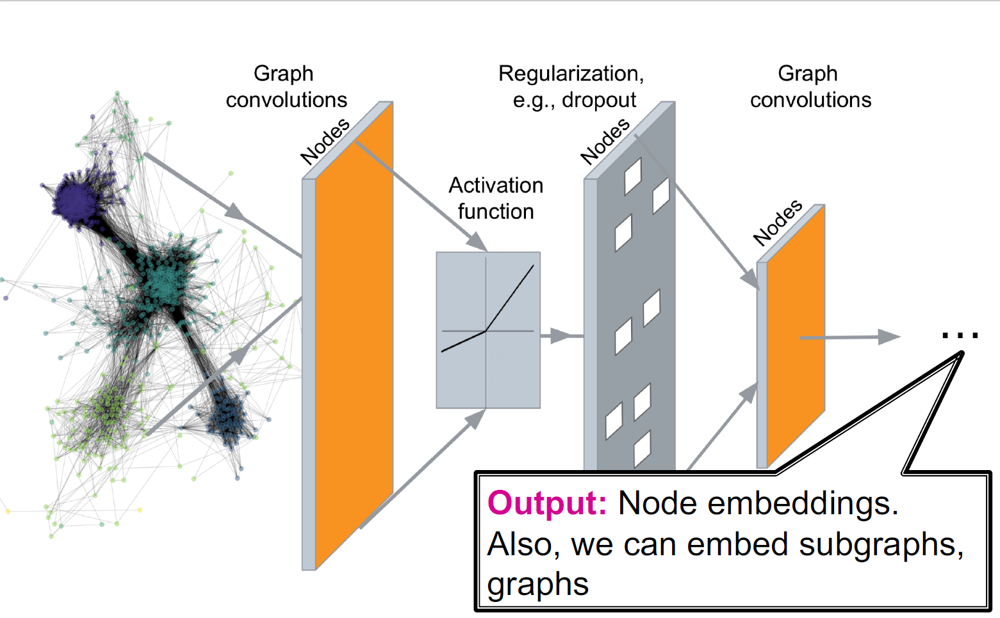
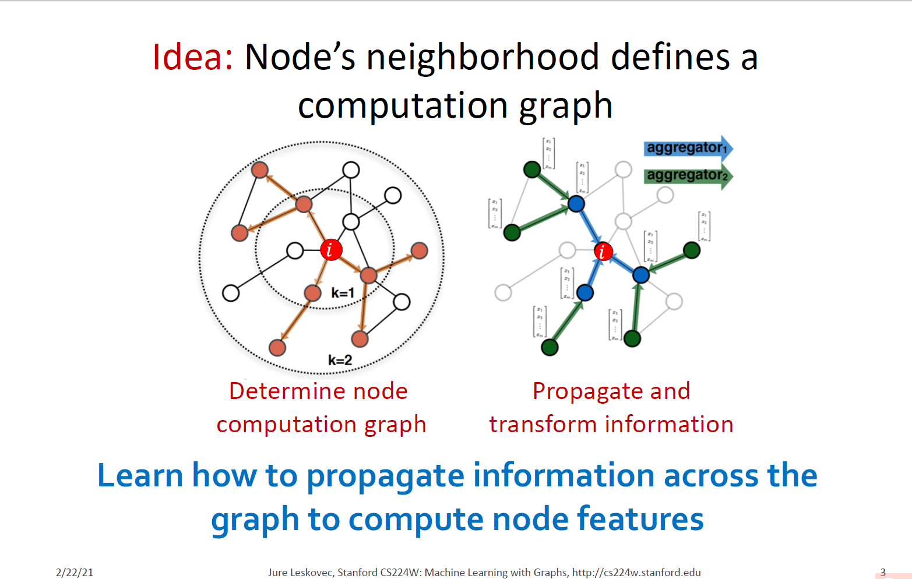
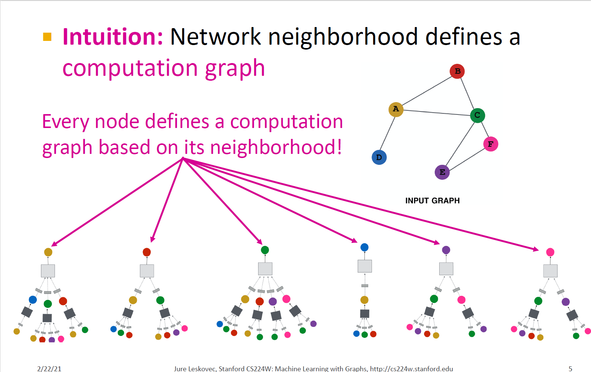
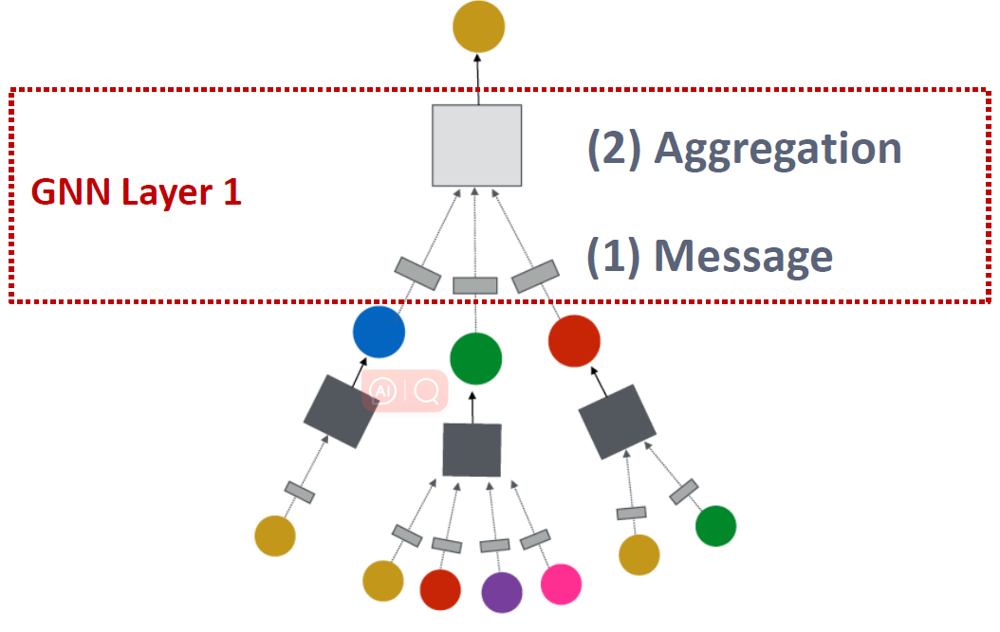
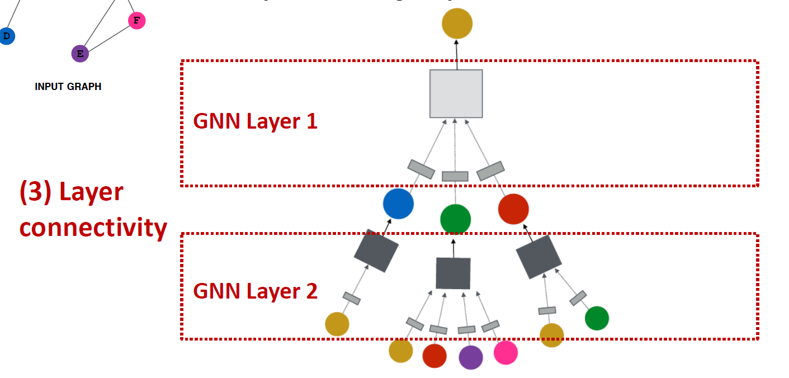

# A general Perspective on GNNs

## Recap

## A General GNN Framework (1)

GNN Layer = Message + Aggregation

+ Different instantiations under this perspective
+ GCN, GraphSAGE, GAT, …

## A General GNN Framework (2)

Connect GNN layers into a GNN

+ Stack layers sequentially
+ Ways of adding skip connections

## A General GNN Framework (3)

Idea: Raw input graph ≠ computational graph

+ Graph feature augmentation
+ Graph structure augmentation

(4) Graph augmentation

## A General GNN Framework (4)

How do we train a GNN

+ Supervised/Unsupervised objectives
+ Node/Edge/Graph level objectives

(5) Learning Objective