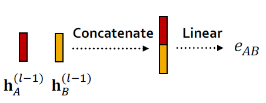

# A Single Layer of a GNN

GNN Layer = Message + Aggregation

+ Different instantiations under this perspective
+ GCN, GraphSAGE, GAT, …

+ Idea of a GNN Layer:
  + Compress a set of vectors into a single vector
  + Two step process:
    + (1) Message
    + (2) Aggregation

**No special ordering** for children neighbors

## Message Computation

+ (1) Message computation

  - Message function:  $\quad \mathbf{m}_{u}^{(l)}=\mathrm{MSG}^{(l)}\left(\mathbf{h}_{u}^{(l-1)}\right)$

    - Intuition: Each node will create a message, which will be sent to other nodes later

    - Example: A Linear layer $\mathbf{m}_{u}^{(l)}=\mathbf{W}^{(l)} \mathbf{h}_{u}^{(l-1)}$ 
      - Multiply node features with weight matrix $\mathbf{W}^{(l)}$ 

- (2) Aggregation

  - Intuition: Each node will aggregate the messages from node $v$'s neighbors

    - $$
      \mathbf{h}_{v}^{(l)}=\mathrm{AGG}^{(l)}\left(\left\{\mathbf{m}_{u}^{(l)}, u \in N(v)\right\}\right)
      $$

  - Example: $\operatorname{Sum}(\cdot)$, $\operatorname{Mean}(\cdot)$ or $\operatorname{Max}(\cdot)$ aggregator  
    - $\mathbf{h}_{v}^{(l)}=\operatorname{Sum}\left(\left\{\mathbf{m}_{u}^{(l)}, u \in N(v)\right\}\right)$

## Message Aggregation: Issue

- Issue: Information from node $v$ itself could get lost

  - Computation of $\mathbf{h}_{v}^{(l)}$ does not directly depend on $\mathbf{h}_{v}^{(l-1)}$ 

- Solution: Include $\mathbf{h}_{v}^{(l-1)}$ when computing $\mathbf{h}_{v}^{(l)}$ 

  - (1) Message: compute message from node $v$ itself
    - Usually, a different message computation will be performed
    - 

  - (2) Aggregation: After aggregating from neighbors, we can aggregate the message from node $v$ itself
    - Via concatenation or summation
    - 

## A Single GNN Layer

- Putting things together:

  - (1) Message: each node computes a message

    - $$
      \mathbf{m}_{u}^{(l)}=\mathrm{MSG}^{(l)}\left(\mathbf{h}_{u}^{(l-1)}\right), u \in\{N(v) \cup v\}
      $$

  + (2) Aggregation: aggregate messages from neighbors

    + $$
      \mathbf{h}_{v}^{(l)}=\mathrm{AGG}^{(l)}\left(\left\{\mathbf{m}_{u}^{(l)}, u \in N(v)\right\}, \mathbf{m}_{v}^{(l)}\right)
      $$

  - Nonlinearity (activation): Adds expressiveness

    - Often written as $\sigma(\cdot)$: $\operatorname{ReLU}(\cdot)$, $\operatorname{Sigmoid}(\cdot)$, $\ldots$ 

    - Can be added to **message** or **aggregation**

## Classical GNN Layers: GCN (1)

- (1) Graph Convolutional Networks (GCN)

$$
\mathbf{h}_{v}^{(l)}=\sigma\left(\mathbf{W}^{(l)} \sum_{u \in N(v)} \frac{\mathbf{h}_{u}^{(l-1)}}{|N(v)|}\right)
$$

- How to write this as Message + Aggregation?

$$
\mathbf{h}_{v}^{(l)}=\sigma\left(\overbrace{\sum_{u \in N(v)}}^{\text{Aggregation}}\underbrace{\mathbf{W}^{(l)} \frac{\mathbf{h}_{u}^{(l-1)}}{|N(v)|}}_{Message}\right)
$$

## Classical GNN Layers: GCN (2)

- Message:

  - Each Neighbor: $\mathbf{m}_{u}^{(l)}=\frac{1}{|N(v)|} \mathbf{W}^{(l)} \mathbf{h}_{u}^{(l-1)} 
  - Normalized by node degree (ln the GCN paper they use a slightly different normalization)

- Aggregation:

  - **Sum** over messages from neighbors, then apply activation

  - $$
    \mathbf{h}_{v}^{(l)}=\sigma\left(\operatorname{Sum}\left(\left\{\mathbf{m}_{u}^{(l)}, u \in N(v)\right\}\right)\right)
    $$

## Classical GNN Layers: GraphSAGE

- (2) GraphSAGE

  - $$
    \mathbf{h}_{v}^{(l)}=\sigma\left(\mathbf{W}^{(l)} \cdot \operatorname{CONCAT}\left(\mathbf{h}_{v}^{(l-1)}, \operatorname{AGG}\left(\left\{\mathbf{h}_{u}^{(l-1)}, \forall u \in N(v)\right\}\right)\right)\right)
    $$

- How to write this as Message + Aggregation?

  - **Message** is computed within the $\operatorname{AGG}(\cdot)$ 

  - **Two-stage aggregation**

    - **Stage 1**: Aggregate from node neighbors

      - $$
        \mathbf{h}_{N(v)}^{(l)} \leftarrow \operatorname{AGG}\left(\left\{\mathbf{h}_{u}^{(l-1)}, \forall u \in N(v)\right\}\right)
        $$

    - **Stage 2**: Further aggregate over the node itself
    
      - $$
        \mathbf{h}_{v}^{(l)} \leftarrow \sigma\left(\mathbf{w}^{(l)} \cdot \operatorname{CONCAT}\left(\mathbf{h}_{v}^{(l-1)}, \mathbf{h}_{N(v)}^{(l)}\right)\right)
        $$

## GraphSAGE Neighbor Aggregation

- Mean: Take a weighted average of neighbors (GCN)

  - $$
    {\mathrm{AGG}}=\underset{\text { Aggregation }} {\sum_{u \in N(v)}} \frac{\mathbf{h}_{u}^{(l-1)}}{\underset{\text { Message computation }}{|N(v)|}}
    $$

  - 

- Pool: Transform neighbor vectors and apply symmetric vector function $\operatorname{Mean}(\cdot)$ or $\operatorname{Max}(\cdot)$ 

  - $$
    \mathrm{AGG}=\underset{\text { Aggregation }} {\operatorname{Mean}}\left(\left\{\underset{\text { Message computation }}{\operatorname{MLP}}\left(\mathbf{h}_{u}^{(l-1)}\right), \forall u \in N(v)\right\}\right)
    $$

- LSTM: Apply LSTM to reshuffled of neighbors

  - $$
    \mathrm{AGG}=\underset{\text { Aggregation }}{\operatorname{LSTM}}\left(\left[\mathbf{h}_{u}^{(l-1)}, \forall u \in \pi(N(v))\right]\right)
    $$

## GraphSAGE: $L_2$ Normalization

+ $\ell_{2}$ Normalization:

  - Optional: Apply $\ell_{2}$ normalization to $\mathbf{h}_{v}^{(l)}$ at every layer
  - $\mathbf{h}_{v}^{(l)} \leftarrow \frac{\mathbf{h}_{v}^{(l)}}{\left\|\mathbf{h}_{v}^{(l)}\right\|_{2}} \forall v \in V$ where $\|u\|_{2}=\sqrt{\sum_{i} u_{i}^{2}}$( \ell_{2} -norm )

  - Without $\ell_{2}$ normalization, the embedding vectors have different scales ($\ell_{2} -norm) for vectors

  - In some cases (not always), normalization of embedding results in performance improvement

  - After $\ell_{2}$ normalization, all vectors will have the same $\ell_{2}$-norm

## Classical GNN Layers: GAT (1)

+ (3) Graph Attention Networks

  + $$
    \mathbf{h}_{v}^{(l)}=\sigma\left(\sum_{u \in N(v)} \underset{\text { Attention weights }}{\alpha_{v u}} \mathbf{W}^{(l)} \mathbf{h}_{u}^{(l-1)}\right)
    $$

- In GCN / GraphSAGE
    - $\alpha_{v u}=\frac{1}{|N(v)|}$ is the **weighting factor (importance)** of node $u$'s message to node $v$_ 
    - $\Rightarrow \alpha_{v u}$ is defined **explicitly** based on the structural properties of the graph (node degree)
    - $\Longrightarrow$ All neighbors $u \in N(v)$ are equally important to node $v$ 
- Not all node’s neighbors are equally important
    - **Attention** is inspired by cognitive attention.
    - The attention $a_{vu}$ focuses on the important parts of the input data and fades out the rest.
        - **Idea:** the NN should devote more computing power on that small but important part of the data.
        - Which part of the data is more important depends on the context and is learned through training.

## Graph Attention Networks

Can we do better than simple neighborhood aggregation?

Can we let weighting factors $\alpha_{v u}$ to be learned?
- Goal: Specify **arbitrary importance** to different neighbors of each node in the graph
- Idea: Compute embedding $\boldsymbol{h}_{v}^{(l)}$ of each node in the graph following an **attention strategy**:
  - Nodes attend over their neighborhoods' message
  - Implicitly specifying different weights to different nodes in a neighborhood

## Attention Mechanism (1)

- Let $\alpha_{v u}$ be computed as a byproduct of an **attention mechanism $a$**:

  - (1) Let $a$ compute attention coefficients $e_{v u}$ across pairs of nodes $u$, $v$ based on their messages:_

    - $$
      e_{v u}=a\left(\mathbf{W}^{(l)} \mathbf{h}_{u}^{(l-1)}, \mathbf{W}^{(l)} \boldsymbol{h}_{v}^{(l-1)}\right)
      $$

    - $e_{v u}$ indicates the importance of  $u^{\prime}$s  message to node $v$ 

    - 

## Attention Mechanism (2)

- Normalize $e_{v u}$ into the **final attention weight $ \alpha_{v u}$**

  - Use the softmax function, so that $\sum_{u \in N(v)} \alpha_{v u}=1$:

    - $$
      \alpha_{v u}=\frac{\exp \left(e_{v u}\right)}{\sum_{k \in N(v)} \exp \left(e_{v k}\right)}
      $$

- Weighted sum based on the **final attention weight** $\alpha_{v u}$

  - $$
    \mathbf{h}_{v}^{(l)}=\sigma\left(\sum_{u \in N(v)} \alpha_{v u} \mathbf{W}^{(l)} \mathbf{h}_{u}^{(l-1)}\right)
    $$

  -  

  - Weighted sum using $\alpha_{A B}, \alpha_{A C}, \alpha_{A D}$:

    - $$
      
            \mathbf{h}_{A}^{(l)}=\sigma\left(\alpha_{A B} \mathbf{W}^{(l)} \mathbf{h}_{B}^{(l-1)}+\alpha_{A C} \mathbf{W}^{(l)} \mathbf{h}_{C}^{(l-1)}+\right. 
            \left.\alpha_{A D} \mathbf{W}^{(l)} \mathbf{h}_{D}^{(l-1)}\right)
      $$

    - 

## Attention Mechanism (3)

- What is the form of attention mechanism $a$?

  - The approach is agnostic to the choice of $a$ 

    - E.g., use a simple single-layer neural network

      - $a$ have trainable parameters (weights in the Linear layer)

      - 

      - $$
        
        e_{A B}=a\left(\mathbf{W}^{(l)} \mathbf{h}_{A}^{(l-1)}, \mathbf{W}^{(l)} \mathbf{h}_{B}^{(l-1)}\right) 
        =\operatorname{Linear}\left(\operatorname{Concat}\left(\mathbf{W}^{(l)} \mathbf{h}_{A}^{(l-1)}, \mathbf{W}^{(l)} \mathbf{h}_{B}^{(l-1)}\right)\right)
        $$
  - Parameters of $a$ are trained jointly:

    - Learn the parameters together with weight matrices (i.e., other parameter of the neural net $W^{(L)}$)  in an end-to-end fashion

## Attention Mechanism (4)

- Multi-head attention: Stabilizes the learning process of attention mechanism

  - Create **multiple attention scores** (each replica with a different set of parameters):

  - $$
    \begin{aligned}
    \mathbf{h}_{v}^{(l)}[1] & =\sigma\left(\sum_{u \in N(v)} \alpha_{v u}^{1} \mathbf{W}^{(l)} \mathbf{h}_{u}^{(l-1)}\right) \\
    \mathbf{h}_{v}^{(l)}[2] & =\sigma\left(\sum_{u \in N(v)} \alpha_{v u}^{2} \mathbf{W}^{(l)} \mathbf{h}_{u}^{(l-1)}\right) \\
    \mathbf{h}_{v}^{(l)}[3] & =\sigma\left(\sum_{u \in N(v)} \alpha_{v u}^{3} \mathbf{W}^{(l)} \mathbf{h}_{u}^{(l-1)}\right)
    \end{aligned}
    $$

  - 

  - Outputs are aggregated:

    - By concatenation or summation

    - $$
      \mathbf{h}_{v}^{(l)}=\operatorname{AGG}\left(\mathbf{h}_{v}^{(l)}[1], \mathbf{h}_{v}^{(l)}[2], \mathbf{h}_{v}^{(l)}[3]\right)
      $$

## Benefits of Attention Mechanism

- Key benefit: Allows for (implicitly) specifying **different importance values $\left(\alpha_{v u}\right)$ to different neighbors**
- Computationally efficient:
  - Computation of attentional coefficients can be parallelized across all edges of the graph
  - Aggregation may be parallelized across all nodes
- Storage efficient:
  - Sparse matrix operations do not require more than $O(V+E)$ entries to be stored
  - **Fixed** number of parameters, irrespective of graph size
- Localized:
  - Only **attends over local network neighborhoods**
- Inductive capability:
  - It is a shared edge-wise mechanism
  - It does not depend on the global graph structure

## GAT Example: Cora Citation Net

- t-SNE plot of GAT-based node embeddings:
  - Node color: 7 publication classes
  - Edge thickness: Normalized attention coefficients between nodes $i$ and $j$, across eight attention heads, $\sum_{k}\left(\alpha_{i j}^{k}+\alpha_{j i}^{k}\right)$

## GNN Layer in Practice
- In practice, these classic GNN layers are a great starting poin
  - We can often get better performance by **considering a general GNN layer design**
  - Concretely, we can **include modern deep learning modules** that proved to be useful in many domains
  - 
- Many modern deep learning modules can be incorporated into a GNN layer
  - Batch Normalization:
    - Stabilize neural network training
  - Dropout:
    - Prevent overfitting
  - Attention/Gating:
    - Control the importance of a message
  - More:
    - Any other useful deep learning modules

## Batch Normalization

+ Goal: Stabilize neural networks training
+ Idea: Given a batch of inputs (node embeddings)
  + Re-center the node embeddings into zero mean
  + Re-scale the variance into unit variance
  + 

## Dropout
- Goal: Regularize a neural net to prevent overfitting.
- Idea:
  - During training: with some probability $p$, randomly set neurons to zero (turn off)
  - During testing: Use all the neurons for computation
  - 

## Dropout for GNNs

- In GNN, Dropout is applied to the linear layer in the message function 
  - A simple message function with linear layer: $\mathbf{m}_{u}^{(l)}=\mathbf{W}^{(l)} \mathbf{h}_{u}^{(l-1)}$
  - 

## Activation (Non-linearity)

Apply activation to $i$-th dimension of embedding $x$ 

- Rectified linear unit (ReLU)

  - $$
    \operatorname{ReLU}\left(\mathbf{x}_{i}\right)=\max \left(\mathbf{x}_{i}, 0\right)
    $$

  - Most commonly used

- Sigmoid

  - $$
    \sigma\left(\mathbf{x}_{i}\right)=\frac{1}{1+e^{-\mathbf{x}_{i}}}
    $$

  - Used only when you want to restrict the range of your embeddings

- Parametric ReLU

  - $$
    \operatorname{PReLU}\left(\mathbf{x}_{i}\right)=\max \left(\mathbf{x}_{i}, 0\right)+a_{i} \min \left(\mathbf{x}_{i}, 0\right)
    $$

  - $a_{i}$ is a trainable parameter

  - **Empirically performs better than ReLU**

- 

## GNN Layer in Practice
- Summary: Modern deep learning modules can be included into a GNN layer for better performance
- Designing novel GNN layers is still an active research frontier!
- Suggested resources: You can explore diverse GNN designs or try out your own ideas in `GraphGym`

