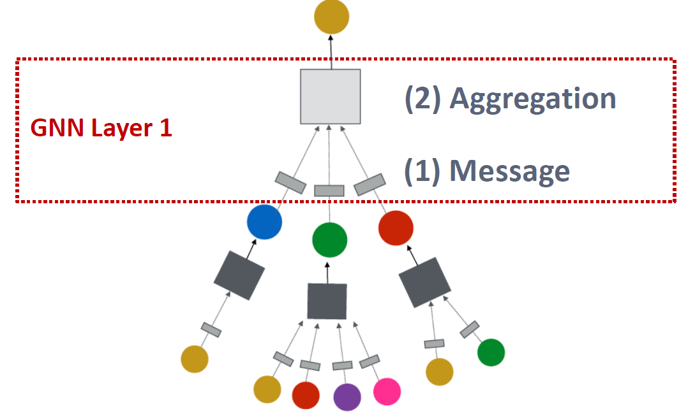

# A Single Layer of a GNN

GNN Layer = Message + Aggregation

+ Different instantiations under this perspective
+ GCN, GraphSAGE, GAT, …

+ Idea of a GNN Layer:
  + Compress a set of vectors into a single vector
  + Two step process:
    + (1) Message
    + (2) Aggregation

**No special ordering** for children neighbors

## Message Computation

+ (1) Message computation

  - Message function:  $\quad \mathbf{m}_{u}^{(l)}=\mathrm{MSG}^{(l)}\left(\mathbf{h}_{u}^{(l-1)}\right)$

    - Intuition: Each node will create a message, which will be sent to other nodes later

    - Example: A Linear layer $\mathbf{m}_{u}^{(l)}=\mathbf{W}^{(l)} \mathbf{h}_{u}^{(l-1)}$ 
      - Multiply node features with weight matrix $\mathbf{W}^{(l)}$ 

- (2) Aggregation

  - Intuition: Each node will aggregate the messages from node $v$'s neighbors

    - $$
      \mathbf{h}_{v}^{(l)}=\mathrm{AGG}^{(l)}\left(\left\{\mathbf{m}_{u}^{(l)}, u \in N(v)\right\}\right)
      $$

  - Example: $\operatorname{Sum}(\cdot)$, $\operatorname{Mean}(\cdot)$ or $\operatorname{Max}(\cdot)$ aggregator  
    - $\mathbf{h}_{v}^{(l)}=\operatorname{Sum}\left(\left\{\mathbf{m}_{u}^{(l)}, u \in N(v)\right\}\right)$

## Message Aggregation: Issue

- Issue: Information from node $v$ itself could get lost

  - Computation of $\mathbf{h}_{v}^{(l)}$ does not directly depend on $\mathbf{h}_{v}^{(l-1)}$ 

- Solution: Include $\mathbf{h}_{v}^{(l-1)}$ when computing $\mathbf{h}_{v}^{(l)}$ 

  - (1) Message: compute message from node $v$ itself
    - Usually, a different message computation will be performed
    - 

  - (2) Aggregation: After aggregating from neighbors, we can aggregate the message from node $v$ itself
    - Via concatenation or summation
    - 

## A Single GNN Layer

- Putting things together:

  - (1) Message: each node computes a message

    - $$
      \mathbf{m}_{u}^{(l)}=\mathrm{MSG}^{(l)}\left(\mathbf{h}_{u}^{(l-1)}\right), u \in\{N(v) \cup v\}
      $$

  + (2) Aggregation: aggregate messages from neighbors

    + $$
      \mathbf{h}_{v}^{(l)}=\mathrm{AGG}^{(l)}\left(\left\{\mathbf{m}_{u}^{(l)}, u \in N(v)\right\}, \mathbf{m}_{v}^{(l)}\right)
      $$

  - Nonlinearity (activation): Adds expressiveness

    - Often written as $\sigma(\cdot)$: $\operatorname{ReLU}(\cdot)$, $\operatorname{Sigmoid}(\cdot)$, $\ldots$ 

    - Can be added to **message** or **aggregation**

## Classical GNN Layers: GCN (1)

- (1) Graph Convolutional Networks (GCN)

$$
\mathbf{h}_{v}^{(l)}=\sigma\left(\mathbf{W}^{(l)} \sum_{u \in N(v)} \frac{\mathbf{h}_{u}^{(l-1)}}{|N(v)|}\right)
$$

- How to write this as Message + Aggregation?

$$
\mathbf{h}_{v}^{(l)}=\sigma\left(\overbrace{\sum_{u \in N(v)}}^{\text{Aggregation}}\underbrace{\mathbf{W}^{(l)} \frac{\mathbf{h}_{u}^{(l-1)}}{|N(v)|}}_{Message}\right)
$$

## Classical GNN Layers: GCN (2)

- Message:

  - Each Neighbor: $\mathbf{m}_{u}^{(l)}=\frac{1}{|N(v)|} \mathbf{W}^{(l)} \mathbf{h}_{u}^{(l-1)} 
  - Normalized by node degree (ln the GCN paper they use a slightly different normalization)

- Aggregation:

  - **Sum** over messages from neighbors, then apply activation

  - $$
    \mathbf{h}_{v}^{(l)}=\sigma\left(\operatorname{Sum}\left(\left\{\mathbf{m}_{u}^{(l)}, u \in N(v)\right\}\right)\right)
    $$

## Classical GNN Layers: GraphSAGE

- (2) GraphSAGE

  - $$
    \mathbf{h}_{v}^{(l)}=\sigma\left(\mathbf{W}^{(l)} \cdot \operatorname{CONCAT}\left(\mathbf{h}_{v}^{(l-1)}, \operatorname{AGG}\left(\left\{\mathbf{h}_{u}^{(l-1)}, \forall u \in N(v)\right\}\right)\right)\right)
    $$

- How to write this as Message + Aggregation?

  - **Message** is computed within the $\operatorname{AGG}(\cdot)$ 

  - **Two-stage aggregation**

    - **Stage 1**: Aggregate from node neighbors

      - $$
        \mathbf{h}_{N(v)}^{(l)} \leftarrow \operatorname{AGG}\left(\left\{\mathbf{h}_{u}^{(l-1)}, \forall u \in N(v)\right\}\right)
        $$

    - **Stage 2**: Further aggregate over the node itself

      - $$
        \mathbf{h}_{v}^{(l)} \leftarrow \sigma\left(\mathbf{w}^{(l)} \cdot \operatorname{CONCAT}\left(\mathbf{h}_{v}^{(l-1)}, \mathbf{h}_{N(v)}^{(l)}\right)\right)
        $$

## GraphSAGE Neighbor Aggregation

- Mean: Take a weighted average of neighbors (GCN)

  - $$
    {\mathrm{AGG}}=\underset{\text { Aggregation }} {\sum_{u \in N(v)}} \frac{\mathbf{h}_{u}^{(l-1)}}{\underset{\text { Message computation }}{|N(v)|}}
    $$

  - 

- Pool: Transform neighbor vectors and apply symmetric vector function $\operatorname{Mean}(\cdot)$ or $\operatorname{Max}(\cdot)$ 

  - $$
    \mathrm{AGG}=\underset{\text { Aggregation }} {\operatorname{Mean}}\left(\left\{\underset{\text { Message computation }}{\operatorname{MLP}}\left(\mathbf{h}_{u}^{(l-1)}\right), \forall u \in N(v)\right\}\right)
    $$

- LSTM: Apply LSTM to reshuffled of neighbors

  - $$
    \mathrm{AGG}=\underset{\text { Aggregation }}{\operatorname{LSTM}}\left(\left[\mathbf{h}_{u}^{(l-1)}, \forall u \in \pi(N(v))\right]\right)
    $$

## GraphSAGE: $L_2$ Normalization

+ $\ell_{2}$ Normalization:

  - Optional: Apply $\ell_{2}$ normalization to $\mathbf{h}_{v}^{(l)}$ at every layer
  - $\mathbf{h}_{v}^{(l)} \leftarrow \frac{\mathbf{h}_{v}^{(l)}}{\left\|\mathbf{h}_{v}^{(l)}\right\|_{2}} \forall v \in V$ where $\|u\|_{2}=\sqrt{\sum_{i} u_{i}^{2}}$( \ell_{2} -norm )

  - Without $\ell_{2}$ normalization, the embedding vectors have different scales ($\ell_{2} -norm) for vectors

  - In some cases (not always), normalization of embedding results in performance improvement

  - After $\ell_{2}$ normalization, all vectors will have the same $\ell_{2}$-norm

## Classical GNN Layers: GAT (1)

+ (3) Graph Attention Networks

  + $$
    \mathbf{h}_{v}^{(l)}=\sigma\left(\sum_{u \in N(v)} \underset{\text { Attention weights }}{\alpha_{v u}} \mathbf{W}^{(l)} \mathbf{h}_{u}^{(l-1)}\right)
    $$

- In GCN / GraphSAGE
    - $\alpha_{v u}=\frac{1}{|N(v)|}$ is the **weighting factor (importance)** of node $u$'s message to node $v$_ 
    - $\Rightarrow \alpha_{v u}$ is defined **explicitly** based on the structural properties of the graph (node degree)
    - $\Longrightarrow$ All neighbors $u \in N(v)$ are equally important to node $v$ 
- Not all node’s neighbors are equally important
    - **Attention** is inspired by cognitive attention.
    - The attention $a_{vu}$ focuses on the important parts of the input data and fades out the rest.
        - **Idea:** the NN should devote more computing power on that small but important part of the data.
        - Which part of the data is more important depends on the context and is learned through training.