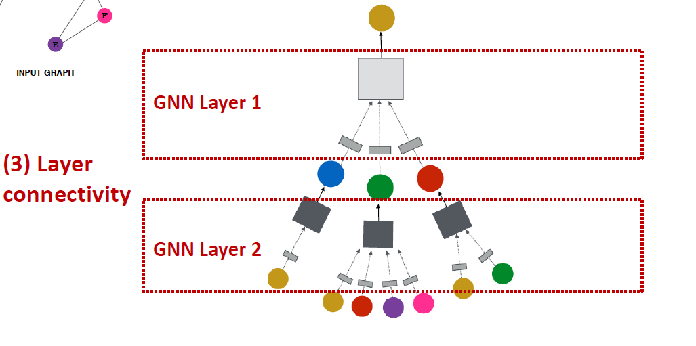
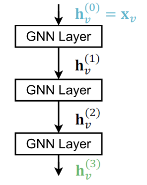
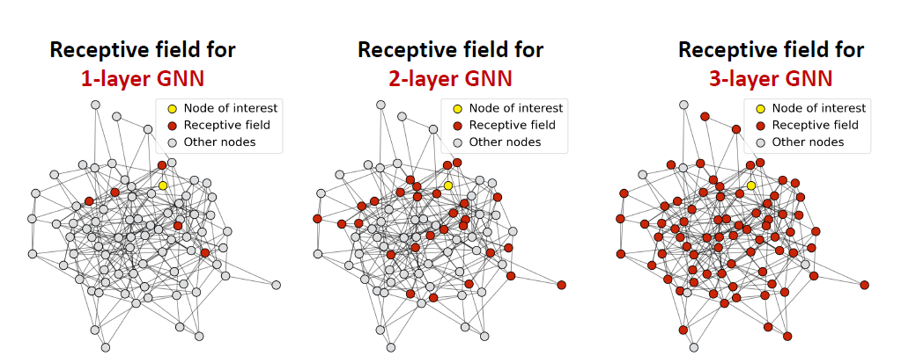
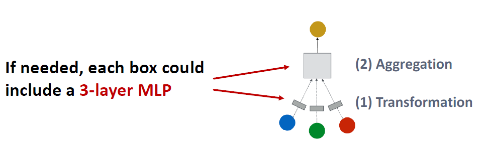
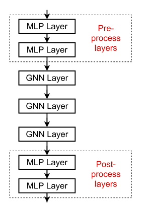
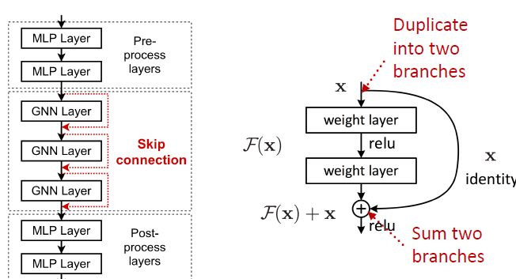
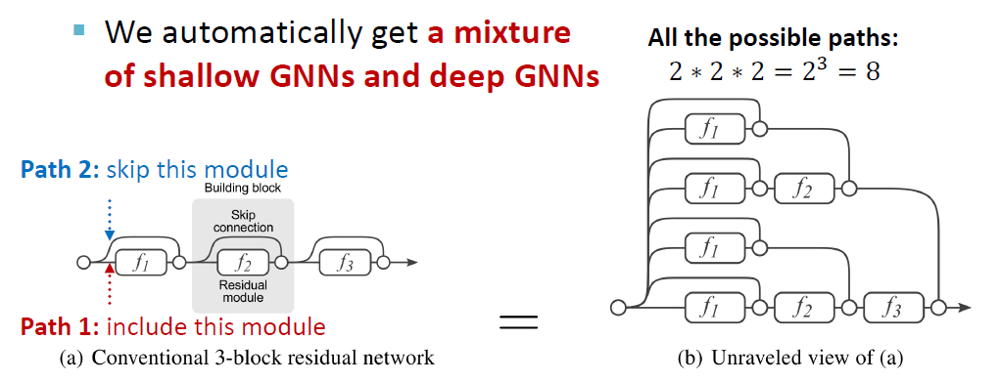
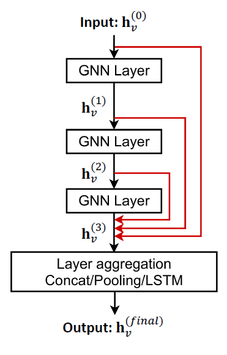

# Stacking layers of a GNN

# Stacking GNN Layers

How to connect GNN layers into a GNN?

+ Stack layers sequentially
+ Ways of adding skip connections

How to construct a Graph Neural Network?
- The standard way: Stack GNN layers sequentially
- Input: Initial raw node feature $\mathrm{x}_{v}$ 
- Output: Node embeddings $\mathbf{h}_{v}^{(L)}$ after $L$ GNN layers

## The Over-smoothing Problem

+ **The depth of a GNN tells how many hops away in the network do we go to collect the information, it doesn't necessarily say how complex or how expressive the entire network is (different from CNN), because that depends on the individual layer of the GNN**

+ The Issue of stacking many GNN layers
  + GNN suffers from **the over-smoothing problem**
+ **The over-smoothing problem:** all the node embeddings converge to the same value
  + This is bad because we want to use node embeddings to differentiate nodes
  + **If the receptive fields are too big, then all the NN collect the same information, which results in the same output for all different nodes**
+ Why does the over-smoothing problem happen?

## Receptive Field of a GNN

+ Receptive field: the set of nodes that determine the embedding of a node of interest
  + In a $K$-layer GNN, each node has a receptive field of $K$-hop neighborhood

+ Receptive field overlap for two nodes
  + The shared neighbors quickly grows when we increase the number of hops (num of GNN layers)

## Receptive Field & Over-smoothing

+ We can explain over-smoothing via the notion of receptive field
  + We knew the embedding of a node is determined by its receptive field
    + If two nodes have highly-overlapped receptive fields, then their embeddings are highly similar
  + Stack many GNN layers => nodes will have highly-overlapped receptive fields => node embeddings will be highly similar => suffer from the over-smoothing problem
+ Next: how do we overcome over-smoothing problem?

## Design GNN Layer Connectivity

+ What do we learn from the over-smoothing problem?

- Lesson 1: Be cautious when adding GNN layers
  - Unlike neural networks in other domains (CNN for image classification), **adding more GNN layers do not always help**
  - Step 1: **Analyze the necessary receptive field** to solve your problem. E.g., by computing the diameter of the graph
  - Step 2: Set number of GNN layers $L$ to be a bit more than the receptive field we like. **Do not set $L$ to be unnecessarily large!**
- **Question:** How to enhance the expressive power of a GNN, if the number of GNN layers is small?

## Expressive Power for Shallow GNNs

+ How to make a shallow GNN more expressive?
+ Solution 1: Increase the expressive power within each GNN layer
  + In our previous examples, each transformation or aggregation function only include one linear layer
  + We can make aggregation / transformation become a deep neural network!
  + 

+ Solution 2: Add layers that do not pass messages
  + A GNN does not necessarily only contain GNN layers
  + E.g., we can add MLP layers (applied to each node) before and after GNN layers, as **pre-process layers** and **post-process layers**
  + 
  + **Pre-processing layers:** Important when encoding node features is necessary. E.g., when nodes represent images/text
  + **Post-processing layers:** Important when reasoning / transformation over node embeddings are needed. E.g., graph classification, knowledge graphs 
  + **In practice, adding these layers works great!**

## Design GNN Layer Connectivity

+ What if my problem still requires many GNN layers?
+ Lesson 2: Add skip connections in GNNs
  + **Observation from over-smoothing:** Node embeddings in earlier GNN layers can sometimes better differentiate nodes
  + Solution: We can increase the impact of earlier layers on the final node embeddings, by adding shortcuts (skip connection) in GNN
  + 
  + Idea of skip connections: Before adding shortcuts: $\boldsymbol{F}(\mathbf{x})$
  + After adding shortcuts: $\boldsymbol{F}(\mathbf{x})+\mathbf{x}$
  + ResNet?

## Idea of Skip Connections

+ Why do skip connections work?

  - Intuition: Skip connections create **a mixture of models** **(weighted combination of previous and current layer)**

  -  $N$ skip connections $\rightarrow 2^{N}$ possible paths

  - Each path could have up to $N$ modules

  - We automatically get a mixture of shallow GNNs and deep GNNs

## Other Options of Skip Connections

+ Other options: Directly skip to the last layer
  + The final layer directly **aggregates from the all the node embeddings** in the previous layers

